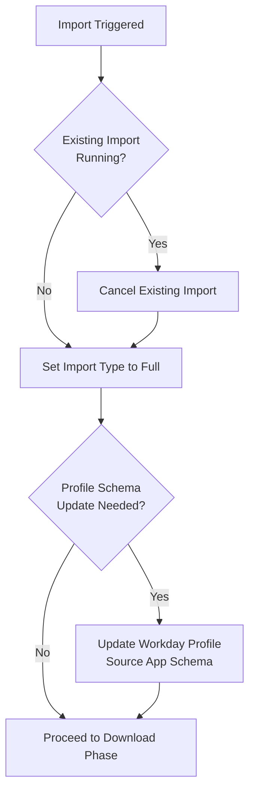
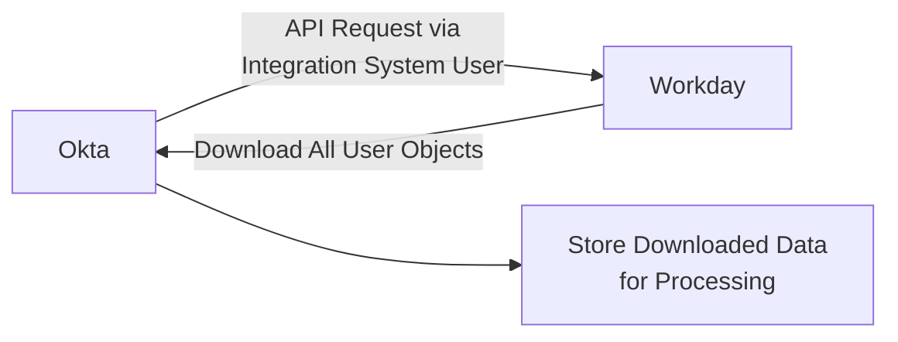
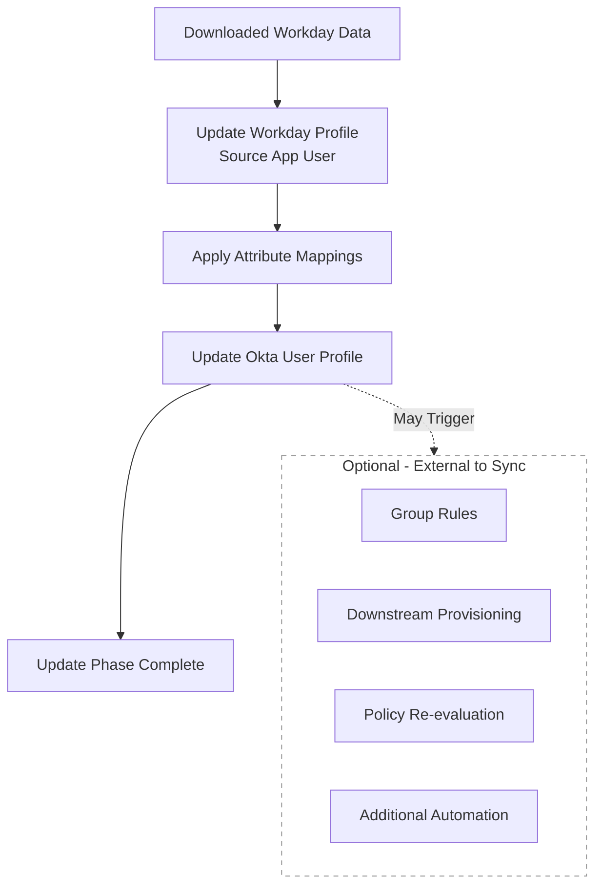
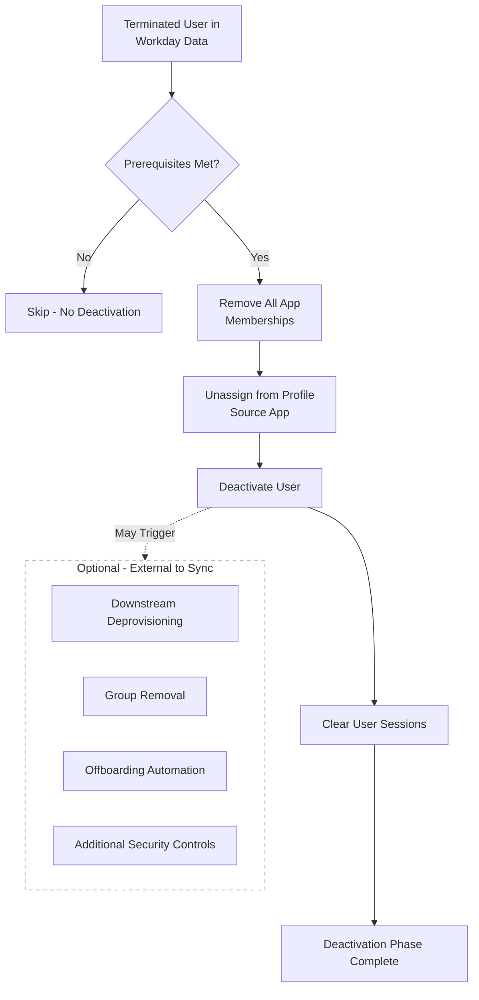
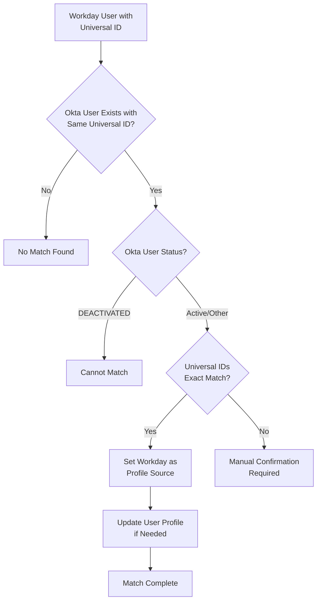
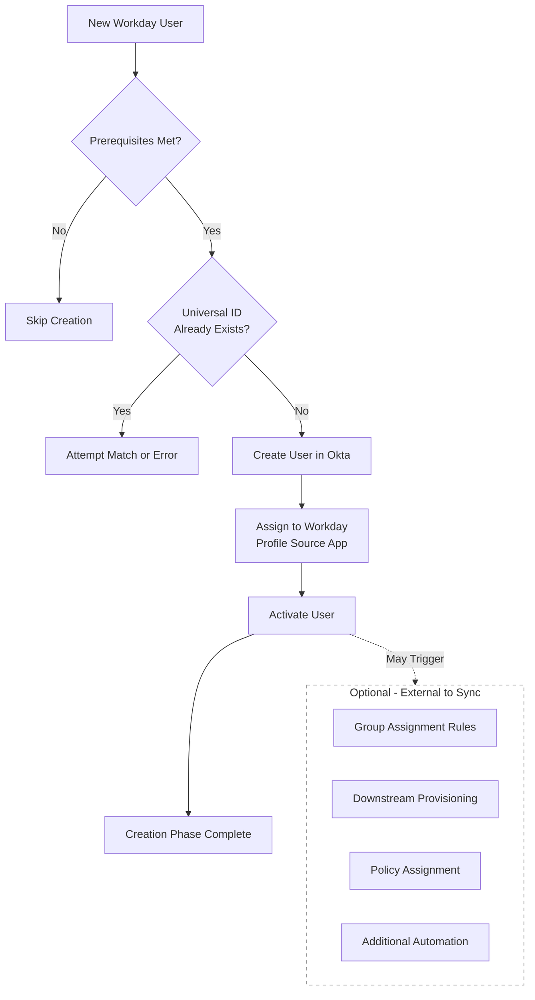
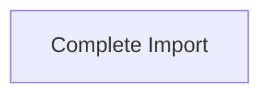
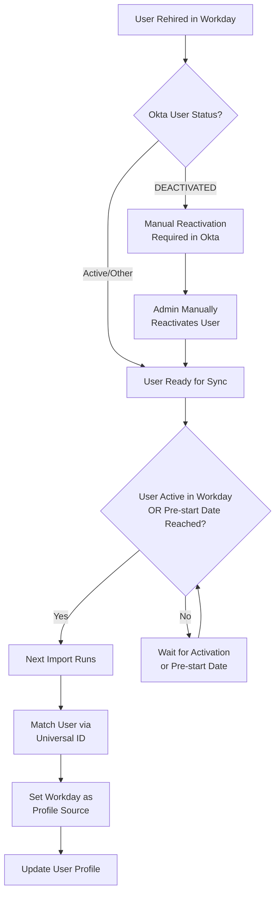
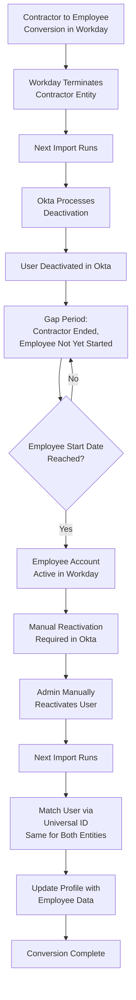

## General

The Okta-Workday integration is a one-way sync where Workday is the authoritative source of truth (profile source) for user identities, and Okta acts as the downstream identity platform (IdP).

GitLab uses the native pre-built Workday integration, providing out-of-the-box support for user lifecycle and identity management between Workday and Okta.

**Population:**
The Okta-Workday integration manages the following user populations in Okta:

- Employees
- Contingent Workers
- Professional Service Partners

All other user types are managed directly in Okta.

**Terminology:**

- **Workday**:
  - HR system containing user identities.
- **Okta**:
  - Identity and access management platform that manages user access and lifecycle at GitLab.
- **Workday Profile Source app**:
  - The app in Okta that serves as a Profile Source.
  - Okta does not directly update the Okta user profile using data downloaded from Workday. Instead, it updates the profile source app with Workday data, then uses attribute mappings between the profile source app and the Okta user profile to determine which fields to sync.
  - A user must be assigned to the profile source app to be considered "managed by Workday".
- **Integration System User**:
  - Service account in Workday used by Okta to access Workday APIs.
  - The data available to Okta is determined by what is made accessible to the Integration System User.
- **Imports**:
  - Hourly or manually triggered syncs.
  - Imports are unidirectional and can be full or incremental.
  - Okta imports users from Workday to manage user profiles and statuses.
- **Attribute Mappings**:
  - Custom mappings that determine which profile source app attributes populate which Okta user profile attributes.
- **Workday Universal ID**:
  - Unique persistent identifier for each user in Workday.
  - Universal IDs allow Okta to match and sync Workday users with Okta users.
  - All other profile attributes (email, name, employee number, etc.) can be updated in Okta while maintaining a match between user identities in both systems.

## Imports

Imports bring Workday users and their profile attributes into Okta, reconciling user profiles and statuses between both systems.

Imports can include base and custom attributes, as well as non-future and future effective-dated attributes. What profile data is imported is determined by:

- What fields have been made available to the Integration System User in Workday.
- Any conditional rules applied to a field in Workday.
- The attribute mappings between the Workday Profile Source app and the Okta user profile.

Imports run hourly or are manually triggered by Okta Admins with appropriate permissions.

```type:mermaid
gantt
    title Import Example
    dateFormat HH:mm:ss
    axisFormat %H:%M:%S
    section Start Import
    Start import process                                    :milestone, m1, 14:00:00, 0s
    Update "Workday Profile Source" app config            :14:00:00, 1s
    section Download Data
    Downloading data from Workday                           :14:00:01, 60s
    section Update Users
    Update profile source app user                          :14:01:01, 10s
    Update user profile                                     :14:01:01, 10s
    section Deactivate Users
    Deactivate user                                         :14:01:15, 30s
    Clear user session                                      :14:01:15, 30s
    Unassign user from apps                                 :14:01:15, 30s
    section Match Users
    Match imported users to existing Okta users             :14:01:45, 15s
    section Create Users
    Create profile source app user                          :14:02:00, 15s
    Create user                                             :14:02:00, 15s
    Activate user                                           :14:02:00, 15s
    section Complete Import
    Complete import process                                 :milestone, m2, 14:02:15, 0s
```

**Additional Info**: Okta may perform certain phases in parallel. Which phases and events occur depends on the Workday data provided. For example, Okta may skip the deactivation phase if no deactivated users are included in the downloaded data.

## Import Phases

### Start Import

**Events**

- An import is triggered. Okta cancels any existing imports, as only one import can be active at a time.
- Okta sets the import type to Full. Unlike incremental imports, which only bring in data changed since the last import, **Full imports** bring in all Workday users and attributes available to the Integration System User.
- If necessary, Okta updates the profile schema for the Workday Profile Source app. The schema defines which attributes make up the app's user profile.

{}



{}

**Event types**

- [`system.import.start`](https://developer.okta.com/docs/reference/api/event-types/?q=system.import.start)
- [`system.import.full_import_required`](https://developer.okta.com/docs/reference/api/event-types/?q=system.import.full_import_required)
- [`application.lifecycle.update`](https://developer.okta.com/docs/reference/api/event-types/?q=application.lifecycle.update)
- [`system.import.incremental_converted_to_full`](https://developer.okta.com/docs/reference/api/event-types/?q=system.import.incremental_converted_to_full)

### Download Data

- Okta downloads all "objects" (users) from Workday.

{}



{}

**Event types**

- [`system.import.download.start`](https://developer.okta.com/docs/reference/api/event-types/?q=system.import.download.start)
- [`system.import.download.complete`](https://developer.okta.com/docs/reference/api/event-types/?q=system.import.download.complete)

### Update Users

**Events**

- Okta updates users assigned to the Workday Profile Source app with data downloaded from Workday.
- Okta updates the user's Okta profile to match their data in the Workday Profile Source app, using attribute mappings to determine which attributes to update and how to format them.
- Common updates include:
  - Name changes
  - Department/division/title changes
  - Manager changes
  - User type changes
- Updates may also trigger:
  - Group assignment rules
  - Downstream provisioning in managed apps
  - Security policy assignments
  - Additional automation

{}



{}

**Additional Info:**

- Only mapped attributes with `Create and Update` set in the profile source app > Okta mapping will update; all others remain unchanged.
- Some mapped attributes have additional rules that transform Workday values into Okta-specific values (e.g. Workday employment types to Okta user types).
- Some Okta profile fields are managed via other systems or automation.
- Okta system logs capture all profile attribute changes, but only indicate that a value changed — not what the previous value was.

**Event types**

- [`system.import.object_creation.start`](https://developer.okta.com/docs/reference/api/event-types/?q=system.import.object_creation.start)
- [`application.user_membership.update`](https://developer.okta.com/docs/reference/api/event-types/?q=application.user_membership.update)
- [`system.import.user.update`](https://developer.okta.com/docs/reference/api/event-types/?q=system.import.user.update)
- [`user.account.update_profile`](https://developer.okta.com/docs/reference/api/event-types/?q=user.account.update_profile)
- [`system.import.object_creation.complete`](https://developer.okta.com/docs/reference/api/event-types/?q=system.import.object_creation.complete)

### Deactivate Users

**Prerequisites:**

- The user must be terminated in Workday.
- The user must be profile sourced by the profile source app in Okta.
- The user cannot already be DEACTIVATED in Okta.

**Events**

- Okta determines which users to deactivate using the downloaded Workday data.
- Okta unassigns the user from the profile source app.
- Okta deactivates users and clears their sessions.
- Deactivations may also trigger:
  - App unassignment
  - Group removal
  - Downstream deprovisioning in managed apps
  - Offboarding automation
  - Additional security controls
  - Additional automation

{}



{}

**Additional Info:**

- A deactivated user's profile becomes frozen in Okta; profile attributes cannot be changed.
- Okta processes deactivations before profile updates. If the same import contains both a profile update and a deactivation for the same user, the profile changes are not applied. This can result in key profile values not being updated.
- If an Okta user is not profile sourced by Workday, termination in Workday has no effect — the Okta account remains active.
- If a user is retroactively terminated in Workday, they will be deactivated in Okta on the next hourly sync.
- Okta does not use profile fields (e.g. `terminationDate`, `lastDayWorked`) to determine whether a user should be deactivated.

**Event types**

- [`system.import.implicit_deletion.start`](https://developer.okta.com/docs/reference/api/event-types/?q=system.import.implicit_deletion.start)
- [`application.user_membership.remove`](https://developer.okta.com/docs/reference/api/event-types/?q=application.user_membership.remove)
- [`user.lifecycle.deactivate`](https://developer.okta.com/docs/reference/api/event-types/?q=user.lifecycle.deactivate)
- [`user.session.clear`](https://developer.okta.com/docs/reference/api/event-types/?q=user.session.clear)
- [`system.import.user.delete`](https://developer.okta.com/docs/reference/api/event-types/?q=system.import.user.delete)
- [`system.import.user.complete`](https://developer.okta.com/docs/reference/api/event-types/?q=system.import.user.complete)
- [`system.import.implicit_deletion.complete`](https://developer.okta.com/docs/reference/api/event-types/?q=system.import.implicit_deletion.complete)

### Match Users

**Prerequisites:**

- The Workday Universal ID must be present for a user to be matched.
- Only exact matches are auto-confirmed; all others require manual confirmation.
- The user cannot be DEACTIVATED in Okta.

**Events**

- Okta compares each downloaded Workday user's Universal ID against the `workdayUniversalID` field in each Okta user profile. On an exact match, Okta sets Workday as the profile source for that user.
- Okta may perform additional Update User phase actions.

{}



{}

**Event types**

- [`system.import.user_matching.start`](https://developer.okta.com/docs/reference/api/event-types/?q=system.import.user_matching.start)
- [`system.import.user_matching.complete`](https://developer.okta.com/docs/reference/api/event-types/?q=system.import.user_matching.complete)

### Create Users

**Prerequisites:**

- A user is created in Okta only if they are A) active in Workday, or B) a pre-hire who has reached their pre-start date. The pre-start date is configured in Okta as **one day prior** to their hire date.
- Okta will not create users for terminated or inactive Workday users.
- If a new Workday user has the same Universal ID as an existing Okta user, Okta will attempt to **match** the user or return an error.

**Events**

- Okta creates users using their Workday data.
- Okta assigns the user to the profile source app.
- Okta activates the user.
- Creation may also trigger:
  - Group assignment rules
  - Downstream provisioning in managed apps
  - Security policy assignments
  - Additional automation

{}



{}

**Event types**

- [`application.user_membership.add`](https://developer.okta.com/docs/reference/api/event-types/?q=application.user_membership.add)
- [`user.lifecycle.create`](https://developer.okta.com/docs/reference/api/event-types/?q=user.lifecycle.create)
- [`user.lifecycle.activate`](https://developer.okta.com/docs/reference/api/event-types/?q=user.lifecycle.activate)

### Complete Import

- Import is completed.



**Event types**

- [`system.import.custom_object.complete`](https://developer.okta.com/docs/reference/api/event-types/?q=system.import.custom_object.complete)
- [`system.import.user.complete`](https://developer.okta.com/docs/reference/api/event-types/?q=system.import.user.complete)
- [`system.import.complete`](https://developer.okta.com/docs/reference/api/event-types/?q=system.import.complete)

## Additional Scenarios

### Rehires / Reactivations

Workday does not have permission in Okta to automatically reactivate users. This is due to specific offboarding scenarios at GitLab where a deactivation occurs in Okta before a termination is processed in Workday — meaning Workday still considers the account active and would erroneously reactivate it on the next sync. To prevent this, Workday can only deactivate users.

For a rehire to be sourced by Workday in Okta, the user must be `manually reactivated in Okta first`. Once the user becomes active in Workday or reaches their pre-start date, the sync will match the existing active Okta user to the Workday user.

Users should be reactivated no more than 24 hours before their start date to prevent accidental early access.

{}



{}

### Conversions

In Workday, contractors and employees are separate entities with separate Workday IDs. The Universal ID links these entities together, preventing conversions (e.g. contractor-to-FTE) from creating duplicate accounts in Okta.

When Workday processes a conversion, it sends a deactivation event to Okta, as the contractor account is technically terminated. Okta processes this like any standard deactivation. This accounts for cases where a contractor is terminated but their employee start date is not the same day — for example, a contractor who converts to an employee role but does not start for another week.

Because Workday cannot reactivate users in Okta, users must be `manually reactivated in Okta first`. Once the Okta user is no longer `DEACTIVATED`, the sync can match and update their account with the new employee data. Failing to reactivate a user will leave them in an offboarded state.

Users should be reactivated no more than 24 hours before their start date to prevent accidental early access.

{}



{}
