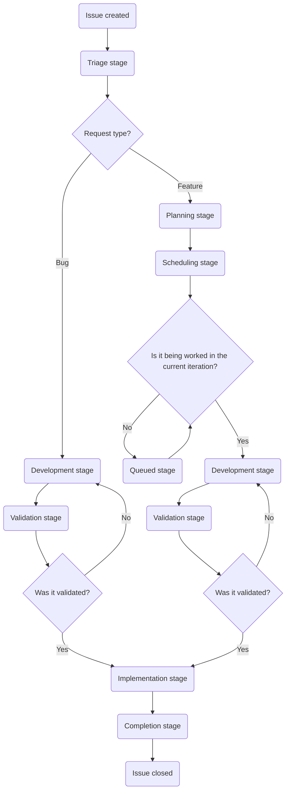

## Purpose

The purpose of Customer Support Operations is to enable GitLab to provide delightful customer experiences by:

- equipping the Customer Support team with knowledge, tools, and data to optimize productivity and efficiently solve customer problems.
- equipping our customers and wider GitLab with the data, knowledge, and insights to prevent customer problems before they occur.
- delivering delightful experiences to both our own internal and external customers.

## Meet the team

| Name | Role |
|------|------|
| [Carlo Curato](https://gitlab.com/ccurato) | Director, Business Technology Operations |
| [Jason Colyer](https://gitlab.com/jcolyer) | Fullstack Engineer, Customer Support Operations |
| [Dylan Tragjasi](https://gitlab.com/dtragjasi) | Senior Customer Support Operations Specialist |
| [Alyssa Villa](https://gitlab.com/avilla4) | Customer Support Operations Specialist |
| [Sarah Cole](https://gitlab.com/Secole) | Customer Support Operations Specialist |

## Working with us

We're here to help! Here's a quick guide on the best way to reach us depending on what you need:

🙋 **Requesting Something New or a Change**

> **Heads up before you file**: Each request type has specific roles that are authorized to submit it. To avoid delays, connect with the right person first - issues filed outside the appropriate role will be closed and you'll be directed to them anyway!

- **Global Support team requests** should be filed by a [SIG team](https://gitlab.com/support-innovation-group) member using [this template](https://gitlab.com/gitlab-com/gl-security/corp/cust-support-ops/issue-tracker/-/issues/new?issuable_template=Feature)
- **US Government Support team requests** should be filed by a US Government Support manager/director using [this template](https://gitlab.com/gitlab-com/gl-security/corp/cust-support-ops/issue-tracker/-/issues/new?issuable_template=Feature)
- **Knowledge Base updates (any Zendesk instance)** should be filed by a Support Senior Technical Program Manager using [this template](https://gitlab.com/gitlab-com/gl-security/corp/cust-support-ops/issue-tracker/-/issues/new?issuable_template=Feature)
- **Everything else** should be filed by a manager/director of the requesting team using [this template](https://gitlab.com/gitlab-com/gl-security/corp/cust-support-ops/issue-tracker/-/issues/new?issuable_template=Feature)

🐛 **Found a Bug?**

Please file an issue using [this template](https://gitlab.com/gitlab-com/gl-security/corp/cust-support-ops/issue-tracker/-/issues/new?issuable_template=Bug). We appreciate you taking the time to report it!

💬 **Something Else?**

Feel free to reach out to us directly in Slack at [#support_operations](https://gitlab.enterprise.slack.com/archives/C018ZGZAMPD). We're always happy to chat!

## Issue flowchart

