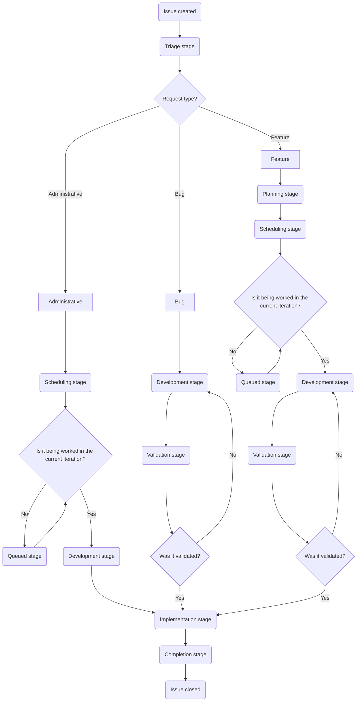

This page documents the workflow for working issues in the Customer Support Operations team. It covers the stages an issue progresses through from creation to completion, including triage, planning, development, validation, and implementation.

Understanding this workflow helps team members know what to expect at each stage, who is responsible, and what actions are required to move issues forward.

{}

While Incidents are a type of issue we work, they operate in a special flow of their own. Please see our [Incidents documentation](/handbook/security/customer-support-operations/incidents/) for more information.

{}

## Issue flowchart

A standard progression for an issue will look like this:



## Who can file what issues

- `Feature` issues depend on the team the request is coming from/is concerning:
  - For anything coming from the Global Support team, it must be a member of the [SIG team](https://gitlab.com/support-innovation-group)
  - For anything coming from the US Government Support team, the issue must be filed by a US Government Support manager.
  - For anything concerning the Knowledge Base (for any instance), the issue should be filed by a Support Senior Technical Program Manager
  - For anything else, it should be filed by a manager of the team requesting it
- `Bug` issues can be filed by anyone
- `Administrative` issues should only ever be filed by the Customer Support Operations team
- `Incident` issues should only ever be filed by the Customer Support Operations team

## Stages

The work to be done on an issue largely depends on the stage the issue is in. Please note the assignee on an issue will change frequently as it moves from stage to stage.

A quick reference to the stages used is:

| Stage | Request Type | Primary DRI | SLA Target |
|-------|--------------|-------------|------------|
| Triage | All | Dylan | 1-2 days |
| Planning | Bug, Feature | Jason | 5 days |
| Scheduling | Feature, Administrative | Dylan & Jason | Weekly |
| Development | All | Varies | 1-3 weeks |
| Validation | Bug, Feature | Varies | 3-5 days |
| Implementation | All | Varies | 3 days |
| Completed | All | Varies | 2 days to close |

### Triage

{}

- Primary DRI: Dylan
- Secondary DRI: Alyssa
- SLA target: 1-2 business days
- Request types that use this stage:
  - Administrative
  - Bugs
  - Features
- Purpose
  - Determine non-technical validity/feasibility of request
  - Determine if more information is needed before proceeding
  - Verify required approvals are present
  - Add labels for customer type, system impacted, priority, and roadmap alignment
- Key activities
  - Gather necessary information from requester
  - Validate approvals based on roadmap alignment and complexity
  - Move to Planning stage or close if unable to proceed
  - Move to Blocked stage if insufficient detail has been provided in original request

{}

Here the DRI will:

- gather the needed information from the request (if required)
- determine if we can move forward on the issue
- determine if the issue is valid (submitted by correct person, is feasible, etc.)

After doing so, the DRI needs to:

- ensure a [priority label](/handbook/security/customer-support-operations/gitlab/labels#priority-labels) is present on the issue
- ensure a [customer label](/handbook/security/customer-support-operations/gitlab/labels#customer-labels) is present on the issue
- ensure a [roadmap label](/handbook/security/customer-support-operations/gitlab/labels#roadmap-labels) is present on the issue (if the issue is tied to a roadmap item)

With that in place, the DRI will then move the issue to the next stage depending the request type:

- For Administrative issues, it is moved to the [Scheduling stage](#scheduling)
- For Bug or Feature issues, it is moved to the [Planning stage](#planning)

This can be done in one comment using [quickactions](https://docs.gitlab.com/user/project/quick_actions/), like so:

```plaintext
/label ~"Customer::Support"
/label ~"Priority::3"
/label ~"RequestType::Feature"
/label ~"roadmap_item"
/label ~"Stage::Planning"
```

You can also use the following [group comment templates](https://gitlab.com/groups/gitlab-com/gl-security/corp/cust-support-ops/-/comment_templates) to generate a quickactions comment to assist you:

- [Triage -> Planning](https://gitlab.com/groups/gitlab-com/gl-security/corp/cust-support-ops/-/comment_templates/1000652)
- [Triage -> Scheduling](https://gitlab.com/groups/gitlab-com/gl-security/corp/cust-support-ops/-/comment_templates/1001112)
- [Triage -> Development](https://gitlab.com/groups/gitlab-com/gl-security/corp/cust-support-ops/-/comment_templates/1001111)

#### Closing requests filed by incorrect persons

If an issue is filed by a person who is not allowed to file the issue (see [Who can file what issues](#who-can-file-what-issues)), the issue needs to be closed out (and the requester directed what actions they should take to move forward).

To assist with this, use the correct [group comment template](https://gitlab.com/groups/gitlab-com/gl-security/corp/cust-support-ops/-/comment_templates) for the situation at hand:

- [Not approved -> Talk to SIG team](https://gitlab.com/groups/gitlab-com/gl-security/corp/cust-support-ops/-/comment_templates/2001174)
- [Not approved -> Talk to manager](https://gitlab.com/groups/gitlab-com/gl-security/corp/cust-support-ops/-/comment_templates/2001175)
- [Not approved -> Talk to Senior Technical Program Manager](https://gitlab.com/groups/gitlab-com/gl-security/corp/cust-support-ops/-/comment_templates/2001176)

Using those should direct those on the issue on who they need to speak with as well as close out the issue properly.

#### Closing a triage issue

If the DRI has determined we cannot proceed on an issue, the DRI should take the following actions:

- comment stating why we will not be proceeding
- set the issue `status` to `Won't do`
- close the issue

This can be done in one comment using [quickactions](https://docs.gitlab.com/user/project/quick_actions/), like so:

```plaintext
Greetings,

After review of this issue, we have determined we will not be able to proceed on this issue.

This is due to <insert reasons here>.

Due to this, we will be closing this out. Should the above mentioned reasons be resolved, please create a **new** issue.

/status "Won't do" 
```

### Planning

{}

- Primary DRI: Jason
- Secondary DRI: Sarah
- SLA target: 5 business days
- Request types that use this stage:
  - Bugs
  - Features
- Purpose
  - Determine technical validity/feasibility
  - Determine if more information is needed
  - Generate implementation gameplan
  - Determine rough estimate of workload
- Key activities
  - Write detailed gameplan
  - Work with requester to resolve blockers
  - Determine issue weight score
  - Move to Scheduling stage when complete

{}

Here the DRI will:

- write up a gameplan for the issue (and post it on the issue as a comment)
- determine technical feasibility of the request
- determine a rough estimate of the work timelines needed (excluding validation time)
- determine the [RICE score](#rice-score)

After doing so, the DRI needs to:

- Add a weight value to the issue (use the [RICE score](#rice-score))
- Add an iteration and milestone to the issue (for Bug issues only)

With that in place, the DRI will then move the issue to the next stage depending the request type:

- For Bug issues, it is moved to the [Development stage](#development)
- For Feature issues, it is moved to the [Scheduling stage](#scheduling)

You can also use the following [group comment templates](https://gitlab.com/groups/gitlab-com/gl-security/corp/cust-support-ops/-/comment_templates) to generate a quickactions comment to assist you:

- [Planning -> Development](https://gitlab.com/groups/gitlab-com/gl-security/corp/cust-support-ops/-/comment_templates/1000755)
- [Planning -> Scheduling](https://gitlab.com/groups/gitlab-com/gl-security/corp/cust-support-ops/-/comment_templates/1000754)

#### RICE score

Customer Support Operations uses a modified version of the [RICE Framework](/handbook/product/product-processes/#using-the-rice-framework) on our Feature issues.

A breakdown of possible values for our modified version is:

| Category | Value | Score |
|----------|-------|:-----:|
| Reach | Impacts customers | 10 |
| | Impacts all agents | 7 |
| | Impacts one region of agents | 4 |
| | Impacts a small group of agents | 2 |
| | Minimal or no real impact | 1 |
| Impact | Directly impacts GitLab's revenue | 3 |
| | Significant impact to support workflows | 2 |
| | Slight impact to support workflows | 1 |
| | Minimal or no real impact | 0.5 |
| Confidence | Percentage | Varies |
| Effort | Numeric | Varies |

We take the scores from the above values and use the following equation to calculate a RICE score:

(Reach × Impact × Confidence) / Effort

You can use [this calculator](https://docs.google.com/spreadsheets/d/1SVIRUJ9UmmMSXl0-WZSBP2KueTzGxJfBH4zir61WTFY/edit?gid=0#gid=0) (requires GitLab Google account access) to quickly generate a RICE score.

#### Closing a planning issue

If the DRI has determine we cannot proceed on an issue, the DRI should take the following actions:

- comment stating why we will not be proceeding
- set the issue `status` to `Won't do`
- close the issue

This can be done in one comment using [quickactions](https://docs.gitlab.com/user/project/quick_actions/), like so:

```plaintext
Greetings,

After review of this issue, we have determined we will not be able to proceed on this issue.

This is due to <insert reasons here>.

Due to this, we will be closing this out. Should the above mentioned reasons be resolved, please create a **new** issue.

/status "Won't do" 
```

### Scheduling

{}

- Primary DRI: Dylan and Jason
- SLA target: Addressed on weekly cadence (within a week)
- Request types that use this stage:
  - Features
- Purpose
  - Determine bandwidth validity/feasibility
  - Assign iteration(s) and milestone(s)
  - Assign Development DRI
- Key activities
  - Discuss development timelines (weekly cadence)
  - Add iteration and milestone to issue
  - If current iteration: Move to Development stage
  - If future iteration: Move to Queued stage

{}

Here the DRIs will discuss development timelines for the changes. This is done on a weekly cadence.

Once determined, the DRIs will do the following on the issue:

- set an iteration on the issue
- set a milestone on the issue
- set the DRI for the issue moving forward

After doing so, the DRIs will move the issue to the next stage depending on the timeline for work to begin:

- if the timeline for work to begin is the **current** iteration, the issue is moved to the [Development stage](#development)
- if the timeline for work to begin is a future iteration, the issue is moved to the [Queued stage](#queued)

You can also use the following [group comment templates](https://gitlab.com/groups/gitlab-com/gl-security/corp/cust-support-ops/-/comment_templates) to generate a quickactions comment to assist you:

- [Scheduling -> Development](https://gitlab.com/groups/gitlab-com/gl-security/corp/cust-support-ops/-/comment_templates/1000757)
- [Scheduling -> Queued](https://gitlab.com/groups/gitlab-com/gl-security/corp/cust-support-ops/-/comment_templates/1000756)

### Queued

{}

- Primary DRI: Dylan and Jason
- SLA target: N/A
- Request types that use this stage:
  - Features
- Purpose
  - Indicate request is ready but waiting for assigned iteration to begin
- Key activities
  - Monitor iteration schedules
  - When iteration begins: Assign Development DRI and move to Development stage

{}

Issues will sit here until their iteration has begun. Once the iteration has begun, the DRIs should move the issue to the [Development stage](#development).

You can also use the following [group comment template](https://gitlab.com/groups/gitlab-com/gl-security/corp/cust-support-ops/-/comment_templates) to generate a quickactions comment to assist you:

- [Queued -> Development](https://gitlab.com/groups/gitlab-com/gl-security/corp/cust-support-ops/-/comment_templates/1000758)

### Development

{}

- Primary DRI: Varies
- SLA target: Based on gameplan timeline (typically 1-3 weeks)
- Request types that use this stage:
  - Administrative
  - Bugs
  - Features
- Purpose
  - Implement changes in staging/sandbox
  - Perform testing
  - Prepare environments for validation
- Key activities
  - Implement changes in appropriate environment
  - Test implementation
  - Move to Validation stage to get validation
    - Moves to Implementation stage instead if validation is not required

{}

In this stage the DRI will perform any needed setup to enable testing and validation (normally in sandboxes). As the DRI makes changes for the setup, they should add comments indicating what has been done. While there is not a set format that has to be used, the general recommendation would look like:

```plaintext
## Development notes

- Zendesk Global Sandbox
  - Triggers
    - Modified [Example trigger](LINK_TO_TRIGGER)
  - Ticket forms
    - Renamed form [Example form](LINK_TO_FORM) to `Modified Example form`
  - Webhooks
    - Created [New webhook](LINK_TO_WEBHOOK)

```

Once you have done all the need setup, you need to perform a test suite based on what you have changed. The exact contents of the test suite is going to vary from issue to issue. While there is not a set format that has to be used, the general recommendation would look like:

```plaintext
## Test Suite

- Summary
  - Test done: xxx
  - Tests passed: xxx/xxx
  - Tests failed: xxx/xxx

<details>
<summary>Tests</summary>

- Description of test 1 to do
  - Ticket or artifact used: LINK_TO_ITEM
  - Expected results:
    - List
    - Of
    - Expectations
  - Status: :white_check_mark: :x:
- Description of test 2 to do
  - Ticket or artifact used: LINK_TO_ITEM
  - Expected results:
    - List
    - Of
    - Expectations
  - Status: :white_check_mark: :x:

</details>
```

As tests are performed, update the comment to indicate the results and state of the test. If tests fail, add notes or comments on what you noticed and if any changes need to be made.

{}

If tests fail, you will need to perform a whole new test suite (including previously done tests). This ensures that even if we need to make changes after a test suite is done, everything will be in working order.

{}

Once all testing and development have been completed, you will need to move the issue to the next stage. The exact stage to use depends on the type of issue being worked:

- for Administrative issues, move to the [Implementation stage](#implementation)
  - If doing this manually, make sure to add the label `Validation::Skipped` when moving to the new stage
- for Bug and Feature issues, move to the [Validation stage](#validation)

You can also use the following [group comment templates](https://gitlab.com/groups/gitlab-com/gl-security/corp/cust-support-ops/-/comment_templates) to generate a quickactions comment to assist you in moving to the new stage:

- [Development -> Validation](https://gitlab.com/groups/gitlab-com/gl-security/corp/cust-support-ops/-/comment_templates/1000759)
- [Development -> Implementation](https://gitlab.com/groups/gitlab-com/gl-security/corp/cust-support-ops/-/comment_templates/1000761)

### Validation

{}

- Primary DRI: Varies
- SLA target: Varies (dependent on requester availability and change complexity, typically 3-5 business days)
- Request types that use this stage:
  - Bugs
  - Features
- Purpose
  - Obtain requester validation
- Key activities
  - Get validation from requester (if required)
  - Move to Implementation stage once validation is received

{}

Here, the DRI will ask the requester of the issue to validate what has been setup aligns with expectations.

You should do this by making a comment asking the request for validation, making sure to include all information the requester might need to validate the changes.

You can use the [Request validation](https://gitlab.com/groups/gitlab-com/gl-security/corp/cust-support-ops/-/comment_templates/1001113) [group comment template](https://gitlab.com/groups/gitlab-com/gl-security/corp/cust-support-ops/-/comment_templates) to generate a quickactions comment to assist you in this.

At this juncture, the issue waits for a comment from the validator indicating the status of their validation. Your actions depend on what they come back with:

- If the requester validate the change(s):
  - Add the label `Validation::Received`
  - Move the issue to the [Implementation stage](#implementation)
- If the requester rejects the change(s):
  - Add the label `Validation::Rejected`
  - Move the issue to the [Development stage](#development)

You can also use the following [group comment templates](https://gitlab.com/groups/gitlab-com/gl-security/corp/cust-support-ops/-/comment_templates) to generate a quickactions comment to assist you in moving to the new stage:

- [Validation received](https://gitlab.com/groups/gitlab-com/gl-security/corp/cust-support-ops/-/comment_templates/1001114)
- [Validation rejected](https://gitlab.com/groups/gitlab-com/gl-security/corp/cust-support-ops/-/comment_templates/1001115)

### Implementation

{}

- Primary DRI: Varies
- SLA target: Varies (dependent on changes being implemented, typically 3-5 business days)
- Request types that use this stage:
  - Administrative
  - Bugs
  - Features
- Purpose
  - Generate technical blueprint
  - Implement changes in production/merge changes
  - Confirm deployment dates
- Key activities
  - Create comprehensive technical blueprint with MR links and change details
  - Implement via MRs or other appropriate methods
  - Once all tasks completed (MR merged for deployment items), move to Completed stage

{}

Here you will generate a technical blueprint and implement the changes (either by merging MRs or making changes directly in systems).

A technical blueprint should go over, in detail, everything that was changed. Anyone looking at the blueprint should be able to perfectly reproduce what you did. This means linking to all created MRs, detailing any non-MR changes made, etc.

Once all implementation tasks are completed (for items using deployments, merging the MR is sufficient), change the issue to the [Completed stage](#completed).

### Completed

{}

- Primary DRI: Varies
- SLA target: 2 business days to close issue
- Request types that use this stage:
  - Administrative
  - Bugs
  - Features
- Purpose
  - Indicate all work is finished
- Key activities
  - Verify all production changes are complete or queued for deployment
  - Close the issue

{}

The DRI will add a comment indicating all work is completed (and what date it will be live if part of a deployment cycle) and then close out the issue.

When closing out the issue, make sure to set the `status` of the issue to `Complete`.

This can be done in one comment using [quickactions](https://docs.gitlab.com/user/project/quick_actions/), like so:

```plaintext
The work on this issue has been completed at this time.

As components of the changes are tied to scheduled deployments, it will be fully live 2026-02-01.

/label ~"Stage::Completed"
/status "Complete" 
```

You can also use the following [group comment templates](https://gitlab.com/groups/gitlab-com/gl-security/corp/cust-support-ops/-/comment_templates) to generate a quickactions comment to assist you:

- [Close out a completed issue](https://gitlab.com/groups/gitlab-com/gl-security/corp/cust-support-ops/-/comment_templates/1001116)

### Blocked

{}

- Primary DRI: Dylan and Jason
- SLA target: N/A
- Purpose
  - Indicate issue is blocked
  - Document blocking reason and previous stage
  - Monitor block status
- Key activities
  - Monitor blocking condition weekly
  - When unblocked: Return to previous stage

{}

This is a special stage that is used when something has blocked all movement on an issue. This could be related to missing approvals, waiting on a tool to be procured, etc.

The DRIs will review these issues weekly (during planning cadences) to determine if they need an update or can be "unblocked".

- If all unblocked criteria have been met, the DRI will then move the issue back to the stage it was originally in.
- If it has been a week since the last update and the issue is still not able to be unblocked, the DRIs will follow the escalation protocol:
  - 1 week without it being unblocked: Ping the blocking party for an update
  - 2 weeks without it being unblocked: Ping the leadership of the previous person pinged for an update
  - 3 weeks without it being unblocked: Ping the leadership of the previous person pinged for an update
  - 4 weeks without it being unblocked:
    - Add a comment stating this has been blocked for 4 weeks without an update
    - Close the issue

Examples of escalation protocols:

- Example 1: Requester is a Support Engineer
  - 1st week without an update, we ping the requester
  - 2nd week without an update, we ping a Support Manager
  - 3rd week without an update, we ping a Support Director
  - 4th week without an update, the issue is closed
- Example 2: Requester is a Support Manager
  - 1st week without an update, we ping the requester
  - 2nd week without an update, we ping a Support Director
  - 3rd week without an update, we ping a VP of Support
  - 4th week without an update, the issue is closed
- Example 3: Requester is a Support Director
  - 1st week without an update, we ping the requester
  - 2nd week without an update, we ping a VP of Support
  - 3rd week without an update, we ping the CTO
  - 4th week without an update, the issue is closed

**Note:** These escalation paths assume the standard organizational hierarchy. Adjust as needed based on the specific blocking party's reporting structure.

#### Moving an issue to the Blocked stage

To move an issue to the Blocked stage, do the following:

- indicate the issue is being moved to blocked
- note the current stage the issue is in (so it can be moved back)
- note the criteria needed to unblock the issue
- indicate what actions should be taken when the criteria is met

You can also use the following [group comment templates](https://gitlab.com/groups/gitlab-com/gl-security/corp/cust-support-ops/-/comment_templates) to generate a quickactions comment to assist you:

- [Move issue to blocked stage](https://gitlab.com/groups/gitlab-com/gl-security/corp/cust-support-ops/-/comment_templates/1001117)

### Backlogged

{}

- Primary DRI: Dylan and Jason
- SLA target: N/A
- Purpose
  - Indicate issue is deferred to an unknown date
  - Generally reserved for lower priority, CustSuppOps oriented tasks
- Key activities
  - When ready to resume: Return to most appropriate stage

{}

This is a special stage that is used when an issue is backlogged. This normally means that while there is a desire to work it, it is to be handled in the far future (beyond the next 10 iterations) or at an unknown future date.

The DRIs will review these issues weekly (during planning cadences) to determine if they can be scheduled.

- If they can be scheduled, it is moved to the [Scheduling stage](#scheduling)
- If they cannot be scheduled, they stay in the Backlogged stage

## Troubleshooting

### Issue is not appearing on issue boards

That indicates the issue itself is missing required labels for the board (such as a stage label, customer label, etc.).

Add the label `Stage::Triage` and assign it to Dylan so the issue can be properly triaged.

### Missing required information

If you realize required information is missing mid-workflow:

1. Add a comment requesting the information
2. Consider moving to Blocked stage if the delay will exceed 1 week
3. Tag the requester and any relevant stakeholders
