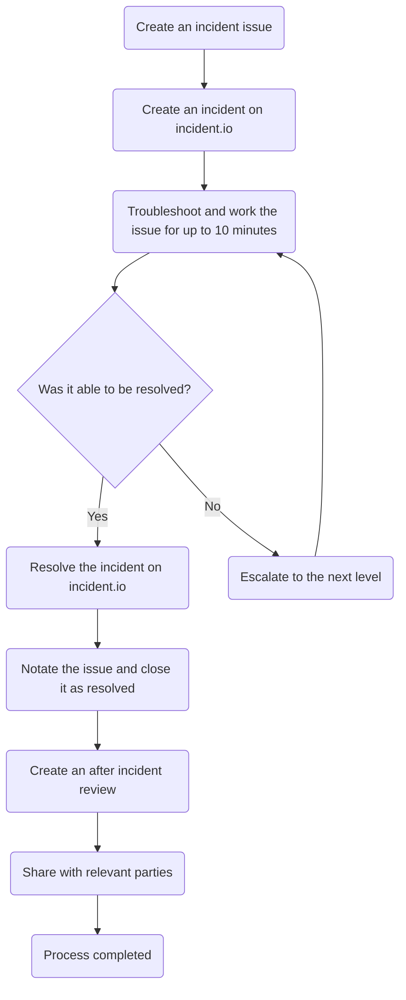
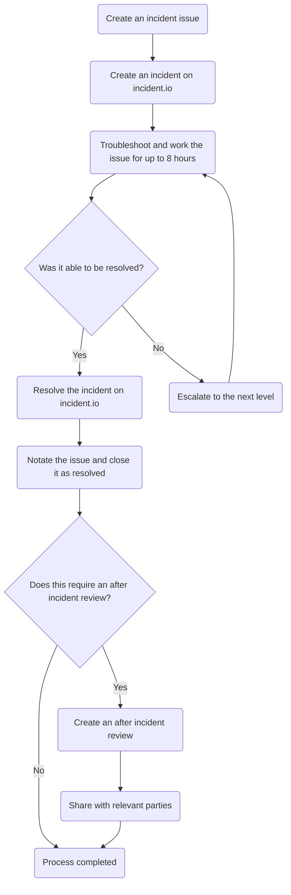

This guide explains how Customer Support Operations handles incidents - problems that cannot be resolved within 10 minutes and require structured response procedures.

The document covers our incident response framework, including how to determine incident severity, when and how to escalate, target resolution times, and post-incident review requirements. The process consists of 6-8 stages depending on severity, ensuring incidents are managed consistently from detection through resolution.

## Understanding incidents

### What are incidents

For the purposes of the Customer Support Operations team, an incident is an event, problem, or error that cannot be quickly (within 10 minutes) resolved. This can stem from a bug, a system change, a user report, etc.

## Escalation levels

In some situations, you will not be able to resolve an incident quickly enough and will need to escalate it. The current escalation levels are:

| Level | Action |
|:-----:|--------|
| 1 | Post in team channel asking for assistance |
| 2 | Page Customer Support Operations Specialist oncall |
| 3 | Page Fullstack Engineer, Customer Support Operations oncall |
| 4 | Page in Customer Support Operations leadership |

Note you technically start at a "level 0" when you begin working an incident (and go up from there as needed).

If at any point you are escalating to a higher level and find the target unavailable, you should move to the next highest level.

{}

For information on paging the Customer Support Operations team or a specific person on the Customer Support Operations team, please see:

- [Paging Customer Support Operations](/handbook/security/customer-support-operations/pagerduty/oncall/#paging-customer-support-operations)
- [Paging a specific person](/handbook/security/customer-support-operations/pagerduty/oncall/#paging-a-specific-person)

{}

## Severity

The severity of an incident is dependent on the highest [criticality level](/handbook/security/customer-support-operations/criticalities/) and highest impact level. Using these, you can determine the severity level from the table below:

|   | Impacts customers | Breaks workflows | Impaired workflows | Inconvenience |
|---|:-----------------:|:----------------:|:------------------:|:-------------:|
| Mission Critical | 1 | 1 | 2 | 2 |
| Business Critical | 1 | 2 | 2 | 3 |
| Business Operational | 2 | 2 | 3 | 4 |
| Administrative | 3 | 3 | 4 | 4 |

## Resolution times

The time we set to resolve incidents depends on their severity. This time also determine the time between each escalation.

| Severity level | Target resolution time | When to escalate |
|----------------|------------------------|------------------|
| Severity 1 | 1-2 hours | 10 minutes without resolution |
| Severity 2 | 2-4 hours | 30 minutes without resolution |
| Severity 3 | 24-48 hours | 8 hours without resolution |
| Severity 4 | 48-72 hours | 24 hours without resolution |

## Handling incidents

Handling incidents can be broken into 6-8 stages. A simplified flow of what this looks like for each severity level can be seen below:

Mission Critical items flowchart

Business Critical items flowchart

Business Operational items flowchart

Administrative items flowchart

### Stage 1 - Determine severity

When an incident occurs and you begin working it, the first thing you need to do is determine the highest severity level. This is done by reviewing all the systems and items impacted, reviewing their individual [criticality levels](/handbook/security/customer-support-operations/criticalities/) and impact levels, and using the highest [severity value](#severity). The highest severity level is always used, regardless of scope or quantity of items in lower levels.

As a reminder, the levels hierarchy is:

Severity 1 > Severity 2 > Severity 3 > Severity 4

Once you know the highest severity level, move to [Stage 2](#stage-2---create-an-issue)

### Stage 2 - Create an issue

For all incidents, we should be creating an issue using the [Incident issue template](https://gitlab.com/gitlab-com/gl-security/corp/cust-support-ops/issue-tracker/-/issues?issuable_template=Incident). The information you put in it initially does not need to be “complete”. It will often be a simplified title (such as "Zendesk Triggers broken") and the error/problem itself that is occuring.

Once the issue is created, move to [Stage 3](#stage-3---create-an-incident-in-incidentio).

### Stage 3 - Create an incident in incident.io

After the issue has been created, you need to publish an incident via incident.io (so it shows on our status page). To do this:

1. Navigate to [Status pages](https://app.incident.io/gitlab/status-pages)
1. Click on the status page you want to make an incident on
1. Click `Publish incident` at the top-right
1. Fill out a meaningful `Name`
1. Set the `Status` of the incident
   - Investigating: Report an incident
     - This is normally what you would use as the starting point
   - Identified: Problem has been determined and a fix is being made
   - Monitoring: Fix is implemented and we are monitoring the situation
   - Resolved: Everything is good to go
1. Set a meaningful `Message` for the incident
   - You should include a link to your incident issue here
1. Set the level of impact on `Affected components` (the value needed depends on the impact of the incident)
   - No impact: The incident does not impact this component
   - Degraded performance: The component is working but at lower than standard performance levels
   - Partial outage: Significant parts of the component are not working
   - Full outage: The component is hard down
1. Click `Review incident`
1. Review all information for accuracy
1. Click `Publish incident`

Once created, move to [Stage 4](#stage-4---troubleshoot-the-incident)

### Stage 4 - Troubleshoot the incident

With that out of the way, you will work to resolve the problem. Make sure to make ample comments on the issue as you do.

As you do, remember to provide periodic updates to the incident in incident.io. In general, you should ensure it is updated every hour (even if it is simply to indicate it is still being looked into).

In some situations, you will not be able to resolve an incident quickly enough and will need to escalate it. The time between escalation levels is going to depend on the severity level of the incident (see [Resolution times](#resolution-times)).

As such, your current state is going to determine the next stage you move to:

- If you are on a reasonably timed path to resolution, continue working the incident until it is resolved. Once you have resolved the cause of the incident, move to [Stage 6](#stage-6---resolve-the-incident-in-incidentio)
- If you need to escalate to the next level, move to [Stage 5](#stage-5---escalate-the-incident)

### Stage 5 - Escalate the incident

In this stage, you are going to escalate the incident. To determine who to escalate the incident to, refer to the [Escalation levels](#escalation-levels).

Make sure to add a comment on the issue indicating you are escalating it (and the level it is being escalated to).

Once you have escalated the incident to the next level (and the target has acknowledged it), the DRI of the incident changes to the target you escalated this to.

The target of the escalation will then move back to [Stage 4](#stage-4---troubleshoot-the-incident)

### Stage 6 - Resolve the incident in incident.io

With the incident itself resolved, you need to resolve it in incident.io. To do this:

1. Login to Incident.io (via Okta)
1. Navigate to [Status pages](https://app.incident.io/gitlab/status-pages)
1. Click on the status page the incident is on
1. Click on the incident in question
1. Click the top-right status bar (says what the current status is)
1. Select the new `Status` (it should be `Resolved`)
1. Enter a meaningful message
1. Click `Review update`
1. Review all information for accuracy
1. Click `Publish update`

With that done, move to [Stage 7](#stage-7---resolve-the-issue)

### Stage 7 - Resolve the issue

Here, you need to resolve the issue previously created. Make sure to add comments detailing what was done to fix the root cause of the incident.

After making the comments, close out the issue.

If any of the following criteria are met, move to [Stage 8](#stage-8---after-incident-review):

- The highest severity level was Severity 1
- The highest severity level was Severity 2
- This required an escalation to level 3 or higher

### Stage 8 - After incident review

For this, you will utilize the [Customer Support Operations After Incident Reviews Google doc](https://docs.google.com/document/d/1aUEHYWa-RWpiUUM34yWGMxIYgFnL6qaCCXu954H5Zqo/edit?tab=t.72mh0ffa6o0f) (internal only).

Make a duplicate of the `Template` tab, and then fill it in completely. You can use previous documents as an example of what is needed.

Once you have filled everything out, make a Slack post in the [#support_operations channel](https://gitlab.enterprise.slack.com/archives/C018ZGZAMPD), making sure to CC Customer Support Operations leadership (by @ mentioning them).
