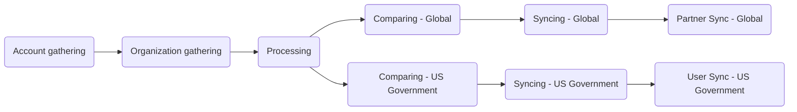

This guide documents the Zendesk-Salesforce Sync, an automated hourly process that synchronizes customer organization and user data from Salesforce (the Single Source of Truth) to Zendesk. This sync ensures accurate support entitlements, proper SLA application, and current customer metadata in Zendesk.

The sync runs through nine sequential stages via GitLab CI/CD pipelines. This documentation explains how the sync works and provides troubleshooting guidance for administrators.

Administrators should review the [Administrator tasks](#administrator-tasks) section.

{}

- Deployment type: `Ad-hoc`
- Project repos:
  - [Salesforce Accounts](https://gitlab.com/gitlab-support-readiness/zd-sfdc-sync/salesforce-accounts)
  - [Zendesk Orgs](https://gitlab.com/gitlab-support-readiness/zd-sfdc-sync/zendesk-orgs)
  - [Processor](https://gitlab.com/gitlab-support-readiness/zd-sfdc-sync/processor)
  - [Global Org Compare](https://gitlab.com/gitlab-support-readiness/zd-sfdc-sync/global-org-compare)
  - [Zendesk Global Org Sync](https://gitlab.com/gitlab-support-readiness/zd-sfdc-sync/zendesk-global-org-sync)
  - [Partner Sync](https://gitlab.com/gitlab-support-readiness/zd-sfdc-sync/partner-sync)
  - [US Government Org Compare](https://gitlab.com/gitlab-support-readiness/zd-sfdc-sync/us-gov-org-compare)
  - [Zendesk US Government Org sync](https://gitlab.com/gitlab-support-readiness/zd-sfdc-sync/zendesk-us-government-org-sync)
  - [Zendesk US Government User Sync](https://gitlab.com/gitlab-support-readiness/zd-sfdc-sync/zendesk-us-gov-user-sync)
- Managed content repos:
  - [Zendesk Global Organization Entitlement Overrides](https://gitlab.com/gitlab-com/support/zendesk-global/organization-entitlement-overrides)

{}

## Understanding the Zendesk-Salesforce Sync

### What is the Zendesk-Salesforce Sync

The Zendesk-Salesforce Sync is a collection of nine interconnected GitLab CI/CD projects that synchronize customer data from Salesforce to Zendesk. The sync handles:

- **Customer organizations**: Account metadata, support entitlements, subscription tiers, and ARR for both Zendesk Global and US Government
- **Partner organizations**: Separate sync process for partner accounts (Zendesk Global only)
- **User associations**: Automatic user-to-organization linking based on Salesforce contacts (Zendesk US Government only)

The sync runs hourly and processes data through sequential stages: gathering, processing, comparing, and syncing.

### How does Zendesk-Salesforce Sync work

The Zendesk-Salesforce Sync is a complex set of projects that run in “stages” to keep all our Zendesk production instances in sync with Salesforce. The stages for this look like:



#### Account gathering

<sup>Source project: [Salesforce Accounts](https://gitlab.com/gitlab-support-readiness/zd-sfdc-sync/salesforce-accounts)</sup>

This is the stage that starts the whole process for the Zendesk-Salesforce Sync. A scheduled pipeline on the source project runs at the top of every hour UTC (`0 * * * *`). This uses the `bin/gather` script, which does the following:

- Fetches a list of Salesforce accounts using the following SOQL query:
  <details>

  <summary>Click to expand</summary>

  ```sql
  SELECT
    Account_ID_18__c,
    Name,
    CARR_This_Account__c,
    Type,
    Ultimate_Parent_Sales_Segment_Employees__c,
    Account_Owner_Calc__c,
    Technical_Account_Manager_Name__c,
    Restricted_Account__c,
    Solutions_Architect_Lookup__r.Name,
    Account_Demographics_Geo__c,
    Account_Demographics_Region__c,
    Latest_Sold_To_Contact__r.Email,
    Latest_Sold_To_Contact__r.Name,
    Partner_Track__c,
    Partners_Partner_Type__c,
    Support_Hold__c,
    Account_Risk_Level__c,
    Support_Instance__c,
    (
      SELECT
        Id,
        Name,
        Subscription_ID_18__c,
        Zuora__Status__c,
        Zuora__SubscriptionStartDate__c,
        Zuora__SubscriptionEndDate__c,
        Sold_To_Email__c
      FROM Zuora__Subscriptions__r
      WHERE
        Zuora__Status__c != 'Cancelled' AND
        Zuora__SubscriptionEndDate__c >= #{end_date}
    ),
    (
      SELECT
        Id,
        Name,
        Zuora__SubscriptionRatePlanChargeName__c,
        Zuora__Subscription__c,
        Zuora__EffectiveStartDate__c,
        Zuora__EffectiveEndDate__c,
        Zuora__Quantity__c
      FROM Zuora__R00N40000001lGjTEAU__r
      WHERE
        Subscription_Status__c != 'Cancelled' AND
        Zuora__EffectiveEndDate__c >= #{end_date}
    )
  FROM Account
  WHERE
    Type IN ('Customer', 'Former Customer')
  ```

  </details>

- Remaps all found Salesforce accounts into account objects
  - The `sales_segment` attribute is derived from the `Ultimate_Parent_Sales_Segment_Employees__c` value
    - Sets it to all lowercase if it has a value. If no value, it is set to `unknown`
  - The `region` attribute is derived from the `Account_Demographics_Geo__c` and `Account_Demographics_Region__c` values:
    - Uses the `Account_Demographics_Geo__c` value if it is `AMER`, `APJ`, or `EMEA`.
    - If none of those values, uses the `Account_Demographics_Region__c` value if it is `AMER`, `APJ`, or `EMEA`.
    - If none of those values, it is set `nil`
  - The `restricted` attribute is derived from the `Restricted_Account__c` value:
    - Set to `true` if the `Restricted_Account__c` value is `Restricted Party`. Otherwise it is set to `false`
  - The `escalated` attribute is derived from the `Account_Risk_Level__c` value:
    - Set to `true` if the `Account_Risk_Level__c` value is `At Risk - Escalated`. Otherwise it is set to `false`
  - The `exception` attribute is derived from the `Support_Instance__c` value:
    - Set to `true` if the `Support_Instance__c` value is `federal-support`. Otherwise it is set to `false`
  - The `subs` attribute is derived from the `Zuora__Subscriptions__r` value
  - The `charges` attribute is derived from the `Zuora__R00N40000001lGjTEAU__r` value
- Creates an artifact file (`data/salesforce_accounts.json`) containing the remapped Salesforce accounts

After it finishes running, the artifact file generated is then passed to the next stage, [Organization gathering](#organization-gathering).

#### Organization gathering

<sup>Source project: [Zendesk Orgs](https://gitlab.com/gitlab-support-readiness/zd-sfdc-sync/zendesk-orgs)</sup>

This stage is triggered upon the completion of [Account gathering](#account-gathering).

This uses two scripts:

- `bin/gather_global`
- `bin/gather_us_government`

While the exact attributes vary based on script, both scripts work the same general way:

- Gather all Zendesk organizations for the instance using the [List organizations](https://developer.zendesk.com/api-reference/ticketing/organizations/organizations/#list-organizations) API endpoints
- Mapping all found organizations into account objects
- Creates an artifact file containing the remapped organizations
  - `data/zendesk_global.json` for `bin/gather_global`
  - `data/zendesk_usgov.json` for `bin/gather_us_government`

After it finishes running, the artifact files it generated, as well as the one generated by [Account gathering](#account-gathering), are then passed to the next stage, [Processing](#processing).

#### Processing

<sup>Source project: [Processor](https://gitlab.com/gitlab-support-readiness/zd-sfdc-sync/processor)</sup>

This stage is triggered upon the completion of [Organization gathering](#organization-gathering). It is the most complex of the stages (as it does all needed conversions for the sync itself).

This uses the `bin/processor` script, which does the following:

- Loads the data needed
  - Fetches an override file from the managed content project, [Zendesk Global Organization Entitlement Overrides](https://gitlab.com/gitlab-com/support/zendesk-global/organization-entitlement-overrides)
  - Reads the `data/plans.yml` file
  - Reads the data from the artifact files
- Generates lookup structures, due to the sheer amount of data being analyzed and manipulated

  | Name | Description | Object type |
  |------|-------------|-------------|
  | global_orgs_by_id | All Global organizations converted to a Hash using the salesforce_id key | Hash |
  | usgov_orgs_by_id | All US Government organizations converted to a Hash using the salesforce_id key | Hash |
  | partners_by_sfdc_id | The salesforce_id of all partner organizations | Array |
  | overrides_by_id | All overrides converted to a Hash using the salesforce_id key | Hash |
  | plan_lookup | All product charge names tied to the subscription type they align to | Hash |
  | all_valid_plans | All product charge names tied to any type of account | Array |
  | usgov_plan_names_for_exceptions | All product charge names tied to US Government accounts with an exception | Array |
  | usgov_plan_names | All product charge names tied to US Government accounts without an exception | Array |
  | today | Today's Date | Date |
  | expired_end_date | 15 days ago | Date |
  | three_years_out | 3 years and one day ago | Date |

- Determines the Global object for each account
  - Creates a Hash matching the Zendesk organization attributes
  - Analyzes all subscriptions from the corresponding Salesforce account
    - It begins by only selecting the subscriptions that would apply to the Global object depending on the account’s US Government exception setting
    - It then iterates over each one to determine the object’s subscription values based off the product charge names tied to the subscriptions of the account
  - Sets the `expiration_date` value based off the max value of all product charges effective end date
  - Checks if there is an override listed for the account (and modifies the object accordingly)
  - Sets the support_level of the object to be that of the highest level of support
    - Ultimate > Gold > Premium > Silver > Consumption Only > Custom > Community > Expired
  - Sets the `type` of the object to that of `customer` unless the object is showing as having a `support_level` of expired
  - Sets the `aar` of the object to 0 if the object is showing as having a `support_level` of expired
  - Sets the `sub_ss_ase` value to true if the object’s `sub_ss_enterprise` is true
  - Determines if the account should be included in the sync by checking the relationship between the object’s `expiration_date` and the value of the lookup object `three_years_out` (if it is less than, it will not be included)
- Determines the US Government object for each account
  - Creates a Hash matching the Zendesk organization attributes
  - Analyzes all subscriptions from the corresponding Salesforce account
    - It begins by only selecting the subscriptions that would apply to the US Government object depending on the account’s US Government exception setting
    - It then iterates over each one to determine the object’s subscription values based off the product charge names tied to the subscriptions of the account
  - Sets the `expiration_date` value based off the max value of all product charges effective end date
  - Checks if there is an override listed for the account (and modifies the object accordingly)
  - Sets the support_level of the object to be that of the highest level of support
    - Ultimate > Gold > Premium > Silver > Consumption Only > Custom > Community > Expired
  - Sets the `type` of the object to that of `customer` unless the object is showing as having a `support_level` of expired
  - Sets the `arr` of the object to 0 if the object is showing as having a `support_level` of expired
  - Sets the `sub_gitlab_dedicated` and `sub_usgov_24x7` of the object to true if the value of the object’s `usgov_fedramp` is true
  - Sets the corresponding schedule for the object (12x5 vs 24x7)
  - Determines if the account should be included in the sync by checking the relationship between the object’s `expiration_date` and the value of the lookup object `three_years_out` (if it is less than, it will not be included)
- Creates artifact files from the various objects:
  - `data/global_accounts.json` for Global objects
  - `data/usgov_accounts.json` for US Government objects

After it finishes running, two separate stages are triggered:

- [Comparing - Global](#comparing---global), passing the artifact files from [Organization gathering](#organization-gathering) and `data/global_accounts.json`
- [Comparing - US Government](#comparing---us-government), passing the artifact files from [Organization gathering](#organization-gathering) and `data/usgov_accounts.json`

#### Comparing - Global

<sup>Source project: [Global Org Compare](https://gitlab.com/gitlab-support-readiness/zd-sfdc-sync/global-org-compare)</sup>

This stage is triggered upon the completion of [Processing](#processing).

This uses the `bin/compare` script, which does the following:

- Reads the data from the artifact files
- Runs all data through a comparison, using `salesforce_id` as the unifying field (the one that ties a Zendesk organization to an organization object) to generate three arrays:
  - `zendesk_only_objects`, which equates to Zendesk organizations without a matching organization object
  - `ssot_only_objects`, which equates to organization objects without a matching Zendesk organization
  - `different_objects`, which equates to organization objects that have a matching Zendesk organization but the data within the two is not equal
- It then generates three artifacts:
  - `data/global_updates.json`, which contains the items in `different_objects`
  - `data/global_creates.json`, which contains the items in `ssot_only_objects` minus those that have a `support_level` of `expired`
  - `data/global_not_in_sync.json`, which contains the items in `zendesk_only_objects` minus:
    - Those with a `type` of `alliance_partner`, `open_partner`, or `select_partner`
    - Those with a `salesforce_id` contained in the array defined by the `protected_ids` function

After it finishes running, the artifact files it generated are then passed to the next stage, [Syncing - Global](#syncing---global).

#### Comparing - US Government

<sup>Source project: [US Government Org Compare](https://gitlab.com/gitlab-support-readiness/zd-sfdc-sync/us-gov-org-compare)</sup>

This stage is triggered upon the completion of [Processing](#processing).

This uses the `bin/compare` script, which does the following:

- Reads the data from the artifact files
- Runs all data through a comparison, using `salesforce_id` as the unifying field (the one that ties a Zendesk organization to an organization object) to generate three arrays:
  - `zendesk_only_objects`, which equates to Zendesk organizations without a matching organization object
  - `ssot_only_objects`, which equates to organization objects without a matching Zendesk organization
  - `different_objects`, which equates to organization objects that have a matching Zendesk organization but the data within the two is not equal
- It then generates three artifacts:
  - `data/usgov_updates.json`, which contains the items in `different_objects`
  - `data/usgov_creates.json`, which contains the items in `ssot_only_objects` minus those that have a `support_level` of `expired`
  - `data/usgov_not_in_sync.json`, which contains the items in `zendesk_only_objects` minus:
    - Those with a `salesforce_id` contained in the array defined by the `protected_ids` function

After it finishes running, the artifact files it generated are then passed to the next stage, [Syncing - US Government](#syncing---us-government).

#### Syncing - Global

<sup>Source project: [Zendesk Global Org Sync](https://gitlab.com/gitlab-support-readiness/zd-sfdc-sync/zendesk-global-org-sync)</sup>

This stage is triggered upon the completion of [Comparing - Global](#comparing---global).

This uses the `bin/sync` script, which does the following:

- Reads the data from the artifact files
- Iterates through the list of objects from the `data/global_creates.json` artifact file to do the following:
  - Create the organization using the Zendesk [Create Organization](https://developer.zendesk.com/api-reference/ticketing/organizations/organizations/#create-organization) API endpoint
  - Associate users from the `sold_tos` attribute to the newly created organization
    - In the event no users can be associated, a post is made in the [#support_operations Slack channel](https://gitlab.enterprise.slack.com/archives/C018ZGZAMPD) notifying the Customer Support Operations team
- Splits the objects from the `data/global_updates.json`  artifact file into batches (of up to 100 due to API limits) to do the following:
  - Create an update job using the Zendesk [Update Many Organizations](https://developer.zendesk.com/api-reference/ticketing/organizations/organizations/#update-many-organizations) API endpoint (to update them to match what was previously determined)
- Splits the objects from the `data/global_not_in_sync.json`  artifact file into batches (of up to 100 due to API limits) to do the following:
  - Create an update job using the Zendesk [Update Many Organizations](https://developer.zendesk.com/api-reference/ticketing/organizations/organizations/#update-many-organizations) API endpoint (to update them to mark them for deletion)

After it finishes running, the next stage, [Partner Sync - Global](#partner-sync---global), is triggered.

#### Syncing - US Government

<sup>Source project: [Zendesk US Government Org sync](https://gitlab.com/gitlab-support-readiness/zd-sfdc-sync/zendesk-us-government-org-sync)</sup>

This stage is triggered upon the completion of [Comparing - US Government](#comparing---us-government).

This uses the `bin/sync` script, which does the following:

- Reads the data from the artifact files
- Iterates through the list of objects from the `data/usgov_creates.json` artifact file to do the following:
  - Create the organization using the Zendesk [Create Organization](https://developer.zendesk.com/api-reference/ticketing/organizations/organizations/#create-organization) API endpoint
- Splits the objects from the `data/usgov_updates.json`  artifact file into batches (of up to 100 due to API limits) to do the following:
  - Create an update job using the Zendesk [Update Many Organizations](https://developer.zendesk.com/api-reference/ticketing/organizations/organizations/#update-many-organizations) API endpoint (to update them to match what was previously determined)
- Splits the objects from the `data/usgov_not_in_sync.json`  artifact file into batches (of up to 100 due to API limits) to do the following:
  - Create an update job using the Zendesk [Update Many Organizations](https://developer.zendesk.com/api-reference/ticketing/organizations/organizations/#update-many-organizations) API endpoint (to update them to mark them for deletion)

After it finishes running, the next stage, [User Sync - US Government](#user-sync---us-government), is triggered.

#### Partner Sync - Global

<sup>Source project: [Partner Sync](https://gitlab.com/gitlab-support-readiness/zd-sfdc-sync/partner-sync)</sup>

This stage is triggered upon the completion of [Syncing - Global](#syncing---global). It acts as the final stage for the Zendesk-Salesforce Sync from a Zendesk Global perspective.

This stage is a multi-script process:

1. `bin/salesforce`, which does the following:
   - Fetches a list of Salesforce accounts using the following SOQL query:
     <details>

     <summary>Click to expand</summary>

     ```sql
     SELECT
       Account_ID_18__c,
       Name,
       Account_Owner_Calc__c,
       Technical_Account_Manager_Name__c,
       Restricted_Account__c,
       Solutions_Architect_Lookup__r.Name,
       Partner_Track__c,
       Support_Hold__c,
       Account_Risk_Level__c,
       Type,
       Partners_Partner_Status__c
     FROM Account
     WHERE
       Account_ID_18__c = 'REDACTED' OR
       (
         Type = 'Partner' AND
         Partners_Partner_Status__c IN ('Authorized') AND
         Partner_Track__c IN ('Open', 'Select')
       )
     ```

     </details>

   - Remaps all found Salesforce accounts into account objects
     - The `account_type` attribute is derived from the `Partner_Track__c`and `Account_ID_18__c` values:
       - Set to `alliance_partner` if it `Account_ID_18__c` is the value of a specific Salesforce account
       - Set to `open_partner` if `Partner_Track__c` is `Open`
       - Set to `select_partner` if `Partner_Track__c` is `Select`
       - Set to `nil` if no previously matching criteria
     - The `restricted_account` attribute is derived from the `Restricted_Account__c` value:
       - Set to `true` if the `Restricted_Account__c` value is `Restricted Party`. Otherwise it is set to `false`
     - The `org_in_escalated_state` attribute is derived from the `Account_Risk_Level__c` value:
       - Set to `true` if the `Account_Risk_Level__c` value is `At Risk - Escalated`. Otherwise it is set to `false`
   - Creates an artifact file (`data/salesforce_accounts.json`) containing the remapped Salesforce accounts
1. `bin/zendesk`, which does the following:
   - Gathers all Zendesk organizations for the instance using the [List organizations](https://developer.zendesk.com/api-reference/ticketing/organizations/organizations/#list-organizations) API endpoint
   - Filters out non-partner type organizations (`account_type` is either `alliance_partner`, `open_partner`, or `select_partner`)
   - Mapping all remaining organizations into organizations objects
   - Creates an artifact file (`data/zendesk_orgs.json`) containing the remapped organizations
1. `bin/compare`, which does the following:
   - Reads the data from the artifact files
   - Runs all data through a comparison, using `salesforce_id` as the unifying field (the one that ties a Zendesk organization to an organization object) to generate three arrays:
     - `zendesk_only_objects`, which equates to Zendesk organizations without a matching organization object
     - `ssot_only_objects`, which equates to organization objects without a matching Zendesk organization
     - `different_objects`, which equates to organization objects that have a matching Zendesk organization but the data within the two is not equal
   - It then generates three artifacts:
     - `data/updates.json`, which contains the items in `different_objects`
     - `data/creates.json`, which contains the items in `ssot_only_objects`
     - `data/not_in_sync.json`, which contains the items in `zendesk_only_objects`
1. `bin/sync`, which does the following:
   - Reads the data from the artifact files
   - Iterates through the list of objects from the `data/creates.json` artifact file to do the following:
     - Create the organization using the Zendesk [Create Organization](https://developer.zendesk.com/api-reference/ticketing/organizations/organizations/#create-organization) API endpoint
   - Splits the objects from the `data/updates.json`  artifact file into batches (of up to 100 due to API limits) to do the following:
     - Create an update job using the Zendesk [Update Many Organizations](https://developer.zendesk.com/api-reference/ticketing/organizations/organizations/#update-many-organizations) API endpoint (to update them to match what was previously determined)
   - Splits the objects from the `data/not_in_sync.json`  artifact file into batches (of up to 100 due to API limits) to do the following:
     - Create an update job using the Zendesk [Update Many Organizations](https://developer.zendesk.com/api-reference/ticketing/organizations/organizations/#update-many-organizations) API endpoint (to update them to mark them for deletion)

#### User Sync - US Government

<sup>Source project: [Zendesk US Government User Sync](https://gitlab.com/gitlab-support-readiness/zd-sfdc-sync/zendesk-us-gov-user-sync)</sup>

This stage is triggered upon the completion of [Syncing - US Government](#syncing---us-government). It acts as the final stage for the Zendesk-Salesforce Sync from a Zendesk US Government perspective.

This stage is a multi-script process:

1. `bin/zendesk_orgs_gather`, which does the following:
   - Gathers all Zendesk organizations for the instance using the [List organizations](https://developer.zendesk.com/api-reference/ticketing/organizations/organizations/#list-organizations) API endpoint
   - Mapping all organizations into organizations objects
   - Creates an artifact file (`data/zendesk_orgs.json`) containing the remapped organizations
1. `bin/zendesk_users_gather`, which does the following:
   - Gathers all Zendesk users for the instance using the [List Users](https://developer.zendesk.com/api-reference/ticketing/users/users/#list-users) API endpoint
   - Filtering out all protected users (those with an email domain of `gitlab.com` or our controlled end user's email address)
   - Mapping all users into user objects
   - Creates an artifact file (`data/zendesk_users.json`) containing the remapped users
1. `bin/salesforce`, which does the following:
   - Reads the artifact file `data/zendesk_orgs.json` to split the list into chunks of 500 (due to SOQL limits) containing only the value of the `salesforce_id` value
   - Fetches a list of Salesforce contacts using the following SOQL query:
     <details>

     <summary>Click to expand</summary>

     ```sql
     SELECT
       Name,
       Email,
       Account.Account_ID_18__c
     FROM Contact
     WHERE
       Inactive_Contact__c = false AND
       Role__c INCLUDES ('Gitlab Admin') AND
       Name != '' AND
       Email != '' AND
       Account.Account_ID_18__c IN (#{chunk.map { |i| "'#{i}'" }.join(',')})
     ```

     </details>

     - Where the `chunk` portion is the list of `salesforce_id` values in each chunk
   - Remaps all found Salesforce contacts into contact
     - The `organization_id` attribute is derived from the `id` value of a matching Zendesk organization's `salesforce_id` value
   - Removes any invalid contacts
     - Missing an `email` value
     - Any duplicates (matched by the `email` value)
   - Creates an artifact file (`data/salesforce_contacts.json`) containing the remapped Salesforce contacts
1. `bin/compare`, which does the following:
   - Reads the data from the artifact files
   - Runs all data through a comparison, using `email` as the unifying field (the one that ties a Zendesk user to a user object) to generate three arrays:
     - `zendesk_only_objects`, which equates to Zendesk organizations without a matching organization object
     - `ssot_only_objects`, which equates to organization objects without a matching Zendesk organization
     - `different_objects`, which equates to organization objects that have a matching Zendesk organization but the data within the two is not equal
   - It then generates three artifacts:
     - `data/updates.json`, which contains the items in `different_objects`
     - `data/creates.json`, which contains the items in `ssot_only_objects`
     - `data/not_in_sync.json`, which contains the items in `zendesk_only_objects`
1. `bin/sync`, which does the following:
   - Reads the data from the artifact files
   - Iterates through the list of objects from the `data/creates.json` artifact file to do the following:
     - Create the user using the Zendesk [Create User](https://developer.zendesk.com/api-reference/ticketing/users/users/#create-user) API endpoint
   - Splits the objects from the `data/updates.json`  artifact file into batches (of up to 100 due to API limits) to do the following:
     - Create an update job using the Zendesk [Update Many Users](https://developer.zendesk.com/api-reference/ticketing/users/users/#update-many-users) API endpoint (to update them to match what was previously determined)
   - Splits the objects from the `data/not_in_sync.json`  artifact file into batches (of up to 100 due to API limits) to do the following:
     - Create an update job using the Zendesk [Update Many Users](https://developer.zendesk.com/api-reference/ticketing/users/users/#update-many-users) API endpoint (to update them to mark them for deletion)

## Administrator tasks

{}

- This action requires `Developer` level access to the Zendesk-Salesforce Sync projects.

{}

### Modifying the Zendesk-Salesforce Sync

{}

- This should only be done if there is a corresponding request issue (Feature Request, Administrative, Bug, etc.). If one does not exist, you should first create one (and let it go through the standard process before working it).

{}

To modify the Zendesk-Salesforce Sync, you will need to create a MR in the corresponding project repo (which one depends on the change being made). The exact changes being made will depend on the request itself.

After a peer reviews and approves your MR, you can merge the MR. Being this is an `Ad-hoc` deployment type, the changes will be used in the next scheduled run.

#### Quick reference on what changes occur where

- SKU changes: see our [SKU Mapping documentation](/handbook/security/customer-support-operations/salesforce/skus) for more information
- Changing entitlement calculations: Modifications will occur in the [Processor](https://gitlab.com/gitlab-support-readiness/zd-sfdc-sync/processor) project
- Modifying the pipeline schedule: Modifications will occur in the [Salesforce Accounts](https://gitlab.com/gitlab-support-readiness/zd-sfdc-sync/salesforce-accounts) project
- Modifying object attributes: Modifications are likely to occur in _every_ project

## Common issues and troubleshooting

### Runner errors

This can include runners failing completely, timing out, etc. When these occur, you have two course of action you can take:

- Restart the sync from the beginning
- Wait for the next run of the sync to occur

If the issue occurred early into the run (within the first 5-10 minutes of the hour), restarting it is an acceptable way to go. Anything later than that, and you should wait for the next run of the sync to occur.

If you see this occur repeatedly, please file an issue to notify the Fullstack Engineer.

### Long running jobs

The complete process should never take more than 45 minutes. If you encounter alerts about long running jobs, the best move is to do one of the following:

- Cancel the older pipeline
- Cancel the newer pipeline

The one left running will be able to handle this (since there is not a cache being used) and should self-correct.

If you see this occur repeatedly, please file an issue to notify the Fullstack Engineer.

### Data mismatches

These can be complex to work out, as it is either a problem in calculation or a problem in expectation. Careful review of the data in the source (Salesforce, Zendesk) will be required to determine if there is actually a data mismatch (i.e. a problem in calculation) or simply a problem in expectation.

- For problems in calculation, please file a bug report to notify the Fullstack Engineer.
- For problems in expectation, explain the difference and why it is the value it is.
  - If that conversation results in a desire to change the calculations, please have the reporter file a feature request issue.

### Script errors

The various scripts used for this have been coded in a way to try to provide as much detail as possible. When you encounter a script error, you first need to conclude if it is actually a script error or simply a problem in networking (causing a script error).

The easiest way to be sure is to look at the past run of the sync and the one after it. A true script error will repeat itself every time. If you do not see it occurring every time, it is a problem in networking.

- For a problem in networking, see [Runner errors](#runner-errors)
- For a true script error, please file an issue to notify the Fullstack Engineer
