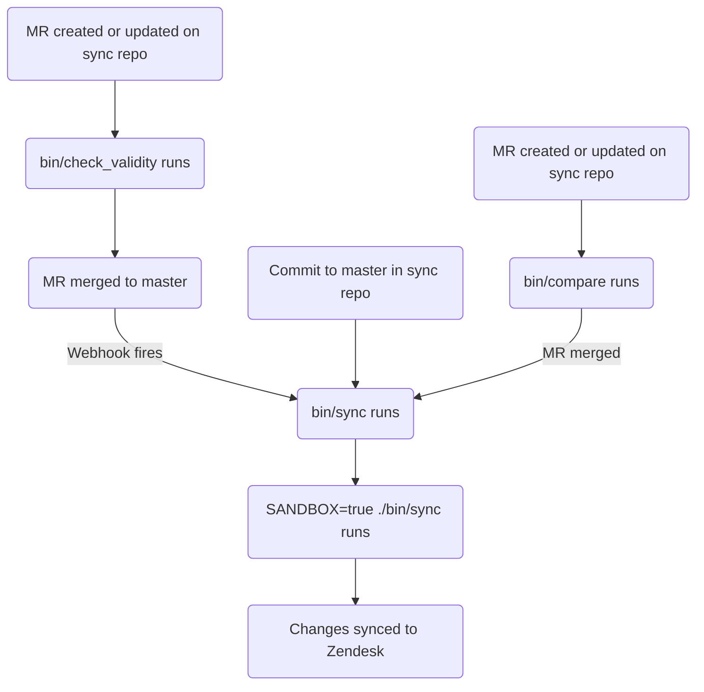

This guide covers how to create, edit, and manage Zendesk articles at GitLab. If you're a support agent looking for information on managing articles, please see [Global Knowledge Base](/handbook/support/knowledge-base/). Administrators should review the [Administrator tasks](#administrator-tasks) section.

{}

- Deployment type: `Ad-hoc`
- Sync repos
  - [Zendesk Global](https://gitlab.com/gitlab-support-readiness/zendesk-global/articles)
  - [Zendesk US Government](https://gitlab.com/gitlab-support-readiness/zendesk-us-government/articles)
- Managed content repo: [Articles](https://gitlab.com/gitlab-com/support/articles)

{}

## Understanding articles

### What are articles

Articles are knowledge base items within the Zendesk knowledge center that contain information. The information within can vary greatly, but generally speaking it can be troubleshooting information, in-depth setup guides, etc.

Currently, they are primarily created and managed by the Customer Support team.

The knowledge center uses a three-level structure:

- **Categories** (top level) - Organize major topic areas, documented on [categories page](/handbook/security/customer-support-operations/zendesk/knowledge-center/categories)
- **Sections** (middle level) - Subdivide categories into related groups, documented on [sections page](/handbook/security/customer-support-operations/zendesk/knowledge-center/sections)
- **Articles** (content level) - Individual help articles, documented on this page

### What are placements

Placements determine which sections an article appears in within the knowledge center. An article can have multiple placements, which allows it to appear in different sections simultaneously.

**Important:** Each placement creates a duplicate of the article in Zendesk. The articles share the same content but exist as separate objects in different sections. Changes to one placement affect all placements of that article.

### How we manage articles

While Zendesk offers a full way to manage articles via the UI, we turn to a more version controlled methodology. This allows for a set review process, the ability to perform rollbacks as needed, etc.

That being the case, we utilize the sync repos and managed content repos.

### How the sync repo works

The sync repo workflow follows this process:

#### In the managed content repo

When a merge request is created or updated on the managed content repo, the `bin/check_validity` script runs via CI/CD. This script does the following:

- Loops over all files ending in the extension `.md`, doing the following
  - Skips the iteration if the filename if `README.md`
  - Parses the file as a front matter file into an object
    - If it cannot be parsed as a front matter file, it stores the filename and an error string to a variable and goes to the next iteration
  - Checks if the object has metadata
    - If it does not contain metadata, it stores the filename and an error string to a variable and goes to the next iteration
  - Does checks over each required attribute (for any issues, it stores the filename and an error string to a variable):
    - `title`
      - Checks it is a String
    - `previous_title`
      - Checks it is a String
    - `category`
      - Checks it is a String
      - Checks it is an allowed category
        - See [Current categories in use](/handbook/security/customer-support-operations/zendesk/knowledge-center/categories#current-categories-in-use) for a list of categories
    - `section`
      - Checks it is a String
      - Checks it is an allowed section
        - See [Current sections in use](/handbook/security/customer-support-operations/zendesk/knowledge-center/sections#current-sections-in-use) for a list of sections
    - `author`
      - Checks it is a String
    - `tags`
      - Checks it is an Array
    - `labels`
      - Checks it is an Array
    - `instances`
      - Checks it is an Array
      - Checks it is an allowed instance
        - `Global`
        - `Global Sandbox`
        - `US Government`
        - `US Government Sandbox`
      - Checks it has at least one instance listed
    - `public`
      - Checks it is a Boolean
    - `convert_markdown`
      - Checks it is a Boolean
  - Stores the title to the `titles` variable (for later checking)
- Checks the contents of the `titles` variable for any duplicate titles in use
  - If any are found, it stores the list of duplicates in a variable
- Checks for any issues in the `errors` variable (used in all above checks to store problems)
  - If `errors` has any values, it outputs them and exits with an exit code of 1

When a a commit is made to the default branch (such as when a merge request is merged), two [GitLab webhooks](https://docs.gitlab.com/user/project/integrations/webhooks/) are fired, trigging CI/CD pipelines in the sync repos.

#### In the sync repos

{}

- All CI/CD jobs for sync repos will begin by cloning the Support Team YAML files project and the managed content project.
- When a merge request is created or updated on the managed content repo, the `bin/check_validity` script runs via CI/CD. This validates the article metadata before allowing it to be merged, enabling a smoother sync process in the sync repos. For details on what is validated, see [In the managed content repo](#in-the-managed-content-repo).

{}

When a merge request is created or updated on the sync repos, `./bin/compare` script is run (both for production and sandbox environments), doing the following:

- Fetches a list of all Zendesk articles (and their translations)
- Fetches a list of all Zendesk categories
- Fetches a list of all Zendesk sections
- Fetches a list of all Zendesk brands
- Fetches a list of all Zendesk content tags
- Fetches a list of all Zendesk article labels
- Fetches a list of all Zendesk permission groups
- Loops over all files ending in the extension `.md` in the managed content repo, doing the following:
  - Skips the iteration if the filename if `README.md`
  - Skips the iteration if the filename path contains `/Templates/`
  - Parses the file as a front matter file into an object
  - Analyzes the file to determine:
    - the corresponding content tags to use
      - If none exists, it stores a creation object
    - if a title update is occurring:
      - It looks for an existing Zendesk article that has a `title` attribute matching the managed content file's `title` value
      - If no Zendesk article exists, it rechecks if a Zendesk articles exists that has a `title` attribute matching the managed content file's `previous_title` value
        - If one does, it stores that a title update is occurring (so it knows how to locate it later)
    - loops over the article labels to determine if they need to be created
  - Creates a repo article object to use in later comparisons
- Loops over all repo article objects, doing the following:
  - Locates the matching Zendesk article
    - If none exists, it stores a creation object
  - Compares the repo article object's metadata values to the Zendesk article's metadata values
    - If differences are found, it stores an article update object
  - Compares the repo article object's translation to the Zendesk article's translation
    - If differences are found, it stores a translation update object
- It then reports on:
  - Content tag creations needed
  - Article label creations needed
  - Article creations needed
  - Article updates needed
  - Translation updates needed

{}

A manual job can be run in the merge request's CI/CD pipelines to trigger the `bin/sync` script for the sandbox environment (this is optional, but useful for validation purposes).

{}

When a CI/CD pipeline is triggered (via a [GitLab webhook](https://docs.gitlab.com/user/project/integrations/webhooks/) from the managed content repo) or a commit is made to the default branch (such as when a merge request is merged), the `bin/sync` script runs, doing the following:

- Does the same tasks as the `bin/compare` script
  - Instead of storing the need to create content tags, it creates them via the [Zendesk API](https://developer.zendesk.com/api-reference/help_center/help-center-api/content_tags/#create-content-tag)
  - It does not do a report at the end of run
- Creates any needed labels using the [Zendesk API](https://developer.zendesk.com/api-reference/help_center/help-center-api/article_labels/#create-label)
- Creates any needed articles using the [Zendesk API](https://developer.zendesk.com/api-reference/help_center/help-center-api/articles/#create-article)
- Updates all needed articles' metadata values using the [Zendesk API](https://developer.zendesk.com/api-reference/help_center/help-center-api/articles/#update-article)
- Updates all needed articles' translation using the [Zendesk API](https://developer.zendesk.com/api-reference/help_center/help-center-api/translations/#update-translation)

### Requesting the deletion of an article

To request the deletion of an article, you need to first modify the managed content file of the article (to prevent the article's re-creation).

- If deleting the article from a specific Zendesk instance, modify the article's managed content file to remove the corresponding Zendesk instance from the `instances` attribute
- If deleting the article from all Zendesk instances, delete the article's managed content file

After that has been done, please create a [Feature Request issue](https://gitlab.com/gitlab-com/gl-security/corp/cust-support-ops/issue-tracker/-/issues/new?description_template=Feature) (as it will require manual intervention by the Customer Support Operations team).

### Requesting the deletion of a placement from an article

To request the deletion of a placement from an article, please create a [Feature Request issue](https://gitlab.com/gitlab-com/gl-security/corp/cust-support-ops/issue-tracker/-/issues/new?description_template=Feature) (as it will require manual intervention by the Customer Support Operations team).

## Administrator tasks

{}

- All sections in this section require `Administrator` level access to Zendesk.

{}

### Moving articles to a new location

{}

- This is for documentation purposes only. If an article needs to be moved to a new section, it should be done via the managed content file.

{}

To move an article to a different location:

1. Access the category containing the sections
1. Click the name of the section the article is currently under
1. Locate the article in question and click the three vertical dots to the right of the article
1. Click `Move to`
1. Select the location you want to move the article to
1. Click `Move`

### Deleting a placement from an article

{}

- This is a permanent action. It cannot be undone. Exercise caution.
- This should only be done if there is a corresponding request issue (Feature Request). If one does not exist, you should first create one (and let it go through the standard process before working it).

{}

Very rarely, we will be requested to delete a placement from an article. This is done by:

1. [Accessing the knowledge center](../knowledge-center/#accessing-the-knowledge-center)
1. Locate the article in question and click on the title (to open the editor)
1. Locate the placement to delete in the `Placements` panel on the right-hand side of the editor
1. Click the three vertical dots
1. Click `Delete`
1. Click `Delete placement` to confirm the deletion

## Common issues and troubleshooting

This is a living section that will have items added to it as needed.

### Not seeing article changes after a merge

The sync does usually need 5-10 minutes to fully run. After that time, you should hard refresh Zendesk in your browser (and then check for the changes).
