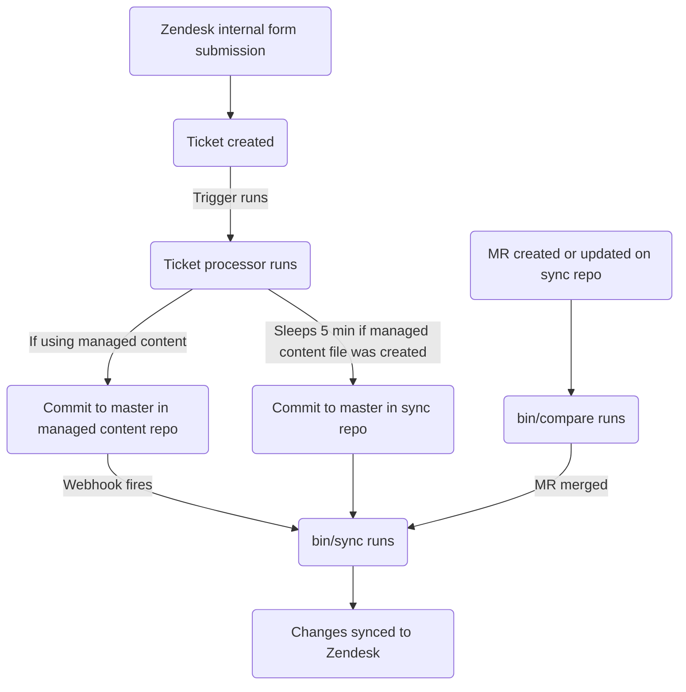

This guide covers how to create, edit, and manage Zendesk macros at GitLab. If you're a support agent looking to create a simple macro, see [Creating a macro as a non-admin](#creating-a-macro-as-a-non-admin). Administrators should review the [Administrator tasks](#administrator-tasks) section.

{}

- Deployment type: `Ad-hoc`
- Sync repos
  - [Zendesk Global](https://gitlab.com/gitlab-support-readiness/zendesk-global/macros)
  - [Zendesk US Government](https://gitlab.com/gitlab-support-readiness/zendesk-us-government/macros)
- Managed content repos
  - [Zendesk Global](https://gitlab.com/gitlab-com/support/zendesk-global/macros)
  - [Zendesk US Government](https://gitlab.com/gitlab-com/support/zendesk-us-government/macros)

{}

## Understanding Macros

### What are macros

As per [Zendesk](https://support.zendesk.com/hc/en-us/articles/4408844187034-Creating-macros-for-repetitive-ticket-responses-and-actions):

> A macro is a prepared response or action that an agent can manually apply when they are creating or updating tickets. Macros contain actions that can update ticket properties.
>
> Unlike triggers and automations, macros only contain actions, not conditions. Conditions aren't used because nothing is automatically evaluating tickets to determine if a macro should be applied. Agents evaluate tickets and apply macros manually as needed.

### Macro categorization

Macros in Zendesk have categorization but it is not obvious in the UI. Instead, the categorization is determined based on the name of the macro itself. Essentially, every group of words becomes a "folder" of sorts in the macros dropdown selector. The separator currently used by Zendesk is two colons (`::`).

### Simple vs. Advanced macros

A simple macro is one that only would modify the following:

- Ticket assignment (or removal thereof)
- Adding tags to the ticket
- Adding a public or private comment to a ticket
- Changing the status of a ticket

If a macro would do anything other than those listed items, it is deemed "advanced" at this time.

### Using a macro in Zendesk

There are two ways to apply a macro to a ticket:

- Via slash commands
- Via the macro selection drop-down

For more information, please see [Zendesk documentation](https://support.zendesk.com/hc/en-us/articles/4408887656602-Using-macros-to-update-tickets)

### How we manage macros

While Zendesk offers a full way to manage macros via the UI, we turn to a more version controlled methodology. This allows for a set review process, the ability to perform rollbacks as needed, etc.

That being the case, we utilize the Zendesk internal forms, sync repos, and managed content repos.

### How the sync repo works

The sync repo workflow follows this process:



#### Human readable replacements

{}

- Only applies to `administrators` creating/editing macros via YAML files

{}

Currently, the sync repo can perform replacements of various items from a human readable item to the "Zendesk" equivalent item. This includes:

| Human readable item | Zendesk field item | Action location | Notes |
|---------------------|--------------------|-----------------|-------|
| `'Brand: XXX'` | `brand_id` | `value` | Replace `XXX` with the `name` of the brand |
| `'Field: XXX'` | `custom_fields_xxx` | `field` | Replace `XXX` with the `title` of the ticket field |
| `'Group: XXX'` | `group_id` | `value` | Replace `XXX` with the `name` of the group |
| `'XXX'` | `role` | `value` | Replace `XXX` with the `name` of the role type OR the email address of the requester |
| `'Form: XXX'` | `ticket_form_id` | `value` | Replace `XXX` with the `name` of the ticket form |
| `'Schedule: XXX'` | `set_schedule` | `value` | Replace `XXX` with the `name` of the schedule |
| `'Schedule: XXX'` | `schedule_id` | `value` | Replace `XXX` with the `name` of the schedule |
| `'XXX'` | `organization_id` | `value` | Replace `XXX` with the `salesforce_id` attribute of the organization |
| `'XXX'` | `assignee_id` | `value` | Replace `XXX` with the email address of the agent |
| `'XXX'` | `satisfaction_reason_code` | `value` | Replace `XXX` with the `name` of the satisfaction reason |
| `'XXX'` | `via_id` | `value` | Replace `XXX` with the `name` of the via type |
| `'XXX'` | `requester_role` | `value` | Replace `XXX` with the `name` of the requester role type |

As an example, if you wanted a macro to change the value of the field `Preferred Region for Support` to `AMER`, you would do the following to use the replacement:

```yaml
- field: 'Field: Preferred Region for Support'
  value: 'AMER'
```

#### When creating MRs in the sync repo

When a MR is created on the sync repo, it performs the compare actions (via the `bin/compare` script), which does the following:

1. Performs a clone of the managed content repo
1. Fetches all brands, ticket fields, ticket forms, groups, schedules, satisfaction reasons, and macros from the Zendesk instance
1. Reviews all YAML files within the sync repo to generate a macro object
   - It also checks to ensure none of the following problems exist in the sync repo files:
     - A title is missing
     - A file with the `active` attribute of `false` is not in the `active` folder
     - A file with the `active` attribute of `true` is not in the `inactive` folder
     - There is not a duplicate use of a `title` attribute
     - Any file with the `contains_managed_content` attribute of `true` has a matching managed content file
1. Compares all macro objects from the YAML files to a matching Zendesk item (determined by checking the value of the attributes `title` and `previous_title`)
   - If none exists, it will store a create object in a variable to be used later
   - If one exists but has different attribute values, it will store an update object in a variable to be used later
1. Output a comparison report

#### Syncing to Zendesk

The sync repo performs its sync task when one of two events occur:

- The managed content repo sends a signal via a [project webhook](https://docs.gitlab.com/user/project/integrations/webhooks/) (configured to do so when a commit occurs on the `master` branch of the managed content repo)
- A commit has occurred on the `master` branch of the sync repo

When either action occurs, the sync performs the [compare actions](#when-creating-mrs-in-the-sync-repo) and then uses the objects generated to perform the needed creates and updates via a loop hitting the needed Zendesk endpoint:

- [Creates](https://developer.zendesk.com/api-reference/ticketing/business-rules/macros/#create-macro)
- [Updates](https://developer.zendesk.com/api-reference/ticketing/business-rules/macros/#update-macro)

#### Reporting orphaned managed content files

On the 1st of February, May, August, and November, a [scheduled pipeline](https://docs.gitlab.com/ci/pipelines/schedules/) will have the sync repo create an issue for the support leadership team to review all orphaned managed content files.

This is done via the `bin/find_orphaned_files` script in the sync repo, which does the following:

1. Performs a clone of the managed content repo
1. Reviews every file within the `active` and `inactive` folders of the managed content repo to determine the `state` (i.e. `active` or `inactive`, the `path`, and the `title`)
1. Reviews every file within the `active` and `inactive` folders of the sync repo itself to determine:
   - If the file is using a managed content file
   - If there is a managed content file
1. If it has located managed content files without a sync repo file, it then creates an issue reporting it to Customer Support leadership

## Creating a macro as a non-admin

### Simple macros

To get a [simple macro](#simple-vs-advanced-macros) created, you would utilize the Zendesk internal form for your instance:

- [Zendesk Global](https://gitlab-internal.zendesk.com/hc/en-us/requests/new?ticket_form_id=22784239213084&tf_22783439650716=custsuppops_ir_category_create_macro)
- [Zendesk US Government](https://gitlab-federal-internal.zendesk.com/hc/en-us/requests/new?ticket_form_id=41826926738708&tf_41825819758484=custsuppops_ir_category_create_macro)

Once the form is filled out and the request submitted, the [ticket processor](/handbook/security/customer-support-operations/zendesk/tickets/processor) will use the information provided to create your simple macro.

If a managed content file is needed for the macro (i.e. the macro will makes a comment) and one does not already exist, a file will be created for you in the managed content repo.

### Advanced macros

For the creation of an [advanced macro](#simple-vs-advanced-macros), please consult with a member of the [SIG team](https://gitlab.com/support-innovation-group) first and have them submit an issue to the Customer Support Operations team using [this template](https://gitlab.com/gitlab-com/gl-security/corp/cust-support-ops/issue-tracker/-/issues/new?issuable_template=Feature) (as it will require manual intervention by the Customer Support Operations team).

## Editing a macro as a non-admin

### Changing the comment wording used in a macro

To edit the comment wording in a macro, you will modify the corresponding file in the managed content repo. Once merged to the `master` branch, it will then sync to the Zendesk instance (via the sync repo).

### Changing title, restrictions, non-comment wording actions, and so on

To change anything else in a macro, please consult with a member of the [SIG team](https://gitlab.com/support-innovation-group) first and have them submit an issue to the Customer Support Operations team using [this template](https://gitlab.com/gitlab-com/gl-security/corp/cust-support-ops/issue-tracker/-/issues/new?issuable_template=Feature) (as it will require manual intervention by the Customer Support Operations team).

## Deactivating a macro as a non-admin

To request the deactivation of a macro, please consult with a member of the [SIG team](https://gitlab.com/support-innovation-group) first and have them submit an issue to the Customer Support Operations team using [this template](https://gitlab.com/gitlab-com/gl-security/corp/cust-support-ops/issue-tracker/-/issues/new?issuable_template=Feature) (as it will require manual intervention by the Customer Support Operations team).

## Administrator tasks

{}

- All sections in this section require `Administrator` level access to Zendesk.

{}

### Seeing macro usage information

To see the usage information on macros:

1. Navigate to the admin panel for the Zendesk instance
1. Go to `Workspaces > Agent tools > Macros`
1. Click the icon to the far right of the list of macros (looks like three vertical rectangles)
1. Click the usage columns you wish to see

### Creating a macro

{}

- This should only be done if there is a corresponding request issue (Feature Request, Administrative, Bug, etc.). If one does not exist, you should first create one (and let it go through the standard process before working it).
- If creating a macro that will use a managed content file, you must create said managed content file first.

{}

If creating a [simple macro](#simple-vs-advanced-macros), please see [Simple macros](#simple-macros).

For the creation of an [advanced macro](#simple-vs-advanced-macros), you will need to create a MR in the sync repo. The exact changes being made will depend on the request itself. A starting template you can use would be:

```yaml
---
title: 'Your::Title::Here'
previous_title: 'Your::Title::Here'
description: 'Your description here'
active: true
actions:
- field: 'the_action_to_perform'
  value: 'the_value_to_use'
restriction: null
contains_managed_content: false
```

After a peer reviews and approves your MR, you can merge the MR (which will have the changes synced to the Zendesk instance).

### Editing a macro

{}

- This should only be done if there is a corresponding request issue (Feature Request, Administrative, Bug, etc.). If one does not exist, you should first create one (and let it go through the standard process before working it).
- If changing the macro's `contains_managed_content` attribute from `false` to `true`, you must create said managed content file first.
- If changing the macro's `contains_managed_content` attribute from `true` to `false`, you should create a follow-up MR to delete the corresponding managed content file.

{}

If only modifying the comment's wording of a macro, please see [Changing the comment wording used in a macro](#changing-the-comment-wording-used-in-a-macro).

For anything else, you will need to create a MR in the sync repo. The exact changes being made will depend on the request itself.

After a peer reviews and approves your MR, you can merge the MR (which will have the changes synced to the Zendesk instance).

#### Changing the title of a macro

If you need to change the title of a macro, copy the current value into the `previous_title` attribute and then change the `title` attribute. This allows the sync to still locate the macro in question to update.

### Deactivating a macro

{}

- This should only be done if there is a corresponding request issue (Feature Request, Administrative, Bug, etc.). If one does not exist, you should first create one (and let it go through the standard process before working it).
- If the macro was using a managed content file (i.e. `contains_managed_content` attribute in the YAML file was previously set to `true`), you likely will need to also move the corresponding file from the `active` to the `inactive` location in the managed content repo.

{}

To deactivate a macro, you will need to create a MR in the sync repo. In this MR, you should do the following to the corresponding macro's YAML file:

1. Move the file from the `active` to `inactive` path
1. Modify the value of the `active` attribute to `false`
1. Change the value of `actions` to the following:
   - For Zendesk Global:

     ```yaml
     - field: 'brand_id'
       value: 'GitLab Support'
     ```

   - For Zendesk US Government:

     ```yaml
     - field: 'brand_id'
       value: 'GitLab'
     ```

1. Change the value of the `contains_managed_content` attribute to `false`

After a peer reviews and approves your MR, you can merge the MR (which will have the changes synced to the Zendesk instance).

### Deleting a macro

{}

- You can only delete a macro if it is deactivated.
- This should only be done if there is a corresponding request issue (Feature Request, Administrative, Bug, etc.). If one does not exist, you should first create one (and let it go through the standard process before working it).
- When deleting a macro, you likely will need to also remove the file from the sync and managed content repos.

{}

As the sync repos do not perform deletions, you will need to do this via Zendesk itself.

To delete a macro:

1. Navigate to the admin dashboard for the Zendesk instance
   - [Zendesk Global (production)](https://gitlab.zendesk.com/admin/home)
   - [Zendesk Global (sandbox)](https://gitlab1707170878.zendesk.com/admin/home)
   - [Zendesk US Government (production)](https://gitlab-federal-support.zendesk.com/admin/home)
   - [Zendesk US Government (sandbox)](https://gitlabfederalsupport1585318082.zendesk.com/admin/home)
1. Go to `Workspaces > Agent tools > Macros`
   - [Zendesk Global](https://gitlab.zendesk.com/admin/workspaces/agent-workspace/macros)
   - [Zendesk Global (sandbox)](https://gitlab1707170878.zendesk.com/admin/workspaces/agent-workspace/macros)
   - [Zendesk US Government](https://gitlab-federal-support.zendesk.com/admin/workspaces/agent-workspace/macros)
   - [Zendesk US Government (sandbox)](https://gitlabfederalsupport1585318082.zendesk.com/admin/workspaces/agent-workspace/macros)
1. Locate the macro you wish to delete and click on the name
1. Click the `Actions` button
1. Click `Delete`
1. Click `Delete macro` in the confirmation box

## Common issues and troubleshooting

### Not seeing macro changes after a merge

The sync does usually need 5-10 minutes to fully run. After that time, you should hard refresh Zendesk in your browser (and then check for the changes).
