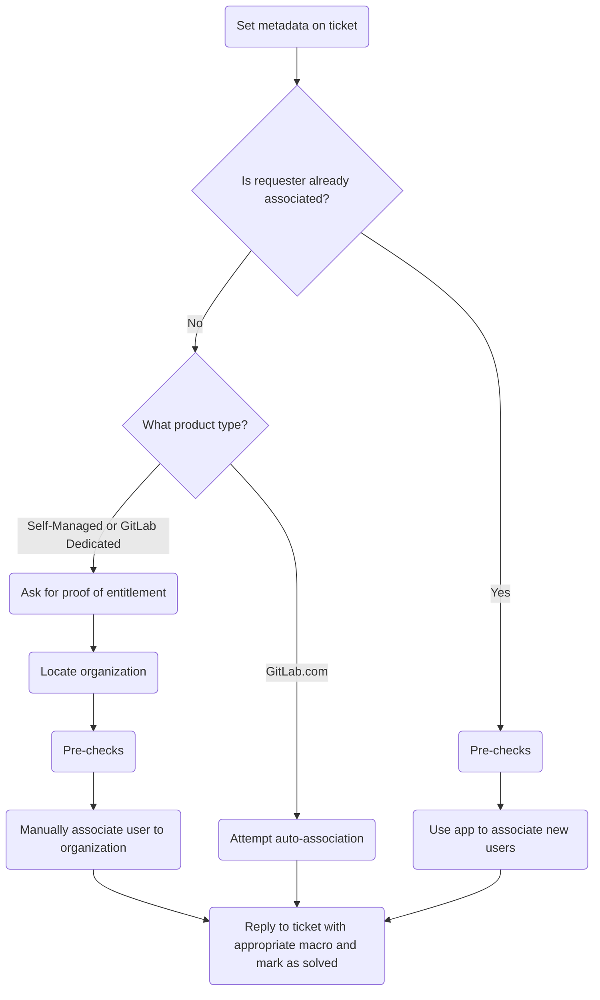

This guide covers how we perform organization association at GitLab.

{}

- Deployment type: `Ad-hoc`
- **Note**: This page only applies to Zendesk Global, as organization association is done via the [Zendesk-Salesforce sync](/handbook/security/customer-support-operations/zendesk-salesforce-sync/) for Zendesk US Government
- **Note**: It is common for users to need to be associated _and_ ask for others to be associated. Focus on the requester first (as it simplifies adding the others).

{}

## Understanding organization association

### What is organization association

Organization association is the process that ties a Zendesk user to an organization.

## The process for association

The very generalized process looks like:



### Step 1: Set metadata on the ticket

Before proceeding, you need to ensure the metadata on the ticket is populated and set properly. Normal form submission should cover most metadata, so your specific focus should be on the ticket field `Support Ops Problem Type` (which you should be setting to `Manage my organization's contacts`).

Once populated, submit an update to the ticket to ensure it is saved.

After doing this, proceed to [Step 2](#step-2-check-if-pre-authorized)

### Step 2: Check if pre-authorized

If a user is already associated to an organization, they are likely pre-authorized to manage their organization's support contacts. As such, the process for this is much simpler:

1. Perform the [Pre-checks](#pre-checks)
1. Gather the list of emails to add to the organization in a comma separated list
   - Example: `alice@example.com, bob@example.com, charlie@example.com`
1. Open the Support Ops Super App
1. Click `Associate User`
1. Put the list of emails in the input box
1. Click the `Associate` button
1. Confirm success via the app's output
1. Reply to the customer confirming the changes have been done (making sure to set the ticket's status to `Solved`)

If they are not already associated, proceed to [Step 3](#step-3-determine-product-type)

### Step 3: Determine product type

The steps from here will vary depending on the product type, so we need to know it. If the user has already provided us the information needed, use it to determine the next step to take:

- If the product type is GitLab.com, proceed to [Step 4](#step-4-attempt-auto-association)
- If the product type is Self-Managed or GitLab Dedicated, proceed to [Step 5](#step-5-ask-for-entitlement-information)

If they have no provided it, reply to the ticket asking the user for their proof of entitlement.

### Step 4: Attempt auto-association

**Note**: The app does the [Pre-checks](#pre-checks) automatically for you.

For organization's who purchased a GitLab.com subscription, the process is much simpler:

1. Open the Support Ops Super App
1. Click `Attempt Association`
1. Click the `Attempt auto-association` button

This will then perform various checks to see if the user can be auto-associated. The results will be displayed in the app.

If they are associated, reply to the customer confirming the changes have been done (making sure to set the ticket's status to `Solved`).

If they failed to associate, determine if it was an app problem or they failed entitlement checks:

- For app problems, see [Common issues and troubleshooting](#common-issues-and-troubleshooting).
- If they failed entitlement checks, send a reply with the macro indicating they are not an owner on a top-level paid namespace.

### Step 5: Ask for entitlement information

**Note**: The user in question must be using a _company_ email. If using a generic one (such as Gmail, Yahoo, etc.), we cannot proceed.

Next we need to ask for entitlement information. For Self-Managed and GitLab Dedicated users, this can come in a variety of methods:

- The requester can provide us the license ID of their subscription
- The requester can provide us the cloud activation code for their subscription
- The requester can provide us the raw license file for their subscription
- The requester can provide us a license usage export CSV file

What they provide us will determine the next steps:

- If a license ID, proceed to [Step 6](#step-6-locate-the-license-from-an-id)
- If a cloud activation code, proceed to [Step 7](#step-7-locate-the-cloud-activation)
- If a raw license file, proceed to [Step 8](#step-8-locate-the-license-from-the-key)
- If a license usage export CSV file, open the file and grab the license key value. Then proceed to [Step 8](#step-8-locate-the-license-from-the-key)

### Step 6: Locate the license from an ID

To locate the license from an ID:

1. Login to the [Customers portal admin panel](https://customers.gitlab.com/admin) via Okta
1. Navigate to the [Licenses page](https://customers.gitlab.com/admin/license)
1. Add `/xxxx` to the end of your URL (replacing `xxxx` with the license ID)

Make note of the license's URL you are at (it will be needed later for a note).

**Note**: If the cloud activation shows it is a trial (the value of the `Trial` is `Yes`), it is not a valid cloud activation (and the user has failed to pass entitlement checks). If this occurs, inform the user it is a trial and is not a valid paid subscription.

From this page, grab the value of `Zuora subscription name` and proceed to [Step 9](#step-9-locate-the-order).

### Step 7: Locate the cloud activation

To locate the cloud activation:

1. Login to the [Customers portal admin panel](https://customers.gitlab.com/admin) via Okta
1. Change your URL to `https://customers.gitlab.com/admin/cloud_activation?query=XXXX` (replacing `XXXX` with the cloud activation code)
1. Click the show button of the found cloud activation (looks like an `i` in a circle)

Make a note of the cloud activation's URL you are at (it will be needed later for a note).

**Note**: If the cloud activation shows it is a trial (the value of the `Trial` is `Yes`), it is not a valid cloud activation (and the user has failed to pass entitlement checks). If this occurs, inform the user it is a trial and is not a valid paid subscription.

From this page, grab the value of `Subscription name` and proceed to [Step 9](#step-9-locate-the-order).

### Step 8: Locate the license from the key

To locate a license from the key:

1. Login to the [Customers portal admin panel](https://customers.gitlab.com/admin) via Okta
1. Navigate to the [Licenses page](https://customers.gitlab.com/admin/license)
1. Click `Validate License`
1. Paste the key into the textarea
1. Click the `Validate` button

From this page, copy the value of the `id` attribute from the object and proceed to [Step 6](#step-6-locate-the-license-from-an-id).

### Step 9: Locate the order

To locate the order (from the subscription name):

1. Login to the [Customers portal admin panel](https://customers.gitlab.com/admin) via Okta
1. Navigate to the [Orders page](https://customers.gitlab.com/admin/order)
1. Click `Add filter` at the top-right of the page
1. Click `Subscription name`
1. Change the drop-down to the right of the `Subscription name` button to `Contains`
1. Put the subscription name (copied from previous steps) into the input box
1. Hit `Enter` or `Return` on your keyboard
1. Click the show button of the found order (looks like an `i` in a circle)

Make a note of the order's URL you are at (it will be needed later for a note).

From this page, scroll down to `Billing account`, click the link, and proceed to [Step 10](#step-10-get-billing-account-information).

### Step 10: Get billing account information

Make a note of the billing account's URL you are at (it will be needed later for a note).

Copy the value of the following:

- `Salesforce account`
- `Sold to`

At this point, you have all the needed information to proceed to [Step 11](#step-11-locate-the-organization).

### Step 11: Locate the organization

Here, you will need to use the `Salesforce account` value to locate the organization. Locating it from this depends on the character length of the value:

- For 15 character values, do a Zendesk search of `sfdc_short_id:xxx` (replacing `xxx` with the value)
- For 18 character values, do a Zendesk search of `salesforce_id:xxx` (replacing `xxx` with the value)

Make note of the organization URL you located (it will be needed later for a note) and proceed to [Step 12](#step-12-validate-information).

**Note** If you do not find an organization, please see [No organization found](#no-organization-found).

### Step 12: Validate information

Here you will need to review all the information you have to determine if the user has passed entitlement checks. The key things to check:

- Was the license/cloud activation for a trial?
  - If the license/cloud activation for a trial was for a trial, they have not passed entitlement checks.
- Does the `Sold to` value from the billing account match what the user provided when filing the ticket?
  - If it does not match, they have not passed entitlement checks.

Add an internal note collating your findings and all information gathered. It should look like the following:

<details>
<summary>If using a license</summary>

```plaintext
- License: LINK_TO_LICENSE
- Order: LINK_TO_ORDER
- Billing account: LINK_TO_BILLING_ACCOUNT
- Sold-to: SOLD_TO_EMAIL
- Salesforce ID: SALESFORCE_ACCOUNT_ID
- Organization: LINK_TO_ORGANIZATION
```

</details>
<details>
<summary>If using a cloud activation</summary>

```plaintext
- Cloud activation: LINK_TO_CLOUD_ACTIVATION
- Order: LINK_TO_ORDER
- Billing account: LINK_TO_BILLING_ACCOUNT
- Sold-to: SOLD_TO_EMAIL
- Salesforce ID: SALESFORCE_ACCOUNT_ID
- Organization: LINK_TO_ORGANIZATION
```

</details>

How you proceed from here depends on if the user passed entitlement checks:

- If they failed entitlement checks, ensure your internal comment includes the reason for failing validation, post the note, and reply to the user accordingly.
- If they passed entitlement checks, add your internal note and proceed to [Step 13](#step-13-manually-associate-the-user).

### Step 13: Manually associate the user

With all that done, you need to associate the user. To do this:

- Copy the organization's name
- Navigate to the user's page in Zendesk
- Paste the value in the `Organization` area
- Click on the matching name of the organization from what shows

After doing so, reply to the customer confirming the changes have been done (making sure to set the ticket's status to `Solved`)

## Removing associated users

If an associated user requests other associated users be removed, you will need to do this manually in Zendesk. To do this:

1. Navigate to the user in question to remove
1. Add the following to the `Notes` attribute for the user:

   > De-associated as per LINK

   - Replacing `LINK` with the ticket link you are working from
1. Click the value under `Organization`
1. Type a hyphen (i.e `-`)
1. Click the blank value (will look like `-`)

After doing so, reply to the customer confirming the changes have been done (making sure to set the ticket's status to `Solved`)

## Pre-checks

Before proceeding to associate a user to an organization, always check the following:

- The association of users to the organization would not cause the organization to surpass the 30 support contact limit
- There are not organization notes/details indicating you should not proceed with the request

If any of those checks fail, you cannot proceed. See [Common issues and troubleshooting](#common-issues-and-troubleshooting) for information on what to do when the checks have failed.

## Common issues and troubleshooting

This is a living section that will have items added to it as needed.

### Attempt auto-association app fails to locate organization

In cases where the Attempt Association app failed to locate the correct Salesforce account or organization, you will need to locate it manually.

To do this:

1. Go to the `GitLab Super App`
1. Click `User Lookup`
1. Click the `Search` button
1. Review the output under `Group memberships`
1. Locate the top-level paid namespace they are an owner of and copy it
1. Go to the `Support Ops Super App`
1. Click `Namespace Lookup`
1. Paste the namespace in the input field
1. Click the `Search` button
1. Review the output to locate the correct Salesforce account (under `Salesforce info`)
1. Do a Zendesk search of `salesforce_id:xxx` (replacing `xxx` with the value)
1. Use the found organization to [Manually associate the user](#step-13-manually-associate-the-user)

If any of that fails, make an internal note indicating what is going on and assign the ticket to the Customer Support Operations, Fullstack Engineer to review.

### Association would cause organization to surpass the 30 contact limit

If adding more users to the organization would cause it to surpass the 30 contact limit, you need to reply to the user stating the problem. Make sure to include a list of the current associated users for them to review.

Once the customer replies back telling you what changes to make to correct the problem, proceed as you normally would have in the process.

### Organization has notes or details saying not to proceed

This will vary from case to case. When in doubt, make an internal note indicating what is going on and assign the ticket to the Customer Support Operations, Fullstack Engineer to review.

### No organization found

If you found a Salesforce account, but not an organization, it can mean one of the sync mechanisms GitLab uses have had an issue.

- If the Salesforce account is missing the subscription (or the subscription is missing the product charges), the Zuora<>Salesforce sync has likely encountered an issue. You may be able to rectify this by forcing a resync. To do that:
  1. Navigate to the Billing Account in Salesforce
  1. Click the down caret at the top-right of the page (to the right of the Edit and Clone buttons)
  1. Click Sync Data from ZBilling
  1. Wait a few minutes, then re-check the subscriptions for the Salesforce Account
     - If everything looks fixed, you will need to wait 1-2 hours for the ZD<>SFDC sync to create the organization. While you wait, add an internal note about what occurred, assign it to yourself, and check back on the ticket in 1-2 hours.
     - If everything does not look fixed, use the `For anything else` bullet below
- For anything else, make an internal note indicating what is going on and assign the ticket to the Customer Support Operations, Fullstack Engineer to review
