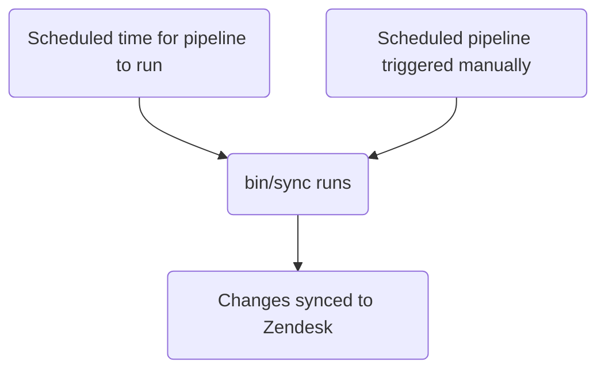

This guide covers how to create, edit, and manage Zendesk ticket fields at GitLab. Administrators should review the [Administrator tasks](#administrator-tasks) section.

{}

- Deployment type: `Standard`
- Sync repos
  - [Zendesk Global](https://gitlab.com/gitlab-support-readiness/zendesk-global/tickets/forms-and-fields)
  - [Zendesk US Government](https://gitlab.com/gitlab-support-readiness/zendesk-us-government/tickets/forms-and-fields)

{}
{}

- This is **very** closely tied with [Ticket forms](/handbook/security/customer-support-operations/zendesk/tickets/forms), especially as they run in the _same_ sync repo
- This is **very** closely tied to [Dynamic content](/handbook/security/customer-support-operations/zendesk/dynamic-content/) in Zendesk Global

{}

## Understanding ticket fields

### What are ticket fields

Ticket fields are the individual components that make up a ticket form. They can be customized to ask for specific information and help generate ticket metadata.

As per [Zendesk](https://support.zendesk.com/hc/en-us/articles/4408886739098-About-ticket-fields), there are two types of ticket fields:

> - Standard ticket fields - predefined fields that agents see in a ticket. Additional standard fields are added to the ticket page when you activate additional Zendesk Support features, such as ticket sharing. You can deactivate and reactivate some (but not all) of the standard fields.
See the [complete list of standard ticket fields](https://support.zendesk.com/hc/en-us/articles/4408886739098-About-ticket-fields#topic_drw_ft1_3nb).
> - Custom ticket fields - created in addition to standard ticket fields to gather additional information from the person who is requesting support. For example, you may add a custom field prompting them to select a product name or model number.
See the [complete list of custom ticket field types](https://support.zendesk.com/hc/en-us/articles/4408838961562).

### How we manage ticket fields

While Zendesk offers a full way to manage ticket fields via the UI, we turn to a more version controlled methodology. This allows for a set review process, the ability to perform rollbacks as needed, etc.

That being the case, we utilize sync repos.

### How the sync repo works

The sync repo workflow follows this process:



### Types of ticket fields

The most common types we use at GitLab are:

| Name | API type value | Purpose | Example use case |
|------|----------------|---------|------------------|
| Checkbox | `checkbox` | Single true/false option | "BPO Ticket" |
| Date | `date` | For date selection | "Due date" |
| Decimal | `decimal` | For numbers using decimals | "ARR associated" |
| Drop-down | `tagger` | For drop-downs allowing one selection | "Product Category" |
| Multi-line | `textarea` | For free-style fields needing multiple lines | "Troubleshooting notes" |
| Multi-select | `multiselect` | For drop-downs allowing multiple selections | "Areas impacted" |
| Numeric | `integer` | For numbers not using decimals | "GitLab.com user ID" |
| Regex | `regexp` | For text style fields that need Regex validation | "Salesforce account ID" |
| Text | `text` | For free-style fields | "GitLab issue link" |

For a full list, please see [Zendesk documentation](https://support.zendesk.com/hc/en-us/articles/4408838961562-About-custom-fields-and-custom-field-types)

#### Note about ticket field options

For `Drop-down` and `Multi-select` field types, there are custom options present on the field.

For tickets fields with custom options, you can "group" or "scope" them together by using `::` as a separator.

As an example, if you had the options:

- Red
- Blue
- Mars
- Venus

And you wanted to group like items (Colors and Planets), you would do:

- `Colors::Red`
- `Colors::Blue`
- `Planets::Mars`
- `Planets::Venus`

Which result in a drop-down that initially shows two options (`Colors` and `Planets`). When either option is clicked, the options for that groups show and are then selectable.

**Before grouping:**

- Red
- Blue
- Mars
- Venus

**After grouping:**

- Colors ▼
  - Red
  - Blue
- Planets ▼
  - Mars
  - Venus

## Creating a ticket field as a non-admin

For the creation of a ticket field, please create a [Feature Request issue](https://gitlab.com/gitlab-com/gl-security/corp/cust-support-ops/issue-tracker/-/issues/new?description_template=Feature) (as it will require manual intervention by the Customer Support Operations team).

## Editing a ticket field as a non-admin

For the modification of a ticket field, please create a [Feature Request issue](https://gitlab.com/gitlab-com/gl-security/corp/cust-support-ops/issue-tracker/-/issues/new?description_template=Feature) (as it will require manual intervention by the Customer Support Operations team).

## Deactivating a ticket field as a non-admin

To request the deactivation of a ticket field, please create a [Feature Request issue](https://gitlab.com/gitlab-com/gl-security/corp/cust-support-ops/issue-tracker/-/issues/new?description_template=Feature) (as it will require manual intervention by the Customer Support Operations team).

## Administrator tasks

{}

- All sections in this section require `Administrator` level access to Zendesk.

{}

### Viewing ticket fields

To view ticket fields on Zendesk:

1. Navigate to the admin panel for the Zendesk instance
   - [Zendesk Global (production)](https://gitlab.zendesk.com/admin/home)
   - [Zendesk Global (sandbox)](https://gitlab1707170878.zendesk.com/admin/home)
   - [Zendesk US Government (production)](https://gitlab-federal-support.zendesk.com/admin/home)
   - [Zendesk US Government (sandbox)](https://gitlabfederalsupport1585318082.zendesk.com/admin/home)
1. Go to `Objects and rules > Tickets > Fields`
   - [Zendesk Global](https://gitlab.zendesk.com/admin/objects-rules/tickets/ticket-fields)
   - [Zendesk Global (sandbox)](https://gitlab1707170878.zendesk.com/admin/objects-rules/tickets/ticket-fields)
   - [Zendesk US Government](https://gitlab-federal-support.zendesk.com/admin/objects-rules/tickets/ticket-fields)
   - [Zendesk US Government (sandbox)](https://gitlabfederalsupport1585318082.zendesk.com/admin/objects-rules/tickets/ticket-fields)

Note: You might need to change the active filter by clicking the `Filter` button if wanting to view non-active user fields

### Creating a ticket field

{}

- This should only be done if there is a corresponding request issue (Feature Request, Administrative, Bug, etc.). If one does not exist, you should first create one (and let it go through the standard process before working it).

{}

For the creation of a ticket field, you will need to create a MR in the sync repo. The exact changes being made will depend on the request itself. The exact content can vary depending on the type of ticket field.

**Note:** Templates shown for common field types. For other types (date, decimal, textarea, multiselect, regexp), modify the `type` attribute accordingly and refer to [Zendesk field documentation](https://support.zendesk.com/hc/en-us/articles/4408838961562-About-custom-fields-and-custom-field-types) for type-specific requirements.

**Tip:** Click each field type below to see its template.

<details>
<summary>checkbox</summary>

```yaml
---
title: 'Your Title Here'
previous_title: 'Your Title Here'
title_in_portal: 'Title shown to customers'
raw_title_in_portal: 'Title shown to customers' # Dynamic content placeholder can be used here
description: 'Your description for end-users here'
raw_description: 'Your description for end-users here' # Dynamic content placeholder can be used here
agent_description: 'Your description for agents here'
active: true
type: 'checkbox'
position: 9999 # Standard position value for all custom fields
required: true # If true, agents must enter a value in the field to change the ticket status to solved
regexp_for_validation: null # Always null unless "regexp"
collapsed_for_agents: false # If true, the field is shown to agents by default. If false, the field is hidden alongside infrequently used fields. Classic interface only
visible_in_portal: true # Whether this field is visible to end users in Help Center
editable_in_portal: true # Whether this field is editable by end users in Help Center
required_in_portal: true # If true, end users must enter a value in the field to create the request
tag: 'tag_to_add_when_checked' # Added onto the user when the checkbox is checked
removable: true # Always true unless a system field
custom_field_options: null # Always null unless "dropdown" or "multiselect"
```

</details>
<details>
<summary>text</summary>

```yaml
---
title: 'Your Title Here'
previous_title: 'Your Title Here'
title_in_portal: 'Title shown to customers'
raw_title_in_portal: 'Title shown to customers' # Dynamic content placeholder can be used here
description: 'Your description for end-users here'
raw_description: 'Your description for end-users here' # Dynamic content placeholder can be used here
agent_description: 'Your description for agents here'
active: true
type: 'text'
position: 9999 # Standard position value for all custom fields
required: true # If true, agents must enter a value in the field to change the ticket status to solved
regexp_for_validation: null # Always null unless "regexp"
collapsed_for_agents: false # If true, the field is shown to agents by default. If false, the field is hidden alongside infrequently used fields. Classic interface only
visible_in_portal: true # Whether this field is visible to end users in Help Center
editable_in_portal: true # Whether this field is editable by end users in Help Center
required_in_portal: true # If true, end users must enter a value in the field to create the request
tag: null # Added onto the user when the checkbox is checked, use null when not a checkbox
removable: true # Always true unless a system field
custom_field_options: null # Always null unless "dropdown" or "multiselect"
```

</details>
<details>
<summary>integer</summary>

```yaml
---
title: 'Your Title Here'
previous_title: 'Your Title Here'
title_in_portal: 'Title shown to customers'
raw_title_in_portal: 'Title shown to customers' # Dynamic content placeholder can be used here
description: 'Your description for end-users here'
raw_description: 'Your description for end-users here' # Dynamic content placeholder can be used here
agent_description: 'Your description for agents here'
active: true
type: 'integer'
position: 9999 # Standard position value for all custom fields
required: true # If true, agents must enter a value in the field to change the ticket status to solved
regexp_for_validation: null # Always null unless "regexp"
collapsed_for_agents: false # If true, the field is shown to agents by default. If false, the field is hidden alongside infrequently used fields. Classic interface only
visible_in_portal: true # Whether this field is visible to end users in Help Center
editable_in_portal: true # Whether this field is editable by end users in Help Center
required_in_portal: true # If true, end users must enter a value in the field to create the request
tag: null # Added onto the user when the checkbox is checked, use null when not a checkbox
removable: true # Always true unless a system field
custom_field_options: null # Always null unless "dropdown" or "multiselect"
```

</details>
<details>
<summary>dropdown</summary>

```yaml
---
title: 'Your Title Here'
previous_title: 'Your Title Here'
title_in_portal: 'Title shown to customers'
raw_title_in_portal: 'Title shown to customers' # Dynamic content placeholder can be used here
description: 'Your description for end-users here'
raw_description: 'Your description for end-users here' # Dynamic content placeholder can be used here
agent_description: 'Your description for agents here'
active: true
type: 'tagger'
position: 9999 # Standard position value for all custom fields
required: true # If true, agents must enter a value in the field to change the ticket status to solved
regexp_for_validation: null # Always null unless "regexp"
collapsed_for_agents: false # If true, the field is shown to agents by default. If false, the field is hidden alongside infrequently used fields. Classic interface only
visible_in_portal: true # Whether this field is visible to end users in Help Center
editable_in_portal: true # Whether this field is editable by end users in Help Center
required_in_portal: true # If true, end users must enter a value in the field to create the request
tag: null # Added onto the user when the checkbox is checked, use null when not a checkbox
removable: true # Always true unless a system field
custom_field_options: # Always null unless "dropdown" or "multiselect"
- name: 'Name of option'
  raw_name: 'Name of option' # Dynamic content placeholder can be used here
  value: 'tag_option_uses'
  default: false # If the option should be pre-selected
- name: 'Name of option 2'
  raw_name: 'Name of option 2' # Dynamic content placeholder can be used here
  value: 'tag_option_uses_2'
  default: false # If the option should be pre-selected
```

</details>

After a peer reviews and approves your MR, you can merge the MR. When the next deployment occurs, it will be synced to Zendesk.

#### Note about ticket forms

{}

**Chicken-and-egg problem:** If a ticket form MR references a field that doesn't exist yet, the validation will fail. In this case, manually create the field in Zendesk first using the steps below, then proceed with the form MR.

{}

1. Navigate to the admin panel for the Zendesk instance
   - [Zendesk Global (production)](https://gitlab.zendesk.com/admin/home)
   - [Zendesk Global (sandbox)](https://gitlab1707170878.zendesk.com/admin/home)
   - [Zendesk US Government (production)](https://gitlab-federal-support.zendesk.com/admin/home)
   - [Zendesk US Government (sandbox)](https://gitlabfederalsupport1585318082.zendesk.com/admin/home)
1. Go to `Objects and rules > Tickets > Fields`
   - [Zendesk Global](https://gitlab.zendesk.com/admin/objects-rules/tickets/ticket-fields)
   - [Zendesk Global (sandbox)](https://gitlab1707170878.zendesk.com/admin/objects-rules/tickets/ticket-fields)
   - [Zendesk US Government](https://gitlab-federal-support.zendesk.com/admin/objects-rules/tickets/ticket-fields)
   - [Zendesk US Government (sandbox)](https://gitlabfederalsupport1585318082.zendesk.com/admin/objects-rules/tickets/ticket-fields)
1. Clicking the `Add field` button (at the top-right)
1. Selecting the field type to create
1. Filling out the field information (varies based off of type)
1. Clicking the `Save` button (at the bottom-right)

### Editing a ticket field

{}

- This should only be done if there is a corresponding request issue (Feature Request, Administrative, Bug, etc.). If one does not exist, you should first create one (and let it go through the standard process before working it).

{}

To edit a ticket field, you will need to create a MR in the sync repo. The exact changes being made will depend on the request itself.

After a peer reviews and approves your MR, you can merge the MR. When the next deployment occurs, it will be synced to Zendesk.

#### Changing the title of a ticket field

If you need to change the title of a ticket field, copy the current value into the `previous_title` attribute and then change the `title` attribute. This allows the sync to still locate the ticket field in question to update.

### Deactivating a ticket field

{}

- This should only be done if there is a corresponding request issue (Feature Request, Administrative, Bug, etc.). If one does not exist, you should first create one (and let it go through the standard process before working it).

{}

To deactivate a ticket field, you will need to create a MR in the sync repo. In this MR, you should do the following to the corresponding actions:

1. Move the file from the `active` folder to the `inactive` folder
1. Change the value of the `active` attribute to `false`

After a peer reviews and approves your MR, you can merge the MR. When the next deployment occurs, it will be synced to Zendesk.

### Deleting a ticket field

{}

- This should only be done if there is a corresponding request issue (Feature Request, Administrative, Bug, etc.). If one does not exist, you should first create one (and let it go through the standard process before working it).
- You can only delete fields that are not in use by forms, triggers, automations, etc.

{}

As the sync repos do not perform deletions, you will need to do this via Zendesk itself.

To delete a ticket field:

1. Navigate to the admin dashboard for the Zendesk instance
   - [Zendesk Global (production)](https://gitlab.zendesk.com/admin/home)
   - [Zendesk Global (sandbox)](https://gitlab1707170878.zendesk.com/admin/home)
   - [Zendesk US Government (production)](https://gitlab-federal-support.zendesk.com/admin/home)
   - [Zendesk US Government (sandbox)](https://gitlabfederalsupport1585318082.zendesk.com/admin/home)
1. Go to `Objects and rules > Tickets > Fields`
   - [Zendesk Global](https://gitlab.zendesk.com/admin/objects-rules/tickets/ticket-fields)
   - [Zendesk Global (sandbox)](https://gitlab1707170878.zendesk.com/admin/objects-rules/tickets/ticket-fields)
   - [Zendesk US Government](https://gitlab-federal-support.zendesk.com/admin/objects-rules/tickets/ticket-fields)
   - [Zendesk US Government (sandbox)](https://gitlabfederalsupport1585318082.zendesk.com/admin/objects-rules/tickets/ticket-fields)
1. Locate the ticket field you wish to delete and click on the name
   - You might need to change the active filter by clicking the `Filter` button
1. Click `Actions` at the top-right of the page
1. Click `Delete`
1. Click `Delete` on the pop-up to submit the changes

### Performing an exception deployment

{}

- This applies for both ticket forms and ticket fields

{}

To perform an exception deployment for ticket fields, navigate to the ticket fields sync project in question, go to the scheduled pipelines page, and click the play button for the sync item. This will trigger a sync job for the ticket fields.

## Common issues and troubleshooting

### Not seeing ticket field changes after a merge

As ticket fields follow the `Standard` deployment type, they would only be deployed during a normal deployment cycle (or when an exception deployment has been done)
