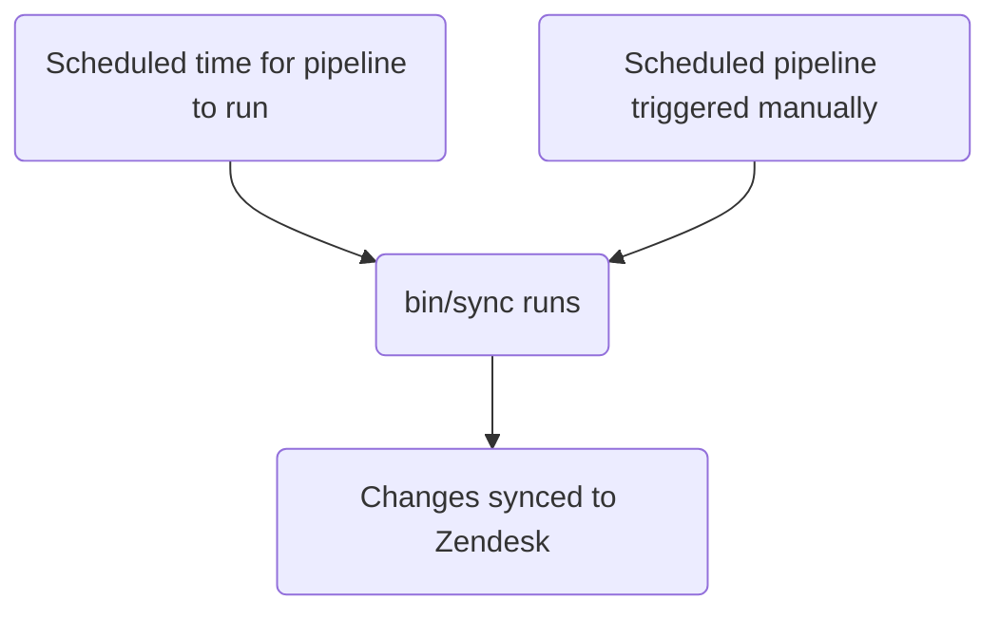

This guide covers how to create, edit, and manage Zendesk ticket forms at GitLab. Administrators should review the [Administrator tasks](#administrator-tasks) section.

{}

- Deployment type: `Standard`
- Sync repos
  - [Zendesk Global](https://gitlab.com/gitlab-support-readiness/zendesk-global/tickets/forms-and-fields)
  - [Zendesk US Government](https://gitlab.com/gitlab-support-readiness/zendesk-us-government/tickets/forms-and-fields)

{}
{}

- This is **very** closely tied with [Ticket fields](/handbook/security/customer-support-operations/zendesk/tickets/fields), especially as they run in the _same_ sync repo
- This is **very** closely tied to [Dynamic content](/handbook/security/customer-support-operations/zendesk/dynamic-content/) in Zendesk Global

{}

## Understanding ticket forms

### What are ticket forms

Ticket forms are the forms utilized by the user to create tickets (when using the web UI). These then translate the responses on the form into ticket metadata.

These fall into one of two types:

- Public - meaning both agents and end-users can see these
- Internal - meaning only agents can see these

### How we manage ticket forms

While Zendesk offers a full way to manage ticket forms via the UI, we turn to a more version controlled methodology. This allows for a set review process, the ability to perform rollbacks as needed, etc.

That being the case, we utilize sync repos.

### How the sync repo works

The sync repo workflow follows this process:



### Ticket forms use condition logic

Ticket forms can use conditions to show/hide fields dynamically:

- `end_user_conditions`: Controls what fields end-users see based on their selections
- `agent_conditions`: Controls what fields agents see and when they're required

When a parent field has a specific value, child fields are shown (and optionally made required). Example: "If Product Category is 'GitLab.com', show the 'GitLab.com User ID' field"

A ticket form does not _have_ to use conditions. Without any conditions, all fields detailed in the form data will show.

This is also how _conditional requirements_ can be set on a ticket form.

In the UI, the format of an end-user condition is:

> If the value of TICKET_FIELD is VALUE, then show LIST_OF_TICKET_FIELDS

With each item in `LIST_OF_TICKET_FIELDS` having the option to require the ticket field item in some way.

The backend for the two types are similar with key differences in the requirement definition.

#### End-user conditions

The format of the backend value for an end-user condition is:

```yaml
- parent_field_id: 'Field title'
  value: 'tag_or_value_used_by_field'
  child_fields:
  - id: 'Field title 2'
    is_required: true
```

Breaking this down:

- `parent_field_id` is the `field` we are checking the value of
- `value` is the value of the `field` we are checking
- `child_fields` is a list of fields to show, with each item having:
  - `id` is the field to show
  - `is_required` is detailing if the newly shown field is required for submission

#### Agent conditions

The format of the backend value for an agent condition is one of two formats:

```yaml
- parent_field_id: 'Field title'
  value: 'tag_or_value_used_by_field'
  child_fields:
  - id: 'Field title 2'
    is_required: true
    required_on_statuses:
      type: 'ALL_STATUSES'
```

```yaml
- parent_field_id: 'Field title'
  value: 'tag_or_value_used_by_field'
  child_fields:
  - id: 'Field title 2'
    is_required: true
    required_on_statuses:
      type: 'SOME_STATUSES'
      statuses:
      - 'pending'
      - 'hold'
      - 'solved'
```

Breaking this down:

- `parent_field_id` is the `field` we are checking the value of
- `value` is the value of the `field` we are checking
- `child_fields` is a list of fields to show, with each item having:
  - `id` is the field to show
  - `is_required` is detailing if the newly shown field is required in some way

What determines the difference is if the new field is _required_ and in what way it is required:

- If requiring it on all statuses:

  ```yaml
  - id: 'Field title 2'
    is_required: true
    required_on_statuses:
      type: 'ALL_STATUSES'
  ```

- If requiring it on no statuses (i.e. not requiring it):

  ```yaml
  - id: 'Field title 2'
    is_required: true
    required_on_statuses:
      type: 'NO_STATUSES'
  ```

- If requiring it only for specific statuses:

  ```yaml
  - id: 'Field title 2'
    is_required: true
    required_on_statuses:
      type: 'SOME_STATUSES'
      statuses:
      - 'list'
      - 'of'
      - 'statuses'
  ```

## Creating a ticket form as a non-admin

For the creation of a ticket form, please create a [Feature Request issue](https://gitlab.com/gitlab-com/gl-security/corp/cust-support-ops/issue-tracker/-/issues/new?description_template=Feature) (as it will require manual intervention by the Customer Support Operations team).

## Editing a ticket form as a non-admin

For the modification of a ticket form, please create a [Feature Request issue](https://gitlab.com/gitlab-com/gl-security/corp/cust-support-ops/issue-tracker/-/issues/new?description_template=Feature) (as it will require manual intervention by the Customer Support Operations team).

## Deactivating a ticket form as a non-admin

To request the deactivation of a ticket form, please create a [Feature Request issue](https://gitlab.com/gitlab-com/gl-security/corp/cust-support-ops/issue-tracker/-/issues/new?description_template=Feature) (as it will require manual intervention by the Customer Support Operations team).

## Human readable replacements

{}

- Only applies to `administrators` creating/editing ticket forms via YAML files

{}

Currently, the sync repo can perform replacements for ticket fields and brand from a human readable format (i.e. the `title` attribute of the ticket field).

So in cases where it sees the value `Preferred Region for Support`, it knows to locate the ticket field with that title and convert it into the needed text for the ticket form attribute it was within. The same is true for brands (except they use the `name` attribute).

## Current forms

### Zendesk Global current forms

| Internal name | Public name | Visibility | Entitlement required? | Direct Link |
|---------------|-------------|------------|:---------------------:|-------------|
| SaaS | Support for GitLab.com | Public | Y | [Link](https://support.gitlab.com/hc/en-us/requests/new?ticket_form_id=334447) |
| 2FA Removal | 2FA Reset | Public | Y | [Link](https://support.gitlab.com/hc/en-us/requests/new?ticket_form_id=18469327708956) |
| SaaS Account | GitLab.com user accounts and login issues | Public | N | [Link](https://support.gitlab.com/hc/en-us/requests/new?ticket_form_id=360000803379) |
| Self-Managed | Support for a self-managed GitLab instance | Public | Y | [Link](https://support.gitlab.com/hc/en-us/requests/new?ticket_form_id=426148) |
| GitLab Dedicated | Support for GitLab Dedicated instances | Public | Y | [Link](https://support.gitlab.com/hc/en-us/requests/new?ticket_form_id=4414917877650) |
| L&R | Subscription, License or Customers Portal Problems | Public | N | [Link](https://support.gitlab.com/hc/en-us/requests/new?ticket_form_id=360000071293) |
| Billing | Billing inquiries/refunds | Public | N | [Link](https://support.gitlab.com/hc/en-us/requests/new?ticket_form_id=360000258393) |
| Alliance Partners | Support for alliance partners | Public | Y | [Link](https://support.gitlab.com/hc/en-us/requests/new?ticket_form_id=360001172559) |
| Support Ops | Support portal related matters | Public | N | [Link](https://support.gitlab.com/hc/en-us/requests/new?ticket_form_id=360001801419) |
| Emergencies | File an emergency request | Public | N | [Link](https://support.gitlab.com/hc/en-us/requests/new?ticket_form_id=360001264259) |
| Support Internal Request | | Internal | N | |
| GitLab Incidents | | Internal | N | |
| Customer Support Internal Requests | Customer Support Internal Requests | Internal | N | [Link](https://gitlab-internal.zendesk.com/hc/en-us/requests/new?ticket_form_id=22783651259548) |
| L&R Support Internal Requests | L&R Support Internal Requests | Internal | N | [Link](https://gitlab-internal.zendesk.com/hc/en-us/requests/new?ticket_form_id=22783840298780) |
| CustSuppOps Support Internal Requests | CustSuppOps Support Internal Requests | Internal | N | [Link](https://gitlab-internal.zendesk.com/hc/en-us/requests/new?ticket_form_id=22784239213084) |

### Zendesk US Government current forms

| Internal name | Public name | Visibility | Entitlement required? | Direct Link |
|---------------|-------------|------------|:---------------------:|-------------|
| Support | Technical Support Requests | Public | Y | [Link](https://federal-support.gitlab.com/hc/en-us/requests/new?ticket_form_id=360000446511) |
| GitLab Dedicated | GitLab Dedicated Technical Support Requests | Public | Y | [Link](https://federal-support.gitlab.com/hc/en-us/requests/new?ticket_form_id=26347526042004) |
| Upgrade Assistance | Upgrade Planning Assistance Request | Public | Y | [Link](https://federal-support.gitlab.com/hc/en-us/requests/new?ticket_form_id=360001434131) |
| Support Ops | Support portal related matters | Public | Y | [Link](https://federal-support.gitlab.com/hc/en-us/requests/new?ticket_form_id=360001421052) |
| L&R | License, Subscription, and Renewals Request | Public | Y | [Link](https://federal-support.gitlab.com/hc/en-us/requests/new?ticket_form_id=360001421072) |
| Emergency | Emergency Support Request | Public | Y | [Link](https://federal-support.gitlab.com/hc/en-us/requests/new?ticket_form_id=360001421112) |
| License Issue | | Internal | N | |
| L&R Support Internal Requests | L&R Support Internal Requests | Internal | N | [Link](https://gitlab-federal-internal.zendesk.com/hc/en-us/requests/new?ticket_form_id=41826474429588) |
| CustSuppOps Support Internal Requests | CustSuppOps Support Internal Requests | Internal | N | [Link](https://gitlab-federal-internal.zendesk.com/hc/en-us/requests/new?ticket_form_id=41826926738708) |

## Administrator tasks

{}

- All sections in this section require `Administrator` level access to Zendesk.

{}

### Viewing ticket forms

To view ticket forms on Zendesk:

1. Navigate to the admin panel for the Zendesk instance
   - [Zendesk Global (production)](https://gitlab.zendesk.com/admin/home)
   - [Zendesk Global (sandbox)](https://gitlab1707170878.zendesk.com/admin/home)
   - [Zendesk US Government (production)](https://gitlab-federal-support.zendesk.com/admin/home)
   - [Zendesk US Government (sandbox)](https://gitlabfederalsupport1585318082.zendesk.com/admin/home)
1. Go to `Objects and rules > Tickets > forms`
   - [Zendesk Global](https://gitlab.zendesk.com/admin/objects-rules/tickets/ticket-forms)
   - [Zendesk Global (sandbox)](https://gitlab1707170878.zendesk.com/admin/objects-rules/tickets/ticket-forms)
   - [Zendesk US Government](https://gitlab-federal-support.zendesk.com/admin/objects-rules/tickets/ticket-forms)
   - [Zendesk US Government (sandbox)](https://gitlabfederalsupport1585318082.zendesk.com/admin/objects-rules/tickets/ticket-forms)

Note: You might need to change the active filter by clicking the `Filter` button if wanting to view non-active ticket forms

### Creating a ticket form

{}

- This should only be done if there is a corresponding request issue (Feature Request, Administrative, Bug, etc.). If one does not exist, you should first create one (and let it go through the standard process before working it).

{}

For the creation of a ticket form, you will need to create a MR in the sync repo. The exact changes being made will depend on the request itself. A starting template you can use would be:

```yaml
---
name: 'Your form name here'
previous_name: 'Your form name here'
display_name: 'Customer visible name'
raw_display_name: 'Customer visible name' # Dynamic content placeholder can be used here
active: true
position: 1 # Integer representing ticket form position
ticket_field_ids:
- 'Field title'
- 'Field title 2'
- 'Field title 3'
- 'Field title 4'
default: false # Is the form the default form for this account
in_all_brands: false # Is the form available for use in all brands on this account (should always be false)
restricted_brand_ids:
- 'Brand name'
end_user_conditions:
- parent_field_id: 'Field title'
  value: 'tag_or_value_used_by_field'
  child_fields:
  - id: 'Field title 2'
    is_required: true
  - id: 'Field title 3'
    is_required: false
agent_conditions:
- parent_field_id: 'Field title'
  value: 'tag_or_value_used_by_field'
  child_fields:
  - id: 'Field title 2'
    is_required: true
    required_on_statuses:
      type: 'ALL_STATUSES'
  - id: 'Field title 3'
    is_required: true
    required_on_statuses:
      type: 'NO_STATUSES'
  - id: 'Field title 4'
    is_required: true
    required_on_statuses:
      type: 'SOME_STATUSES'
      statuses:
      - 'pending'
      - 'hold'
      - 'solved'
```

Ticket forms can be very complex to create from scratch, so when in doubt use an existing one from the sync repo as a viable example.

After a peer reviews and approves your MR, you can merge the MR. When the next deployment occurs, it will be synced to Zendesk.

### Editing a ticket form

{}

- This should only be done if there is a corresponding request issue (Feature Request, Administrative, Bug, etc.). If one does not exist, you should first create one (and let it go through the standard process before working it).

{}

To edit a ticket form, you will need to create a MR in the sync repo. The exact changes being made will depend on the request itself.

After a peer reviews and approves your MR, you can merge the MR. When the next deployment occurs, it will be synced to Zendesk.

#### Changing the name of a ticket form

If you need to change the title of a ticket form, copy the current value into the `previous_name` attribute and then change the `name` attribute. This allows the sync to still locate the ticket form in question to update.

### Deactivating a ticket form

{}

- This should only be done if there is a corresponding request issue (Feature Request, Administrative, Bug, etc.). If one does not exist, you should first create one (and let it go through the standard process before working it).

{}

To deactivate a ticket form, you will need to create a MR in the sync repo. In this MR, you should do the following to the corresponding ticket form's YAML file:

1. Move the file from the `active` to `inactive` path
1. Modify the value of the `active` attribute to `false`
1. Change the value of `ticket_field_ids` to the following:

   ```yaml
   - 'Status'
   - 'Group'
   - 'Assignee'
   - 'Ticket status'
   - 'Subject'
   - 'Description'
   ```

1. Change the value of `end_user_conditions` be an empty array (i.e. `[]`)
1. Change the value of `agent_conditions` be an empty array (i.e. `[]`)

After a peer reviews and approves your MR, you can merge the MR. When the next deployment occurs, it will be synced to Zendesk.

### Deleting a ticket form

{}

- You can only delete a ticket form if it is deactivated.
- This should only be done if there is a corresponding request issue (Feature Request, Administrative, Bug, etc.). If one does not exist, you should first create one (and let it go through the standard process before working it).

{}

As the sync repos do not perform deletions, you will need to do this via Zendesk itself.

To delete a ticket form:

1. Navigate to the admin panel for the Zendesk instance
   - [Zendesk Global (production)](https://gitlab.zendesk.com/admin/home)
   - [Zendesk Global (sandbox)](https://gitlab1707170878.zendesk.com/admin/home)
   - [Zendesk US Government (production)](https://gitlab-federal-support.zendesk.com/admin/home)
   - [Zendesk US Government (sandbox)](https://gitlabfederalsupport1585318082.zendesk.com/admin/home)
1. Go to `Objects and rules > Tickets > forms`
   - [Zendesk Global](https://gitlab.zendesk.com/admin/objects-rules/tickets/ticket-forms)
   - [Zendesk Global (sandbox)](https://gitlab1707170878.zendesk.com/admin/objects-rules/tickets/ticket-forms)
   - [Zendesk US Government](https://gitlab-federal-support.zendesk.com/admin/objects-rules/tickets/ticket-forms)
   - [Zendesk US Government (sandbox)](https://gitlabfederalsupport1585318082.zendesk.com/admin/objects-rules/tickets/ticket-forms)
1. Change the filter to `Inactive`
1. Locate the ticket form you wish to delete and click its name
1. Click the three vertical dots (top-right of the ticket form data)
1. Click `Delete`
1. Click `Delete` to submit the changes

### Performing an exception deployment

{}

- This applies for both ticket forms and ticket fields

{}

To perform an exception deployment for ticket forms, navigate to the ticket forms sync project in question, go to the scheduled pipelines page, and click the play button for the sync item. This will trigger a sync job for the ticket forms.

## Common issues and troubleshooting

### Not seeing ticket form changes after a merge

As ticket forms follow the `Standard` deployment type, they would only be deployed during a normal deployment cycle (or when an exception deployment has been done)
