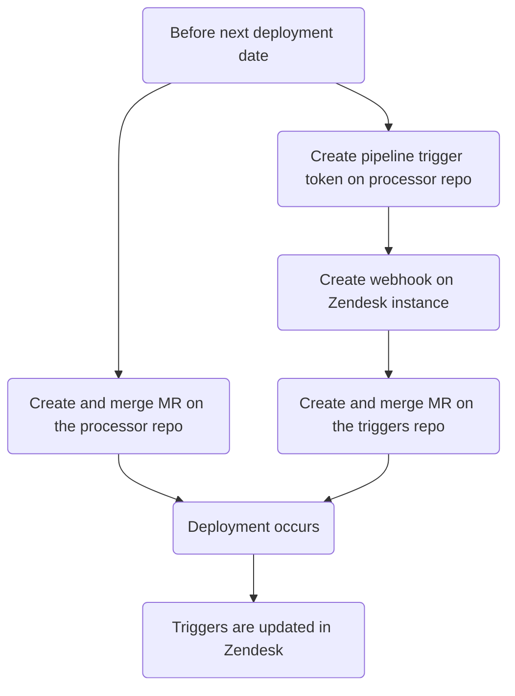
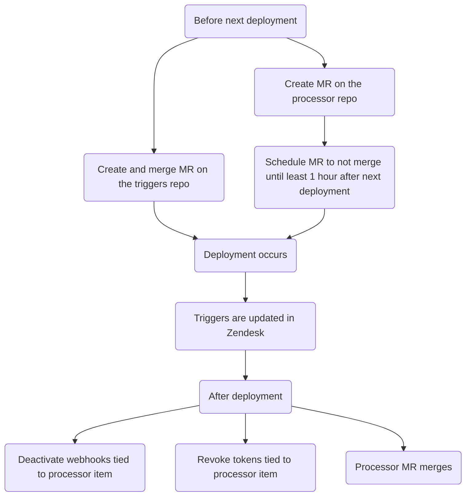

This guide covers the Zendesk ticket processor, an automation system that performs custom actions on tickets based on specific triggers. It documents available processor types and how to create, modify, and remove processor items.

{}

- Deployment type: `Ad-hoc`
- Sync repos
  - [Zendesk Global](https://gitlab.com/gitlab-support-readiness/zendesk-global/tickets/processor)
  - [Zendesk US Government](https://gitlab.com/gitlab-support-readiness/zendesk-us-government/tickets/processor)

{}

## Understanding the ticket processor

### What is the ticket processor

The ticket processor is a group of scripts we store on gitlab.com that are activated via CI/CD pipeline triggers. They can do various custom acts on a ticket.

### Zendesk Global processor items

#### 2FA Removal

Introduced via [gitlab-com/support/support-team-meta#6663](https://gitlab.com/gitlab-com/support/support-team-meta/-/issues/6663)

This checks the request itself to determine the eligibility status. Depending on the determination, it adds a tag to the ticket (which will fire a corresponding Zendesk trigger).

- If the request is to remove the requester's 2FA:
  - The user has support entitlement for the request, the tag `2fa_challenge_questions` is added (and the process ends)
  - The user does not have support entitlement for the request, the tag `2fa_user_not_entitled` is added (and the process ends)
- If the request is to remove another user's 2FA:
  - Checks the following criteria
    - Does the requester have support entitlement for the request?
    - Is the domain of the requester's email an exact match for the domain of the target's email?
    - Does the requester have a gitlab.com account?
    - Does the target have a gitlab.com account?
    - Is the requester an `Owner` on a top-level paid namespace?
    - Is the target a member under the top-level paid namespace?
  - If it passed all checks, the tag `2fa_snippet_verification` is added (and the process ends)
  - If it fails any checks, the tag `2fa_owner_not_entitled` is added (and the process ends)

#### Account blocked

Introduced via [gitlab-com/support/support-ops/zendesk-global/trigger!264](https://gitlab.com/gitlab-com/support/support-ops/zendesk-global/triggers/-/merge_requests/264)

This checks the account status of a gitlab.com user. Depending on the status, different actions can occur:

- If the user does not exist...
  - A public reply is sent to the user stating the account does not exist
  - The `Ticket Stage` value is set to `FRT`
  - The ticket's status is set to `Pending`
- If the user is not blocked...
  - A public reply is sent to the user stating the account is not actually blocked
  - The `Ticket Stage` value is set to `FRT`
  - The ticket's status is set to `Pending`
- If the user is blocked due to embargo policies...
  - A public reply is sent to the user stating they were blocked due to embargo policies. It also tells them the next steps to resolve that.
  - The `Ticket Stage` value is set to `FRT`
  - The ticket's status is set to `Solved`
- If the user is blocked (but not due to embargo policies)...
  - An issue is made within the [T&S account reinstatement project](https://gitlab.com/gitlab-com/gl-security/security-operations/trust-and-safety/TS_Operations/account-reinstatements)
  - An internal reply made on the ticket pointing the SE to the next steps to follow

#### ASE update

Introduced via [gitlab-com/gl-security/corp/cust-support-ops/issue-tracker#623](https://gitlab.com/gitlab-com/gl-security/corp/cust-support-ops/issue-tracker/-/issues/623)

This handles adding or removing an Assigned Support Engineer (ASE) from an organization (using the `bin/ase_update` script).

The script works as follows:

- If the organization exists:
  - If for an ASE addition/modification and the user ID is valid:
    - It modifies the organization's `assigned_se` attribute to use the user's ID
    - It comments on the ticket stating the task is completed (and closes the ticket)
  - If for an ASE removal:
    - It modifies the organization's `assigned_se` attribute to a blank value
    - It comments on the ticket stating the task is completed (and closes the ticket)
  - If for an ASE addition and the user ID provided is invalid, it comments on the ticket telling the requester as much (and closes the ticket)
- If the organization does not exist, it comments on the ticket telling the requester as much (and closes the ticket)

#### Collaboration IDs

Introduced via [gitlab-com/gl-security/corp/cust-support-ops/issue-tracker#623](https://gitlab.com/gitlab-com/gl-security/corp/cust-support-ops/issue-tracker/-/issues/623)

This handles adding or removing a collaboration project ID from an organization (using the `bin/collab_ids` script).

The script works as follows:

- If the organization exists:
  - If for a collaboration project addition/modification:
    - It modifies the organization's `am_project_id` attribute to use the projects's ID
    - It comments on the ticket stating the task is completed (and closes the ticket)
  - If for a collaboration project removal:
    - It modifies the organization's `am_project_id` attribute to a blank value
    - It comments on the ticket stating the task is completed (and closes the ticket)
- If the organization does not exist, it comments on the ticket telling the requester as much (and closes the ticket)

#### Create macro

Introduced via [gitlab-com/gl-security/corp/cust-support-ops/issue-tracker#705](https://gitlab.com/gitlab-com/gl-security/corp/cust-support-ops/issue-tracker/-/issues/705)

This handles adding [simple macros](../macros/#simple-vs-advanced-macros) macros for the Zendesk instance (using the `bin/create_macro` script).

The script works as follows:

- If the macro will be making a comment, it will check if an existing managed content file exists (and create a managed content file if one does not)
- It create a YAML file in the macros repo (which will trigger a Zendesk sync, thus creating the macro)
- It comments on the ticket confirming the task is complete (and closes out the ticket).

#### Create on behalf of

Introduced via [gitlab-com/gl-security/corp/cust-support-ops/issue-tracker#706](https://gitlab.com/gitlab-com/gl-security/corp/cust-support-ops/issue-tracker/-/issues/706)

This handles requests to create tickets on behalf of customers, prospects, etc (using the `bin/create_on_behalf` script).

The script works as follows:

- Reading the request's information, it creates a new ticket on behalf of a user (using the form `Support Internal Request`)
- It comments on the ticket confirming the task is complete (and closes out the ticket).

#### Email Suppressions

Introduced via [gitlab-com/support/support-ops/zendesk-global/trigger!264](https://gitlab.com/gitlab-com/support/support-ops/zendesk-global/triggers/-/merge_requests/264)

This checks if an email suppression exists within Mailgun. Depending on the results of the check, different actions can occur:

- If a suppression exists...
  - The located suppressions in Mailgun are deleted
  - An internal reply made on the ticket stating that a suppression was found and removed, including the code, error, and timestamp of said suppression
  - A public reply is sent to the user stating a suppression was found, removed, and what next steps the user should take.
  - The ticket's status is set to `Solved`
- If a suppression does not exist...
  - A public reply is sent to the user stating we did not locate any suppressions and what next steps they can take. It also tells them the next steps to resolve that.
  - The `Ticket Stage` value is set to `FRT`
  - The ticket's status is set to `Pending`

#### Link Tagger

Introduced to Zendesk Global via [gitlab-com/support/support-ops/support-ops-project#998](https://gitlab.com/gitlab-com/support/support-ops/support-ops-project/-/issues/998) and to Zendesk US Government via [gitlab-com/gl-security/corp/cust-support-ops/issue-tracker#841](https://gitlab.com/gitlab-com/gl-security/corp/cust-support-ops/issue-tracker/-/work_items/841)

This checks the passed comment (public and made be an agent) for the various types of items we would want to tag on the ticket. The current kinds of items (and the tag added based on them) are as follows:

- Contains a gitlab.com issue link
  - `gitlab_issue_link` tag is added
  - `CUSTOMPATH_issues_IID` tag is added (Global only)
    - `CUSTOMPATH` is the project's slug, `IID` is the issue ID
    - Example: a link to issue 5 on project jcolyer/most_amazing_project_ever would be: `jcolyer_most_amazing_project_ever_issues_5`
  - `issue~CUSTOMPATH_IID`
    - `CUSTOMPATH` is the project's slug, `IID` is the issue ID
    - Example: a link to issue 5 on project jcolyer/most_amazing_project_ever would be: `issue~jcolyer_most_amazing_project_ever_issues_5`
  - `issue_PROJECTID_IID` (Global only)
    - `PROJECTID` is the project's ID, `IID` is the issue ID
    - Example: a link to issue 5 on project jcolyer/most_amazing_project_ever (project ID 123) would be: `issue_123_5`
- Contains a gitlab.com merge request link
  - `gitlab_merge_request_link` tag is added
  - `CUSTOM_PATH_merge_requests_IID` tag is added (Global only)
    - `CUSTOMPATH` is the project's slug, `IID` is the merge request ID
    - Example: a link to merge request 27 on project jcolyer/most_amazing_project_ever would be: `jcolyer_most_amazing_project_ever_merge_requests_27`
  - `mergerequest~CUSTOMPATH_IID`
    - `CUSTOMPATH` is the project's slug, `IID` is the issue ID
    - Example: a link to merge request 27 on project jcolyer/most_amazing_project_ever would be: `mergerequest~jcolyer_most_amazing_project_ever_27`
  - `mergerequest_PROJECTID_IID` (Global only)
    - `PROJECTID` is the project's ID, `IID` is the merge request ID
    - Example: a link to merge request 27 on project jcolyer/most_amazing_project_ever (project ID 123) would be: `mergerequest_123_27`
- Contains a gitlab.com epic link
  - `gitlab_epic_link` tag is added
  - `CUSTOMPATH_epic_IID` tag is added (Global only)
    - `CUSTOMPATH` is the project's slug, `IID` is the epic ID
    - Example: a link to epic 10 on project jcolyer/most_amazing_project_ever would be: `jcolyer_most_amazing_project_ever_epic_10`
  - `epic~CUSTOMPATH_IID`
    - `CUSTOMPATH` is the project's slug, `IID` is the epic ID
    - Example: a link to epic 10 on project jcolyer/most_amazing_project_ever would be: `epic~jcolyer_most_amazing_project_ever_10`
  - `epic_PROJECTID_IID` (Global only)
    - `PROJECTID` is the project's ID, `IID` is the epic ID
    - Example: a link to epic 10 on project jcolyer/most_amazing_project_ever (project ID 123) would be: `epic_123_10`
- Contains a docs.gitlab.com link
  - `docs_link` tag is added
- Contains a handbook.gitlab.com link
  - `hb_link` tag is added
- Contains a KB article link
  - `kb_link` tag is added
- Contains text that indicates the agent offered a call
  - `agent_offered_call` tag is added
  - Search terms used:
    - `calendly.com`
    - `gitlab.zoom.us`
    - `gitlabmtgs.webex.com`
    - `teams.microsoft.com`

#### Namespace availability

Introduced via [gitlab-com/gl-security/corp/cust-support-ops/issue-tracker#578](https://gitlab.com/gitlab-com/gl-security/corp/cust-support-ops/issue-tracker/-/issues/578)

This handles checking if a namespace is available (via the `bin/namespace_availability` script). At its core, this is a less thorough (and non-customer visible) version of the [Namesquatting](#namesquatting) process.

The script works as follows:

- It checks if the namespace exists
  - If it does not, it comments on the ticket indicating as much (and closes the ticket), stopping the process
- It checks if the namespace is using a paid plan
  - If it is, it comments on the ticket indicating the namespace is not available (and closes the ticket), stopping the process
- If checks for the type of namespace
  - For `user` namespaces:
    - It checks if the user is confirmed and was created less than 90 days ago
      - If so, it comments on the ticket indicating it _may_ be available (and closes the ticket), stopping the process
    - It checks if the last sign in was within the last 2 years ago
      - If it is, it comments on the ticket indicating the namespace is not available (and closes the ticket), stopping the process
    - In all other cases, it comments on the ticket indicating it _may_ be available (and closes the ticket), stopping the process
  - For `group` namespaces:
    - It checks if the group has any projects under updated within the last 2 years
      - If so, it comments on the ticket indicating it _may_ be available (and closes the ticket), stopping the process
    - In all other cases, it comments on the ticket indicating it _may_ be available (and closes the ticket), stopping the process

#### Namesquatting

Introduced via [gitlab-com/support/support-ops/zendesk-global/trigger!264](https://gitlab.com/gitlab-com/support/support-ops/zendesk-global/triggers/-/merge_requests/264)

This checks if a given namespace is eligible for release based on our various criteria. The result of the check will determine what actions occur:

- If the requester is a free user...
  - A public reply is sent to the user stating these requests are only eligible for paying customers.
  - The `Ticket Stage` value is set to `FRT`
- If the namespace is invalid...
  - A public reply is sent to the user stating we could not locate the namespace in question.
  - The `Ticket Stage` value is set to `FRT`
- If the namespace is not eligible...
  - A public reply is sent to the user stating the namespace is not eligible for release at this time.
  - The `Ticket Stage` value is set to `FRT`
- If the namespace _may_ be eligible...
  - An internal reply made on the ticket stating that the namespace can only be released after contacting the namespace's current owners. It lists the found email addresses of the owners.
  - The `Ticket Stage` value is set to `FRT`
- If the namespace **is** eligible...
  - An internal reply made on the ticket stating that the namespace is eligible for immediate release.
  - The `Ticket Stage` value is set to `FRT`

#### Organization Notes

Introduced via [gitlab-com/support/support-ops/zendesk-global/trigger!264](https://gitlab.com/gitlab-com/support/support-ops/zendesk-global/triggers/-/merge_requests/264)

This adds internal notes on a ticket based off information derived from the organization the requester of the ticket is a member of. This has the potential to make 3 different internal notes:

- One derived from organization notes that can contain...
  - A message about the organization being in an escalated state
  - Partner troubleshooting information
  - General organization information
  - Any recent emergency tickets filed under the organization
  - If the organization has a collaboration project
  - If the organization is using a contact management project
  - Support Operations notes (derived from the Notes/Details fields on the organization itself in Zendesk)
  - Support notes (derived from the [Zendesk Global Organizations project](https://gitlab.com/gitlab-com/support/zendesk-global/organizations))
- One detailing the organization's support entitlement information
  - Only if the organization is expired or a priority prospect
- One about the organization being GitLab Dedicated

If a Support notes file does not exist, this will also create one for the organization.

#### STAR

Introduced via [gitlab-com/support/support-ops/support-ops-project#957](https://gitlab.com/gitlab-com/support/support-ops/support-ops-project/-/issues/957)

This adds the ticket tag `star_submitted` onto the ticket.

### Zendesk US Government processor items

The following items work identically to Zendesk Global:

- [ASE update](#ase-update)
- [Collaboration IDs](#collaboration-ids)
- [Create macro](#create-macro)
- [Link tagger](#link-tagger)

#### Organization Notes

Introduced via [gitlab-support-readiness/zendesk-us-government/triggers@c573f55c](https://gitlab.com/gitlab-support-readiness/zendesk-us-government/triggers/-/commit/c573f55c1f4bc241c49567e56f409e7d593692cd)

This adds internal notes on a ticket based off information derived from the organization the requester of the ticket is a member of. This has the potential to make 3 different internal notes:

- One derived from organization notes that can contain...
  - General organization information
  - Any recent emergency tickets filed under the organization
  - If the organization has a collaboration project
  - Support Operations notes (derived from the Notes/Details fields on the organization itself in Zendesk)
- One detailing the organization's support entitlement and grace period information
  - Only if the organization is expired
- One about the organization being GitLab Dedicated

## Administrator tasks

### Creating new processor items

{}

- This should only be done if there is a corresponding request issue (Feature Request, Administrative, Bug, etc.). If one does not exist, you should first create one (and let it go through the standard process before working it).

{}

To add an item to the ticket processor, you will need to perform a multiple step process:

1. Create a MR to the ticket processor repo, which:
   - creates the script tied to the item
   - adds the item's entry from the `.gitlab-ci.yml` file
   - adds the item's entry from the `README.md` file
   - updates the filetree shown in the `README.md` file
1. Create a pipeline trigger token for the item (used in the webhook(s))
1. [Create a webhook](/handbook/security/customer-support-operations/zendesk/webhooks/#creating-a-webhook) in the corresponding Zendesk instance for the item
1. Create a MR to the triggers repo of the corresponding Zendesk instance, which:
   - creates any triggers tied to the processor item

As such, the overall flow should look like this:

#### Considering the sandbox

As you will need to do testing on the Zendesk sandbox, you will need steps 1-3 completed before you can work on step 4.

### Modifying the ticket processor

{}

- This should only be done if there is a corresponding request issue (Feature Request, Administrative, Bug, etc.). If one does not exist, you should first create one (and let it go through the standard process before working it).

{}

To edit a processor item, you will need to create a MR in the sync repo. The exact changes being made will depend on the request itself.

After a peer reviews and approves your MR, you can merge the MR. When the next deployment occurs, it will be synced to Zendesk.

### Removing processor items

{}

- This should only be done if there is a corresponding request issue (Feature Request, Administrative, Bug, etc.). If one does not exist, you should first create one (and let it go through the standard process before working it).

{}

To remove an item from the ticket processor, you will need to perform a multiple step process:

1. Create a MR to the ticket processor repo, which:
   - removes the script tied to the item
   - removes the item's entry from the `.gitlab-ci.yml` file
   - removes the item's entry from the `README.md` file
   - updates the filetree shown in the `README.md` file
1. Create a MR to the triggers repo of the corresponding Zendesk instance, which:
   - deactivates any triggers tied to the processor item
1. [Deactivate any webhooks](/handbook/security/customer-support-operations/zendesk/webhooks/#deactivating-a-webhook) from the corresponding Zendesk instance tied to the item
1. Revoke any pipeline trigger tokens tied to the item (used in the webhook(s))

Because the processor is an `Ad-hoc` deployment, this means you need to use MR scheduling. As such, the overall flow should look like this:

## Common issues and troubleshooting

This is a living section that will have items added to it as needed.
