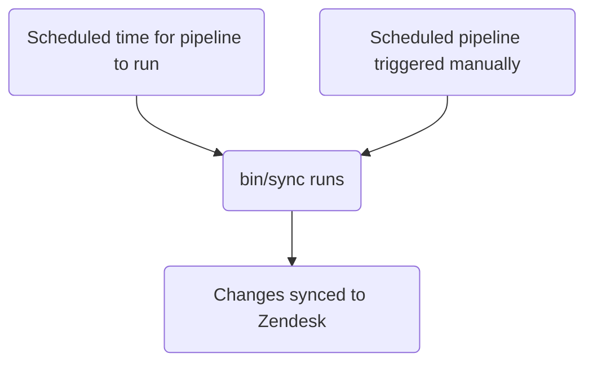

This guide covers how to create, edit, and manage Zendesk triggers at GitLab. Administrators should review the [Administrator tasks](#administrator-tasks) section.

Unlike [macros](../macros/) which agents apply manually, triggers run when an update occurs on a ticket.

{}

- Deployment type: `Standard`
- Sync repos
  - [Zendesk Global](https://gitlab.com/gitlab-support-readiness/zendesk-global/triggers)
  - [Zendesk US Government](https://gitlab.com/gitlab-support-readiness/zendesk-us-government/triggers)
- Managed content repos
  - [Zendesk Global](https://gitlab.com/gitlab-com/support/zendesk-global/triggers)
  - [Zendesk US Government](https://gitlab.com/gitlab-com/support/zendesk-us-government/triggers)

{}

## Understanding triggers

### What are triggers

As per [Zendesk](https://support.zendesk.com/hc/en-us/articles/4408822236058-About-triggers-and-how-they-work):

> Triggers are business rules you define that run immediately after tickets are created or updated. For example, a trigger can be used to notify the customer when a ticket has been opened. Another can be created to then notify the customer when the ticket is solved.

### When do triggers run in Zendesk

Triggers in Zendesk run whenever an update occurs on a ticket. When this occurs, the complete list of triggers runs on the ticket (that apply to it based off of conditions).

### Triggers run based off position

Position for triggers is vital as they run from a top-down flow (i.e. from lowest position to highest).

As an example, if (based off conditions), triggers 2, 5, and 10 would run on a ticket, the run order would be trigger 2 first, then trigger 5, and finally trigger 10. That being said, if trigger 5 performs actions that negate the match from trigger 10, only triggers 2 and 5 would run (since trigger 10 no longer matches).

### Triggers use condition logic

Triggers use condition logic:

- `all`: ALL of the conditions in the array must be true (AND logic)
- `any`: AT LEAST ONE condition in the array must be true (OR logic)
- You can use either only one set or both sets (but there must be at least one set used)

### How we manage triggers

While Zendesk offers a full way to manage triggers via the UI, we turn to a more version controlled methodology. This allows for a set review process, the ability to perform rollbacks as needed, etc.

That being the case, we utilize sync repos and managed content repos.

### How the sync repo works

The sync repo workflow follows this process:



#### Human readable replacements

{}

- Only applies to `administrators` creating/editing triggers via YAML files

{}

Currently, the sync repo can perform replacements of various items from a human readable item to the "Zendesk" equivalent item. This includes:

| Human readable item | Zendesk field item | Condition/Action location | Notes |
|---------------------|--------------------|-----------------|-------|
| `'Brand: XXX'` | `brand_id` | `value` | Replace `XXX` with the `name` of the brand |
| `'Field: XXX'` | `custom_fields_xxx` | `field` | Replace `XXX` with the `title` of the ticket field |
| `'Group: XXX'` | `group_id` | `value` | Replace `XXX` with the `name` of the group |
| `'XXX'` | `role` | `value` | Replace `XXX` with the `name` of the role type OR the email address of the requester |
| `'Form: XXX'` | `ticket_form_id` | `value` | Replace `XXX` with the `name` of the ticket form |
| `'Schedule: XXX'` | `set_schedule` | `value` | Replace `XXX` with the `name` of the schedule |
| `'Schedule: XXX'` | `schedule_id` | `value` | Replace `XXX` with the `name` of the schedule |
| `'XXX'` | `organization_id` | `value` | Replace `XXX` with the `salesforce_id` attribute of the organization |
| `'XXX'` | `assignee_id` | `value` | Replace `XXX` with the email address of the agent |
| `'XXX'` | `satisfaction_reason_code` | `value` | Replace `XXX` with the `name` of the satisfaction reason |
| `'XXX'` | `via_id` | `value` | Replace `XXX` with the `name` of the via type |
| `'XXX'` | `requester_role` | `value` | Replace `XXX` with the `name` of the requester role type |
| `'Target: XXX'` | `notification_target` | `value` | Replace `XXX` with the `name` of the target |
| `'Webhook: XXX'` | `notification_webhook` | `value` | Replace `XXX` with the `name` of the webhook |

As an example, if you wanted a trigger to change the value of the field `Preferred Region for Support` to `AMER`, you would do the following to use the replacement:

```yaml
- field: 'Field: Preferred Region for Support'
  value: 'AMER'
```

As another, if you needed a condition to check if the form of a ticket is not the `SaaS` form, you would do:

```yaml
- field: 'ticket_form_id'
  operator: 'is_not'
  value: 'Form: SaaS'
```

#### When creating MRs in the sync repo

When a MR is created on the sync repo, it performs the compare actions (via the `bin/compare` script), which does the following:

1. Performs a clone of the managed content repo
1. Fetches all brands, groups, satisfaction reasons, schedules, targets, ticket fields, ticket forms, triggers, and webhooks from the Zendesk instance
1. Reviews all YAML files within the sync repo to generate a trigger object
   - It also checks to ensure none of the following problems exist in the sync repo files:
     - A title is missing
     - A file with the `active` attribute of `false` is not in the `active` folder
     - A file with the `active` attribute of `true` is not in the `inactive` folder
     - There is not a duplicate use of a `title` attribute
     - Any file with the `contains_managed_content` attribute of `true` has a matching managed content file
     - Any file with the `contains_managed_webhook` attribute of `true` has a matching managed content file
1. Compares all trigger objects from the YAML files to a matching Zendesk item (determined by checking the value of the attributes `title` and `previous_title`)
   - If none exists, it will store a create object in a variable to be used later
   - If one exists but has different attribute values, it will store an update object in a variable to be used later
1. Output a comparison report

#### Syncing to Zendesk

The sync repo performs its sync task when the scheduled pipeline runs for the project (either via the correct timing or when performed manually).

When either action occurs, the sync performs the [compare actions](#when-creating-mrs-in-the-sync-repo) and then uses the objects generated to perform the needed creates and updates via a loop hitting the needed Zendesk endpoint:

- [Creates](https://developer.zendesk.com/api-reference/ticketing/business-rules/triggers/#create-trigger)
- [Updates](https://developer.zendesk.com/api-reference/ticketing/business-rules/triggers/#update-ticket-trigger)

#### Reporting orphaned managed content files

On the 1st of February, May, August, and November, a [scheduled pipeline](https://docs.gitlab.com/ci/pipelines/schedules/) will have the sync repo create an issue for the support leadership team to review all orphaned managed content files.

This is done via the `bin/find_orphaned_files` script in the sync repo, which does the following:

1. Performs a clone of the managed content repo
1. Reviews every file within the `active` and `inactive` folders of the managed content repo to determine the `state` (i.e. `active` or `inactive`, the `path`, and the `title`)
1. Reviews every file within the `active` and `inactive` folders of the sync repo itself to determine:
   - If the file is using a managed content file
   - If there is a managed content file
1. If it has located managed content files without a sync repo file, it then creates an issue reporting it to Customer Support leadership

## Creating triggers as a non-admin

For the creation of a trigger, please create a [Feature Request issue](https://gitlab.com/gitlab-com/gl-security/corp/cust-support-ops/issue-tracker/-/issues/new?description_template=Feature) (as it will require manual intervention by the Customer Support Operations team).

## Editing triggers as a non-admin

### Changing the comment wording used in a trigger

To edit the comment wording in a trigger, you will modify the corresponding file in the managed content repo. After it is merged to the `master` branch, it will be picked up at the next deployment cycle to deploy to Zendesk.

### Changing the payload used in a trigger

To edit the payload in a trigger (that is using a managed webhook), you will modify the corresponding file in the managed content repo. After it is merged to the `master` branch, it will be picked up at the next deployment cycle to deploy to Zendesk.

### Changing title, non-comment wording actions, and so on

To change anything else in a trigger, please create a [Feature Request issue](https://gitlab.com/gitlab-com/gl-security/corp/cust-support-ops/issue-tracker/-/issues/new?description_template=Feature) (as it will require manual intervention by the Customer Support Operations team).

## Deactivating a trigger as a non-admin

To request the deactivation of a trigger, please create a [Feature Request issue](https://gitlab.com/gitlab-com/gl-security/corp/cust-support-ops/issue-tracker/-/issues/new?description_template=Feature) (as it will require manual intervention by the Customer Support Operations team).

## Administrator tasks

{}

- All sections in this section require `Administrator` level access to Zendesk.

{}

### Seeing trigger usage information

To see the usage information on triggers:

1. Navigate to the admin dashboard for the Zendesk instance
   - [Zendesk Global (production)](https://gitlab.zendesk.com/admin/home)
   - [Zendesk Global (sandbox)](https://gitlab1707170878.zendesk.com/admin/home)
   - [Zendesk US Government (production)](https://gitlab-federal-support.zendesk.com/admin/home)
   - [Zendesk US Government (sandbox)](https://gitlabfederalsupport1585318082.zendesk.com/admin/home)
1. Go to `Objects and rules > Business rules > Triggers`
   - [Zendesk Global](https://gitlab.zendesk.com/admin/objects-rules/rules/triggers)
   - [Zendesk Global (sandbox)](https://gitlab1707170878.zendesk.com/admin/objects-rules/rules/triggers)
   - [Zendesk US Government](https://gitlab-federal-support.zendesk.com/admin/objects-rules/rules/triggers)
   - [Zendesk US Government (sandbox)](https://gitlabfederalsupport1585318082.zendesk.com/admin/objects-rules/rules/triggers)
1. Click the icon to the far right of the list of triggers (looks like three vertical rectangles)
1. Click the usage columns you wish to see

### Creating a trigger

{}

- This should only be done if there is a corresponding request issue (Feature Request, Administrative, Bug, etc.). If one does not exist, you should first create one (and let it go through the standard process before working it).
- If creating a trigger that will use a managed content file, you must create said managed content file first.

{}

For the creation of a trigger, you will need to create a MR in the sync repo. The exact changes being made will depend on the request itself. A starting template you can use would be:

```yaml
---
title: 'Your::Title::Here'
previous_title: 'Your::Title::Here'
description: 'Your description here'
active: true
position: 1 # Integer representing trigger position
actions:
- field: 'the_action_to_perform'
  value: 'the_value_to_use'
conditions:
  all:
  - field: 'the_action_to_perform'
    operator: 'the_operator_to_use'
    value: 'the_value_to_use'
  any:
  - field: 'the_action_to_perform'
    operator: 'the_operator_to_use'
    value: 'the_value_to_use'
category_id: 'Name of category'
contains_managed_content: false
contains_managed_email: false
contains_managed_webhook: false
```

After a peer reviews and approves your MR, you can merge the MR. When the next deployment occurs, it will be synced to Zendesk.

### Editing a trigger

{}

- This should only be done if there is a corresponding request issue (Feature Request, Administrative, Bug, etc.). If one does not exist, you should first create one (and let it go through the standard process before working it).
- If changing the trigger's `contains_managed_content` or `contains_managed_webhook` attribute from `false` to `true`, you must create said managed content file first.
- If changing the trigger's `contains_managed_content` or `contains_managed_webhook` attribute from `true` to `false`, you should create a follow-up MR to delete the corresponding managed content file.

{}

To edit a trigger, you will need to create a MR in the sync repo. The exact changes being made will depend on the request itself.

After a peer reviews and approves your MR, you can merge the MR. When the next deployment occurs, it will be synced to Zendesk.

#### Changing the title of a trigger

If you need to change the title of an trigger, copy the current value into the `previous_title` attribute and then change the `title` attribute. This allows the sync to still locate the trigger in question to update.

### Deactivating a trigger

{}

- This should only be done if there is a corresponding request issue (Feature Request, Administrative, Bug, etc.). If one does not exist, you should first create one (and let it go through the standard process before working it).
- If the trigger was using a managed content file (i.e. `contains_managed_content` or `contains_managed_webhook` attribute in the YAML file was previously set to `true`), you likely will need to also move the corresponding file from the `active` to the `inactive` location in the managed content repo.

{}

To deactivate a trigger, you will need to create a MR in the sync repo. In this MR, you should do the following to the corresponding trigger's YAML file:

1. Move the file from the `active` to `inactive` path
1. Modify the value of the `active` attribute to `false`
1. Change the value of `actions` to the following:
   - For Zendesk Global:

     ```yaml
     - field: 'brand_id'
       value: 'GitLab Support'
     ```

   - For Zendesk US Government:

     ```yaml
     - field: 'brand_id'
       value: 'GitLab'
     ```

1. Change the value of `conditions` to the following:
   - For Zendesk Global:

     ```yaml
     all:
       - field: 'brand_id'
         operator: 'is_not'
         value: 'GitLab Support'
       - field: 'brand_id'
         operator: 'is_not'
         value: 'GitLab - Internal'
     any: []
     ```

   - For Zendesk US Government:

     ```yaml
     all:
       - field: 'brand_id'
         operator: 'is_not'
         value: 'GitLab'
       - field: 'brand_id'
         operator: 'is_not'
         value: 'GitLab - Internal'
     any: []
     ```

1. Change the value of the `contains_managed_content` attribute to `false`
1. Change the value of the `contains_managed_webhook` attribute to `false`

After a peer reviews and approves your MR, you can merge the MR. When the next deployment occurs, it will be synced to Zendesk.

### Deleting a trigger

{}

- You can only delete a trigger if it is deactivated.
- This should only be done if there is a corresponding request issue (Feature Request, Administrative, Bug, etc.). If one does not exist, you should first create one (and let it go through the standard process before working it).
- When deleting a trigger, you likely will need to also remove the file from the sync and managed content repos.

{}

As the sync repos do not perform deletions, you will need to do this via Zendesk itself.

To delete a trigger:

1. Navigate to the admin dashboard for the Zendesk instance
   - [Zendesk Global (production)](https://gitlab.zendesk.com/admin/home)
   - [Zendesk Global (sandbox)](https://gitlab1707170878.zendesk.com/admin/home)
   - [Zendesk US Government (production)](https://gitlab-federal-support.zendesk.com/admin/home)
   - [Zendesk US Government (sandbox)](https://gitlabfederalsupport1585318082.zendesk.com/admin/home)
1. Go to `Objects and rules > Business rules > Triggers`
   - [Zendesk Global](https://gitlab.zendesk.com/admin/objects-rules/rules/triggers)
   - [Zendesk Global (sandbox)](https://gitlab1707170878.zendesk.com/admin/objects-rules/rules/triggers)
   - [Zendesk US Government](https://gitlab-federal-support.zendesk.com/admin/objects-rules/rules/triggers)
   - [Zendesk US Government (sandbox)](https://gitlabfederalsupport1585318082.zendesk.com/admin/objects-rules/rules/triggers)
1. Locate the trigger you wish to delete and click on the three vertical dots to the right of it
   - You are likely going to need to change the filter in use
1. Click `Delete`
1. Click `Delete trigger` to submit the changes

### Performing an exception deployment

To perform an exception deployment for triggers, navigate to the triggers sync project in question, go to the scheduled pipelines page, and click the play button for the sync item. This will trigger a sync job for the triggers.

## Common issues and troubleshooting

### Not seeing trigger changes after a merge

As triggers follow the `Standard` deployment type, they would only be deployed during a normal deployment cycle (or when an exception deployment has been done)
