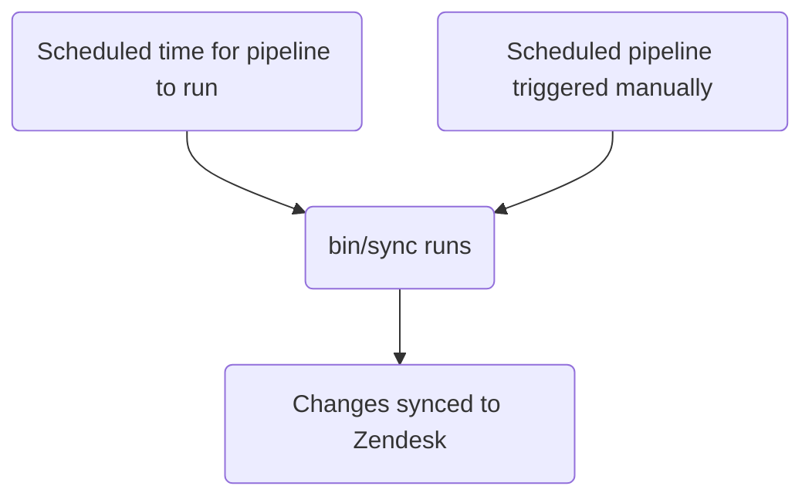

This guide covers how to create, edit, and manage Zendesk views at GitLab. If you're a support agent looking to modify existing views, see [Changing the fields, grouping, or sorting used in a view](#changing-the-fields-grouping-or-sorting-used-in-a-view). Administrators should review the [Administrator tasks](#administrator-tasks) section.

{}

- Deployment type: `Standard`
- Sync repos
  - [Zendesk Global](https://gitlab.com/gitlab-support-readiness/zendesk-global/views)
  - [Zendesk US Government](https://gitlab.com/gitlab-support-readiness/zendesk-us-government/views)
- Managed content repos
  - [Zendesk Global](https://gitlab.com/gitlab-com/support/zendesk-global/views)
  - [Zendesk US Government](https://gitlab.com/gitlab-com/support/zendesk-us-government/views)

{}

## Understanding views

### What are views

As per [Zendesk](https://support.zendesk.com/hc/en-us/articles/4408888828570-Creating-views-to-build-customized-lists-of-tickets):

> Views are a way to organize your tickets by grouping them into lists based on certain criteria. For example, you can create a view for unsolved tickets that are assigned to you, a view for new tickets that need to be triaged, or a view for pending tickets that are awaiting response. Using views can help you determine what tickets need attention from you or your team and plan accordingly.

### Types of views

Currently, Zendesk has 3 view types:

- Default: Pre-defined views created by Zendesk
- Shared: Views created by the Zendesk Administrator(s) (ie. Customer Support Operations)
- Personal: Views created by you and usable only by you

### View limitations

Currently, Zendesk views have some limitations:

- Views cannot use criteria that is not “defined”, meaning it must be selectable data (text fields will not work, as an example).
- Views will not include [archived tickets](https://support.zendesk.com/hc/en-us/articles/4408887617050-About-ticket-archiving) (i.e. Closed tickets after 120 days.)

### Views can be nested

Through the use of double colons (i.e. `::`) in the view's title, we can nest views within each other.

As an example, if you had the views:

- Support Agents Tier 1 Normal tickets
- Support Agents Tier 1 Escalated tickets
- Support Agents Tier 2 Normal tickets
- Support Agents Tier 2 Escalated tickets
- Support Agents Tier 3 Normal tickets
- Support Agents Tier 3 Escalated tickets

You could rename them to:

- Support Agents::Tier 1::Normal tickets
- Support Agents::Tier 1::Escalated tickets
- Support Agents::Tier 2::Normal tickets
- Support Agents::Tier 2::Escalated tickets
- Support Agents::Tier 3::Normal tickets
- Support Agents::Tier 3::Escalated tickets

Resulting in the views looking like:

- Support Agents
  - Tier 1
    - Normal tickets
    - Escalated tickets
  - Tier 2
    - Normal tickets
    - Escalated tickets
  - Tier 3
    - Normal tickets
    - Escalated tickets

Note that in the above, `Support Agents`, `Tier 1`, `Tier 2` and `Tier 3` are not actually views (but categories displayed for nesting). Think of it like a file structure (with categories being folders and actual views being files).

### Views use condition logic

Views use condition logic:

- `all`: ALL of the conditions in the array must be true (AND logic)
- `any`: AT LEAST ONE condition in the array must be true (OR logic)
- You can use either only one set or both sets (but there must be at least one set used)

### How we manage views

While Zendesk offers a full way to manage views via the UI, we turn to a more version controlled methodology. This allows for a set review process, the ability to perform rollbacks as needed, etc.

That being the case, we utilize sync repos and managed content repos.

### How the sync repo works

The sync repo workflow follows this process:



#### Human readable replacements

{}

- Only applies to `administrators` creating/editing views via YAML files

{}

Currently, the sync repo can perform replacements of various items from a human readable item to the "Zendesk" equivalent item. This includes:

| Human readable item | Zendesk field item | Condition location | Notes |
|---------------------|--------------------|--------------------|-------|
| `'Brand: XXX'` | `brand_id` | `value` | Replace `XXX` with the `name` of the brand |
| `'Field: XXX'` | `custom_fields_xxx` | `field` | Replace `XXX` with the `title` of the ticket field |
| `'Group: XXX'` | `group_id` | `value` | Replace `XXX` with the `name` of the group |
| `'XXX'` | `role` | `value` | Replace `XXX` with the `name` of the role type OR the email address of the requester |
| `'Form: XXX'` | `ticket_form_id` | `value` | Replace `XXX` with the `name` of the ticket form |
| `'Schedule: XXX'` | `set_schedule` | `value` | Replace `XXX` with the `name` of the schedule |
| `'Schedule: XXX'` | `schedule_id` | `value` | Replace `XXX` with the `name` of the schedule |
| `'XXX'` | `organization_id` | `value` | Replace `XXX` with the `salesforce_id` attribute of the organization |
| `'XXX'` | `assignee_id` | `value` | Replace `XXX` with the email address of the agent |
| `'XXX'` | `satisfaction_reason_code` | `value` | Replace `XXX` with the `name` of the satisfaction reason |
| `'XXX'` | `via_id` | `value` | Replace `XXX` with the `name` of the via type |
| `'XXX'` | `requester_role` | `value` | Replace `XXX` with the `name` of the requester role type |
| `'Target: XXX'` | `notification_target` | `value` | Replace `XXX` with the `name` of the target |
| `'Webhook: XXX'` | `notification_webhook` | `value` | Replace `XXX` with the `name` of the webhook |

It can also do conversions in [restriction objects](#view-restriction-objects) as well (see that section for more information).

As an example, if you a condition to check if the form of a ticket is not the `SaaS` form, you would do:

```yaml
- field: 'ticket_form_id'
  operator: 'is_not'
  value: 'Form: SaaS'
```

#### When creating MRs in the sync repo

When a MR is created on the sync repo, it performs the compare actions (via the `bin/compare` script), which does the following:

1. Performs a clone of the managed content repo
1. Fetches all brands, groups, satisfaction reasons, schedules, targets, ticket fields, ticket forms, views, and webhooks from the Zendesk instance
1. Reviews all YAML files within the sync repo to generate a view object
   - It also checks to ensure none of the following problems exist in the sync repo files:
     - A title is missing
     - A position is missing
     - A file with the `active` attribute of `false` is not in the `active` folder
     - A file with the `active` attribute of `true` is not in the `inactive` folder
     - There is not a duplicate use of a `title` attribute
     - Any file with the `contains_managed_content` attribute of `true` has a matching managed content file
     - Any file with the `contains_managed_webhook` attribute of `true` has a matching managed content file
1. Compares all view objects from the YAML files to a matching Zendesk item (determined by checking the value of the attributes `title` and `previous_title`)
   - If none exists, it will store a create object in a variable to be used later
   - If one exists but has different attribute values, it will store an update object in a variable to be used later
1. Output a comparison report

#### Syncing to Zendesk

The sync repo performs its sync task when the scheduled pipeline runs for the project (either via the correct timing or when performed manually).

When either action occurs, the sync performs the [compare actions](#when-creating-mrs-in-the-sync-repo) and then uses the objects generated to perform the needed creates and updates via a loop hitting the needed Zendesk endpoint:

- [Creates](https://developer.zendesk.com/api-reference/ticketing/business-rules/views/#create-view)
- [Updates](https://developer.zendesk.com/api-reference/ticketing/business-rules/views/#update-view)

#### Reporting orphaned managed content files

On the 1st of February, May, August, and November, a [scheduled pipeline](https://docs.gitlab.com/ci/pipelines/schedules/) will have the sync repo create an issue for the support leadership team to review all orphaned managed content files.

This is done via the `bin/find_orphaned_files` script in the sync repo, which does the following:

1. Performs a clone of the managed content repo
1. Reviews every file within the `active` and `inactive` folders of the managed content repo to determine the `state` (i.e. `active` or `inactive`, the `path`, and the `title`)
1. Reviews every file within the `active` and `inactive` folders of the sync repo itself to determine:
   - If the file is using a managed content file
   - If there is a managed content file
1. If it has located managed content files without a sync repo file, it then creates an issue reporting it to Customer Support leadership

## Creating a personal view as a non-admin

{}

- If you are an admin of Zendesk, be careful if you do this, as you have the ability to make non-personal views.

{}

To create a personal view in Zendesk:

1. Open the new view page
   - [Zendesk Global (production)](https://gitlab.zendesk.com/admin/workspaces/agent-workspace/views/new)
   - [Zendesk Global (sandbox)](https://gitlab1707170878.zendesk.com/admin/workspaces/agent-workspace/views/new)
   - [Zendesk US Government (production)](https://gitlab-federal-support.zendesk.com/admin/workspaces/agent-workspace/views/new)
   - [Zendesk US Government (sandbox)](https://gitlabfederalsupport1585318082.zendesk.com/admin/workspaces/agent-workspace/views/new)
1. Enter a name for your view
1. Enter a description for your view (optional)
1. If you are an admin, ensure the `Who has access` section has `Only you` selected
1. Enter the conditions for your view (i.e. the filter it will use)
1. Enter the fields to show for your view
1. Enter the grouping information for your view
1. Enter the sorting information for your view
1. Click the `Save` button at the bottom-right of the page

## Creating a non-personal view as a non-admin

For the creation of a view, please create a [Feature Request issue](https://gitlab.com/gitlab-com/gl-security/corp/cust-support-ops/issue-tracker/-/issues/new?description_template=Feature) (as it will require manual intervention by the Customer Support Operations team).

## Editing a personal view as a non-admin

To edit your existing personal view:

1. Navigate to the view in question
1. Click the `Actions` button at the top right of the page
1. Click `Edit view`
1. Make the changes you need to make
1. Click the `Save` button at the bottom-right of the page

## Editing a non-personal view as a non-admin

### Changing the fields, grouping, or sorting used in a view

To edit the fields, grouping, or sorting used in a view, you will modify the corresponding file in the managed content repo. After it is merged to the `master` branch, it will be picked up at the next deployment cycle to deploy to Zendesk.

### Changing title, position, and so on

To change anything else in a view, please create a [Feature Request issue](https://gitlab.com/gitlab-com/gl-security/corp/cust-support-ops/issue-tracker/-/issues/new?description_template=Feature) (as it will require manual intervention by the Customer Support Operations team).

## Deactivating a view as a non-admin

To request the deactivation of a view, please create a [Feature Request issue](https://gitlab.com/gitlab-com/gl-security/corp/cust-support-ops/issue-tracker/-/issues/new?description_template=Feature) (as it will require manual intervention by the Customer Support Operations team).

## Administrator tasks

{}

- All sections in this section require `Administrator` level access to Zendesk.

{}

### View restriction objects

Views can be restricted to only display for certain sets of agents. This is done via a restriction object.

As our sync repo does not manage personal views, the only use of this object you will see is either a `null` (or blank) value or a group restriction.

When not restricting the view from anyone, the entire value of the object is `null` (or blank).

When restricting the view's visibility to that of group(s), the format of the object is:

```yaml
restriction:
  type: Group
  id: 'Name of group 1'
  ids:
  - 'Name of group 1'
  - 'Name of group 2'
  - 'Name of group 3'
```

The sync repo will handle sorting and the like, so the order of the `ids` array (or which exact value is in the `id` attribute) does not matter (as long as one of the groups listed in `ids` is present in `id`). When in doubt for what to put in the `id` value, use what comes first alphabetically.

As an example, to restrict a view so that only the group `Support Ops` can see it, you would use:

```yaml
restriction:
  type: Group
  id: 'Support Ops'
  ids:
  - 'Support Ops'
```

As another example, to restrict a view so that only the groups `Support AMER`, `Support APAC`, and `Support EMEA` can see it, you would use:

```yaml
restriction:
  type: Group
  id: 'Support AMER'
  ids:
  - 'Support AMER'
  - 'Support APAC'
  - 'Support EMEA'
```

### Viewing a list of views

To see a list of views in Zendesk:

1. Navigate to the admin dashboard for the Zendesk instance
   - [Zendesk Global (production)](https://gitlab.zendesk.com/admin/home)
   - [Zendesk Global (sandbox)](https://gitlab1707170878.zendesk.com/admin/home)
   - [Zendesk US Government (production)](https://gitlab-federal-support.zendesk.com/admin/home)
   - [Zendesk US Government (sandbox)](https://gitlabfederalsupport1585318082.zendesk.com/admin/home)
1. Go to `Workspaces > Agent tools > Views`
   - [Zendesk Global](https://gitlab.zendesk.com/admin/workspaces/agent-workspace/views)
   - [Zendesk Global (sandbox)](https://gitlab1707170878.zendesk.com/admin/workspaces/agent-workspace/views)
   - [Zendesk US Government](https://gitlab-federal-support.zendesk.com/admin/workspaces/agent-workspace/views)
   - [Zendesk US Government (sandbox)](https://gitlabfederalsupport1585318082.zendesk.com/admin/workspaces/agent-workspace/views)

You might need to tweak the filter in use to locate any specific view (as it defaults to `active` `shared` views).

### Creating a view

{}

- This should only be done if there is a corresponding request issue (Feature Request, Administrative, Bug, etc.). If one does not exist, you should first create one (and let it go through the standard process before working it).
- You must create the managed content file first. If one does not exist, pipelines will fail in your MR.

{}

For the creation of a view, you will need to create a MR in the sync repo. The exact changes being made will depend on the request itself. A starting template you can use would be:

```yaml
---
title: 'Your view title here'
previous_title: 'Your view title here'
description: 'Your description here'
active: true
position: 1 # Integer representing view position
conditions:
  all:
  - field: 'the_action_to_perform'
    operator: 'the_operator_to_use'
    value: 'the_value_to_use'
  any:
  - field: 'the_action_to_perform'
    operator: 'the_operator_to_use'
    value: 'the_value_to_use'
execution:
  columns: MANAGED_CONTENT # It is always this value as it pulls from the corresponding managed content file
  group_by: MANAGED_CONTENT # It is always this value as it pulls from the corresponding managed content file
  group_order: MANAGED_CONTENT # It is always this value as it pulls from the corresponding managed content file
  sort_by: MANAGED_CONTENT # It is always this value as it pulls from the corresponding managed content file
  sort_order: MANAGED_CONTENT # It is always this value as it pulls from the corresponding managed content file
restriction: # Leave blank to make it visible to all, add a restriction object if you need to fine tune visibility
```

After a peer reviews and approves your MR, you can merge the MR. When the next deployment occurs, it will be synced to Zendesk.

### Editing a view

{}

- This should only be done if there is a corresponding request issue (Feature Request, Administrative, Bug, etc.). If one does not exist, you should first create one (and let it go through the standard process before working it).
- This only applies to making changes for the following (anything else is done via the managed content repo):
  - Title
  - Description
  - Position
  - Conditions
  - Restriction

{}

To edit a view, you will need to create a MR in the sync repo. The exact changes being made will depend on the request itself.

After a peer reviews and approves your MR, you can merge the MR. When the next deployment occurs, it will be synced to Zendesk.

#### Changing the title of a view

If you need to change the title of an view, copy the current value into the `previous_title` attribute and then change the `title` attribute. This allows the sync to still locate the view in question to update.

### Deactivating a view

{}

- This should only be done if there is a corresponding request issue (Feature Request, Administrative, Bug, etc.). If one does not exist, you should first create one (and let it go through the standard process before working it).
- Since the view is using a managed content file, you likely will need to also move the corresponding file from the `active` to the `inactive` location in the managed content repo.

{}

To deactivate a view, you will need to create a MR in the sync repo. In this MR, you should do the following to the corresponding view's YAML file:

1. Move the file from the `active` to `inactive` path
1. Modify the value of the `active` attribute to `false`
1. Change the value of `conditions` to the following:
   - For Zendesk Global:

     ```yaml
       all:
       - field: 'brand_id'
         operator: 'is_not'
         value: 'GitLab Support'
       - field: 'brand_id'
         operator: 'is_not'
         value: 'GitLab - Internal'
       - field: 'status'
         operator: 'less_than'
         value: 'closed'
     any: []
     ```

   - For Zendesk US Government:

     ```yaml
     all:
       - field: 'brand_id'
         operator: 'is_not'
         value: 'GitLab'
       - field: 'brand_id'
         operator: 'is_not'
         value: 'GitLab - Internal'
       - field: 'status'
         operator: 'less_than'
         value: 'closed'
     any: []
     ```

After a peer reviews and approves your MR, you can merge the MR. When the next deployment occurs, it will be synced to Zendesk.

### Deleting a view

{}

- You can only delete a view if it is deactivated.
- This should only be done if there is a corresponding request issue (Feature Request, Administrative, Bug, etc.). If one does not exist, you should first create one (and let it go through the standard process before working it).
- When deleting a view, you likely will need to also remove the file from the sync and managed content repos.

{}

To delete a view:

1. Navigate to the [views list](#viewing-a-list-of-views)
1. Locate the view you wish to delete and click the three dots to the right of the view
   - You might need to tweak the filter in use to locate the specific view (as it defaults to `active` `shared` views).
1. Click `Delete`
1. Click `Delete view` to submit the changes

### Performing an exception deployment

To perform an exception deployment for views, navigate to the views sync project in question, go to the scheduled pipelines page, and click the play button for the sync item. This will trigger a sync job for the views.

## Common issues and troubleshooting

### Not seeing view changes after a merge

As views follow the `Standard` deployment type, they would only be deployed during a normal deployment cycle (or when an exception deployment has been done)
