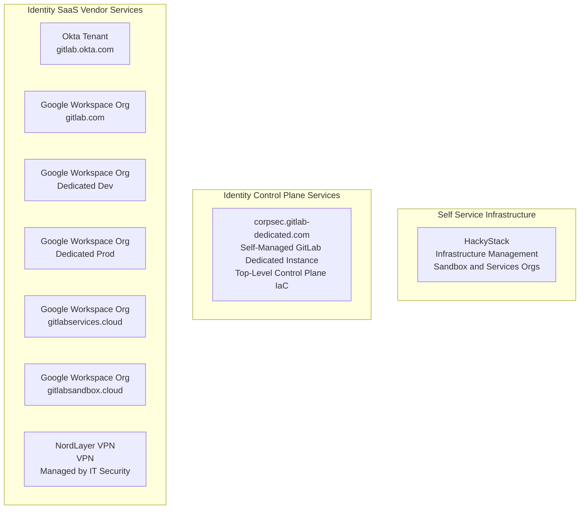
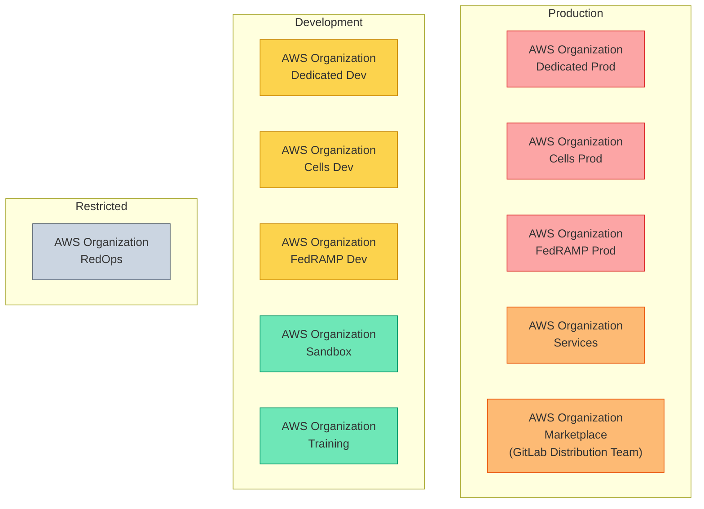
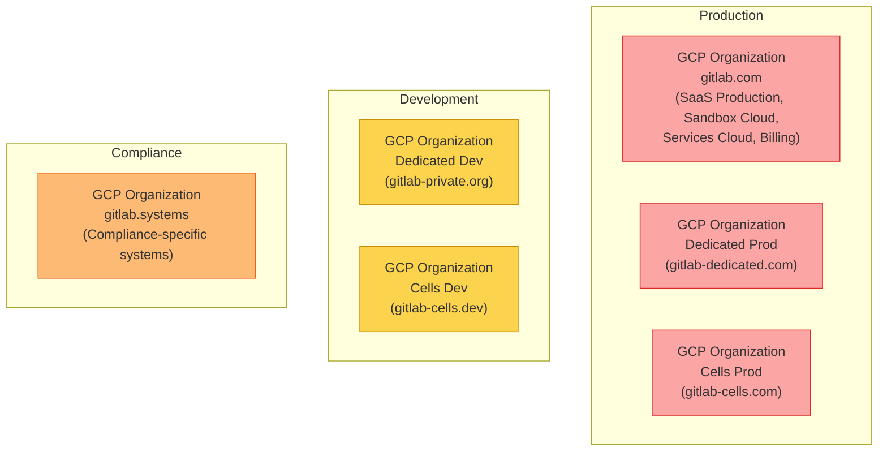

<link rel="stylesheet" type="text/css" href="/stylesheets/biztech.css" />

## Overview

All Cloud infrastructure with RED data is managed by the [Infrastructure](/handbook/engineering/infrastructure) department. All demo/dev/test/sandbox/staging/production infrastructure for ORANGE/YELLOW/GREEN data is created by the CorpSec Identity team using our self service portal or through issue templates.

Every team member can self-service create an AWS account and GCP project using the Sandbox Cloud for their own experimentation. This is your personal sandbox and is not shared with others.

We provision AWS accounts and GCP projects for each service/workload that more than one user has access to.

We believe in "one account/project per workload" for security blast radius and cost attribution reasons. We call these `collaborative projects/accounts`. Do **not** deploy different functional applications in the same AWS account or GCP project that has your team's name on it. You simply need to use the issue template to request a new AWS account or GCP project.

- [Sandbox Cloud Documentation](/handbook/company/infrastructure-standards/realms/sandbox)
- Self Service: [Create an Individual AWS Account or GCP Project](/handbook/company/infrastructure-standards/realms/sandbox/#individual-aws-account-or-gcp-project)
- Issue Template: [Create a Service/Team/Workload AWS Account](https://gitlab.com/gitlab-com/gl-security/corp/issue-tracker/-/issues/new?issuable_template=aws_account_create)
- Issue Template: [Create a Service/Team/Workload GCP Project](https://gitlab.com/gitlab-com/gl-security/corp/issue-tracker/-/issues/new?issuable_template=gcp_project_create)
- Issue Template: [Add or Remove IAM Users from AWS Account](https://gitlab.com/gitlab-com/gl-security/corp/issue-tracker/-/issues/new?issuable_template=aws_account_iam_update)
- Issue Template: [Add or Remove IAM Users from GCP Project](https://gitlab.com/gitlab-com/gl-security/corp/issue-tracker/-/issues/new?issuable_template=gcp_project_iam_update)
- `#sandbox-cloud-questions` for non-production infrastructure questions - tag Vlad Stoianovici

## Identity Control Plane

The Identity team manages the administrative access control plane for infrastructure. The following services make up the Identity control plane:

- [corpsec.gitlab-dedicated.com](https://corpsec.gitlab-dedicated.com) - Self-managed GitLab Dedicated instance for CorpSec. Hosts identity configuration pipelines, policies, and infrastructure-as-code. SSO through Okta. Access restricted to designated Security team members.
- [gitops.gitlabsandbox.cloud](https://gitops.gitlabsandbox.cloud) - Terraform environments for Sandbox Cloud (powered by HackyStack)
- [gitlabsandbox.cloud](https://gitlabsandbox.cloud) - Our instance of HackyStack that provides self-service access to AWS and GCP for team members.

## Cloud Provider Organization Management

The CorpSec Identity team manages our top-level cloud provider infrastructure organization-level management for GCP, AWS and Azure in collaboration with the [Infrastructure Security](/handbook/security/product-security/infrastructure-security) team.

Each team that deploys infrastructure resources is responsible for managing their own infrastructure workloads and DevOps operations using industry best practices. The Security team provides the organizational scaffolding (Terraform templates) and security boundaries, while each team is responsible for managing their own workloads within those boundaries.

### AWS Organizations

There are 11 AWS organizations in total. Previously referenced "AWS Billing Org" and "AWS Systems Org" do not exist.

| Organization | Purpose | Data Classification |
|---|---|---|
| **Sandbox** | Self-service individual accounts for team member experimentation. One account per user. | GREEN |
| **Services** | Shared workload accounts for internal tools and services. One account per workload. | ORANGE |
| **Marketplace** | GitLab Distribution Team. Marketplace listing and distribution infrastructure. | ORANGE |
| **Training** | Product training and hands-on lab environments. | GREEN |
| **Dedicated Dev** | Development environments for GitLab Dedicated. One account per user. | YELLOW |
| **Dedicated Prod** | Production environments for GitLab Dedicated. Control plane accounts and one account per tenant environment. | RED |
| **Cells Dev** | Development environments for GitLab Cells. | YELLOW |
| **Cells Prod** | Production environments for GitLab Cells. | RED |
| **FedRAMP Dev** | FedRAMP development environments. Exact org name may differ. | YELLOW |
| **FedRAMP Prod** | FedRAMP production environments. Exact org name may differ. | RED |
| **RedOps** | Red Team operations. Restricted access — intentionally isolated from other organizations. | Restricted |

### GCP Organizations

There are 6 known GCP organizations. This list is best-effort as the billing team does not have full visibility into specific organizations due to billing setup. Previously referenced "GCP Billing" is not a separate org — billing is part of the `gitlab.com` GCP organization.

> **Note**: The Dedicated and Cells teams are [transitioning away from GCP](https://gitlab.com/gitlab-com/gl-infra/gitlab-dedicated/team/-/work_items/11211). These GCP organizations may be decommissioned in the near-to-midterm future.

| Organization | Domain | Purpose | Data Classification |
|---|---|---|---|
| **gitlab.com** | `gitlab.com` | Primary GCP organization. Contains SaaS production infrastructure, Sandbox Cloud (as a folder/realm), Services Cloud, and billing. | RED |
| **gitlab.systems** | `gitlab.systems` | Compliance-specific applications requiring complete separation from the rest of infrastructure. Owned by CorpSec Identity. | ORANGE |
| **Dedicated Dev** | `gitlab-private.org` (Org ID: 407309174171) | Development environments for GitLab Dedicated. | YELLOW |
| **Dedicated Prod** | `gitlab-dedicated.com` | Production environments for GitLab Dedicated. | RED |
| **Cells Dev** | `gitlab-cells.dev` | Development environments for GitLab Cells. | YELLOW |
| **Cells Prod** | `gitlab-cells.com` | Production environments for GitLab Cells. | RED |

## Shared Responsibilities

We use a shared responsibility model for cloud providers.

### CorpSec Identity Team

> The CorpSec Identity team owns identity, access, and cloud infrastructure management across GitLab. We are one team covering the full spectrum — from identity provider administration to cloud organization management to security policy enforcement.

**Identity & Access Management**

- Okta administration and integration
- Lumos access governance
- Workday identity lifecycle integrations
- Defining Identity Roles and Identity Groups
- Managing AWS Identity Center Groups and Permission Sets
- Managing Google Groups and User Memberships
- Service account lifecycle management
- Non-human identity (NHI) security — service accounts, API keys, OAuth tokens
- Workforce identity verification and proofing
- Just-in-time access controls
- Least privilege and role-based access control assignments

**Cloud Infrastructure Management**

- Top-level GCP, AWS and Azure organization-level management, billing, IAM/RBAC
- AWS Account and GCP Project creation and decommissioning
- Azure sandbox user management
- Infrastructure standards and naming conventions
- Sandbox Cloud Architecture and Automation (dev/test environments)
- Services Cloud Architecture and Automation (production-esque environments)
- Tech debt reduction of legacy AWS accounts and GCP projects
- Cloud security policies and configuration audit

**AI Enterprise Enablement**

- AI tool security evaluation and approval workflows
- AI risk assessment and governance frameworks
- CorpSecAI automation engineering (data pipelines, webhook automation)
- Enabling secure adoption of AI tools and platforms across the organization

### Services Cloud

Each team that deploys infrastructure resources is responsible for managing their own infrastructure workloads and DevOps operations using industry best practices.

The Security team provides the organizational scaffolding and security boundaries, while each team is responsible for managing their own workloads within those boundaries.

### Sandbox Cloud Users (Engineers)

Each user is responsible for creating and destroying your own workloads.

See the [Sandbox Cloud handbook page](/handbook/company/infrastructure-standards/realms/sandbox) to learn more.
