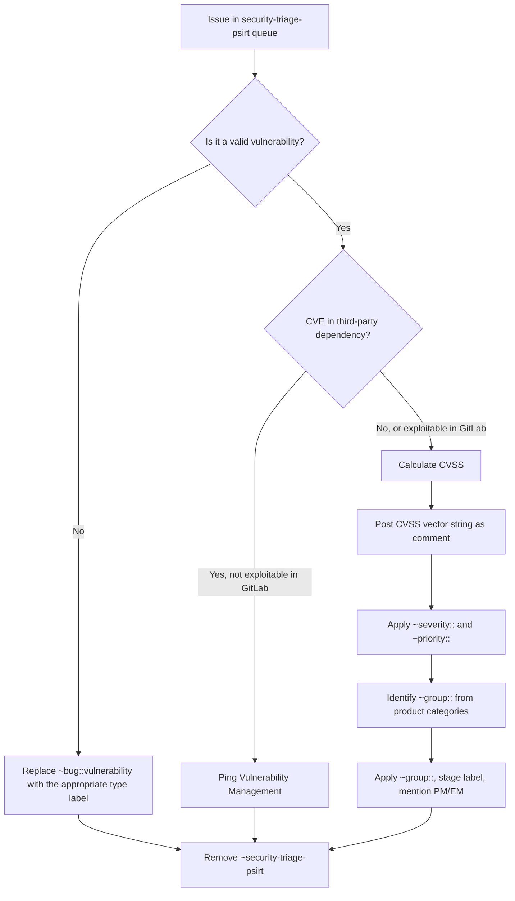

## Purpose and Overview

This runbook describes the process for triaging issues labeled `~security-triage-psirt` in the [gitlab-org issue tracker](https://gitlab.com/groups/gitlab-org/-/issues?scope=all&utf8=%E2%9C%93&state=opened&label_name%5B%5D=security-triage-psirt). These issues represent potential vulnerabilities that require assessment, classification, and routing to the appropriate engineering group.

A bot posts a daily summary in Slack with the current count of open `~security-triage-psirt` issues. The goal of triage is to assess each issue and replace the `~security-triage-psirt` label with the appropriate `~group::`, `~severity::`, and `~priority::` labels.

## Key Stakeholders and Responsibilities

- **PSIRT Team:** Collectively responsible for triaging `~security-triage-psirt` issues. This is a shared responsibility across all PSIRT team members, similar to how the [HackerOne queue](/handbook/security/product-security/psirt/runbooks/hackerone-process/) is worked.
- **Product and Engineering Managers:** Responsible for scheduling remediation once the issue has been triaged and routed to their group.
- **SIRT:** Engaged when active exploitation or incident response is required.

## Daily Triage Notification

Each day, GitLab SecurityBot posts a message in Slack:

> There are currently **N** security-triage-psirt issues on the gitlab-org issue list. (X created in the last 24 hours.)

The message includes a link to the [open issues list](https://gitlab.com/groups/gitlab-org/-/issues?scope=all&utf8=%E2%9C%93&state=opened&label_name%5B%5D=security-triage-psirt). PSIRT team members share responsibility for working through this queue.

## Step-by-Step Triage Procedure

### 1. Open the Issue Queue

Navigate to the [security-triage-psirt issue list](https://gitlab.com/groups/gitlab-org/-/issues?scope=all&utf8=%E2%9C%93&state=opened&label_name%5B%5D=security-triage-psirt) and sort by oldest first.

### 2. Assess the Potential Vulnerability

For each issue:

- Read the issue description and any linked references or reproduction steps.
- Determine whether the issue describes a valid vulnerability. Refer to [non-vulnerability security issues](/handbook/security/engaging-with-security/#non-vulnerability-security-issues) for guidance on issues that do not qualify as vulnerabilities.
- If the issue is **not a vulnerability**, apply the appropriate labels (e.g., `~"type::feature"`, `~"type::maintenance"`, `~"securitybot::ignore"`) and remove `~security-triage-psirt`. See [Non-vulnerability ~security issues](/handbook/security/engaging-with-security/#non-vulnerability-security-issues) for the different labels available.

### 3. Determine Severity and Priority

For valid vulnerabilities:

- [Calculate the CVSS score](/handbook/security/product-security/psirt/runbooks/cvss-calculation/) to determine the appropriate severity.
- Post a comment on the issue with the CVSS vector string (e.g., `CVSS:3.1/AV:N/AC:L/PR:L/UI:R/S:C/C:L/I:L/A:N`). This is required because our [security-release-tools](https://gitlab.com/gitlab-com/gl-security/product-security/appsec/tooling/security-release-tools) parse issue comments for the CVSS to populate CVE data.
- Apply the `~severity::` label (`~severity::1` through `~severity::4`) based on the CVSS score.
- Apply the corresponding `~priority::` label. Refer to [Severity and Priority Labels on Security Issues](/handbook/security/engaging-with-security/#severity-and-priority-labels-on-security-issues) for guidance.
- If the issue is `~severity::1` / `~priority::1`, immediately follow the [S1/P1 handling process](/handbook/security/product-security/psirt/runbooks/handling-s1p1/).

### 4. Identify and Assign the Responsible Group

- Determine the responsible engineering group using the [product categories page](/handbook/product/categories/features/). You can also use Duo Agent Platform (DAP) to help here by asking to find the relevant documentation and associated group.
- Apply the appropriate `~group::` label (e.g., `~"group::editor"`, `~"group::package"`).
- The [stage label](https://gitlab.com/gitlab-org/gitlab/blob/master/doc/development/contributing/issue_workflow.md#stage-labels) should be applied automatically, but if it's not, apply it manually.
- @-mention the relevant product manager and engineering manager for scheduling.

### 5. Finalize the Issue

- Ensure the issue has the `~security`, `~type::bug`, and `~bug::vulnerability` labels.
- Verify the issue has a clear `How to reproduce` section. Add or refine reproduction steps if needed.
- **Remove the `~security-triage-psirt` label.** This signals that triage is complete.

### Triage Decision Flowchart

## Handling Special Cases

### Insufficient Information

If the issue lacks enough detail to assess the vulnerability, leave a comment requesting clarification from the reporter. Keep the `~security-triage-psirt` label until sufficient information is provided.

### Duplicates

Check whether the vulnerability has already been reported. If a duplicate exists:

- Link to the existing issue.
- Close the duplicate.
- Remove the `~security-triage-psirt` label.

### CVE-Related Issues

If the issue relates to a CVE in a third-party dependency but does **not** demonstrate exploitability within GitLab, ping `@gitlab-com/gl-security/product-security/vulnerability-management` and apply the `~security-triage-vulnmgmt` label to route it to the Vulnerability Management team. This prevents the bot from reapplying `~security-triage-psirt`, while keeping the later stage reminders (milestone, escalation) active. The bot will remove `~security-triage-psirt` on its next run, but you can also remove it manually right away. If the issue demonstrates exploitability within GitLab, it should remain with PSIRT for triage or be escalated to SIRT if active exploitation is involved.

### Issues Requiring SIRT Engagement

If the issue describes active exploitation or an ongoing security incident, engage SIRT using the `/security` Slack command. See [Working with SIRT](/handbook/security/product-security/psirt/runbooks/working-with-sirt/) for details.

## Triage SLO

PSIRT has established triage SLOs as defined in the [PSIRT Case Lifecycle](/handbook/security/product-security/psirt/runbooks/psirt-case-lifecycle/#slo). The triage SLO applies uniformly regardless of severity:

| | Critical/High | Medium | Low |
| :---- | :---- | :---- | :---- |
| Triage | 5 days | 5 days | 5 days |

Issues that are not triaged within the SLO are considered **breached**. The daily Slack notification from SecurityBot will report the SLO status of the queue, similar to the HackerOne Daily Pulse:

> X are within triage SLO
> X have breached the triage SLO < 10 days
> X have breached the triage SLO by >= 11 days

## Related Resources

- [CVSS Calculation](/handbook/security/product-security/psirt/runbooks/cvss-calculation/)
- [HackerOne Process](/handbook/security/product-security/psirt/runbooks/hackerone-process/)
- [Handling S1/P1 Issues](/handbook/security/product-security/psirt/runbooks/handling-s1p1/)
- [Severity and Priority Labels](/handbook/security/engaging-with-security/#severity-and-priority-labels-on-security-issues)
- [Engaging with Security](/handbook/security/engaging-with-security/)
