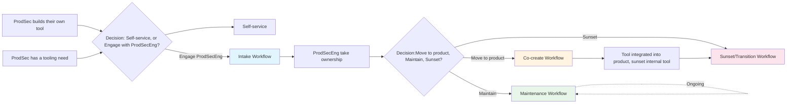

## Overview

Product Security Engineering (ProdSecEng) serves as the steward of automation and tooling within Product Security (ProdSec), with the mission of shepherding internal tools into the GitLab product.

This page describes the four interconnected workflows that enable ProdSecEng to effectively manage this lifecycle of security tooling and automation.

These workflows support the [Security Interlock](/handbook/security/product-security/security-platforms-architecture/security-interlock/) initiative: when Security teams build their own tooling to address gaps in GitLab's product, and there is a clear fit for other customers like us, ProdSecEng shepherds those internal tools into product features. This enables the Security division to dogfood our own product and allows GitLab to better serve the security teams of our customers.

Teams are always welcome to contribute directly to the product themselves instead of engaging with ProdSecEng. However if teams need support, then ProdSecEng offers a proven framework and dedicated capacity to help when needed.

## The Four Workflows

ProdSecEng operates four complementary workflows that work together to manage the full lifecycle of security tooling and automation:

| # | Workflow | Purpose |
|---|----------|---------|
| 1 | **[Intake](#intake-workflow)** | How ProdSecEng receives, evaluates, and accepts tooling/automation work |
| 2 | **[Maintenance & Inventory Prioritisation](#maintenance-and-inventory-prioritisation-workflow)** | Ongoing maintenance of existing tooling until product integration or sunsetting |
| 3 | **[Co-create](#co-create-workflow)** | Collaborating directly with Product and Engineering; Product validation → Product integration |
| 4 | **[Transition & Sunset](#transition-and-sunset-workflow)** | Migrate internal users to product feature and decommission internal tools |

### How the Workflows Connect

## Intake Workflow

### Purpose

The intake workflow is the entry point for tooling and automation work that teams want ProdSecEng's help with - including requests, ideas, and handover of existing tooling. This ensures we have a clear, repeatable process for evaluating requests and tool transfers before committing to ownership, and our customers (ProdSec) have clear expectations for maintenance going forward.

The intent of this workflow is to complete a technical assessment (so we understand user need, maintainability, architecture, tech stack) and strategic business assessment (so we understand if and how the need could be met in the GitLab product).

### When to Use Intake

Use the intake workflow when:

- A ProdSec team needs new tooling or automation built, and need support
- An existing tool or automation is being transferred to ProdSecEng for ownership
- A team wants to validate whether a tool idea aligns with product capabilities before building

### How to Engage

1. **For net-new requests:** [Open a new tooling/automation request](https://gitlab.com/gitlab-com/gl-security/product-security/product-security-engineering/product-security-engineering-team/-/issues/new?description_template=new_tooling_automation_request)
1. **For ownership transfers:** [Open a handover request](https://gitlab.com/gitlab-com/gl-security/product-security/product-security-engineering/product-security-engineering-team/-/issues/new?description_template=existing_tooling_automation_handover)
1. **For other requests:** [Open a request](https://gitlab.com/gitlab-com/gl-security/product-security/product-security-engineering/product-security-engineering-team/-/issues/new)
1. **For general questions:** Reach out in `#security-capabilities-engineering` Slack channel and tag `@product-security-engineering`

### Intake Paths

There are two distinct intake paths, each with different evaluation criteria:

#### 1. Net-New Tooling/Automation Requests

**Use when:** A team identifies a need but hasn't built a solution yet, or wants to validate whether a tool idea aligns with product capabilities before building.

This intake path focuses on understanding the problem, evaluating whether an existing solution (within GitLab or otherwise) could meet the need, and determining the best path forward — whether that's building new tooling, waiting for product development, or redirecting to an existing solution.

##### Process Overview

The net-new intake follows these steps:

1. **[Understand the problem and need](#step-1-understand-the-problem-and-need)** — What problem needs to be solved, who is affected, and what has already been explored?
1. **[Determine the path forward](#step-2-determine-the-path-forward)** — Should we build, wait, redirect, or defer? If we build, should it go directly into the product or be built as internal tooling first?
1. **[Plan internal tooling (if applicable)](#step-3-plan-internal-tooling-if-applicable)** — For internal tooling only: what are the design decisions, and what level of maintenance can ProdSecEng commit to?
1. **[Record decision and plan next steps](#step-4-record-decision-and-plan-next-steps)** — Finalise the intake decision and plan the work.

The requesting team initiates the process by completing the [net-new request work item template](https://gitlab.com/gitlab-com/gl-security/product-security/product-security-engineering/product-security-engineering-team/-/issues/new?description_template=new_tooling_automation_request), which provides the information ProdSecEng needs to work through each step. Collaboration between ProdSecEng and the requesting team is needed to get to a decision.

##### Step 1: Understand the problem and need

The requesting team must provide enough information for ProdSecEng to understand the problem being solved and what has already been explored. This is captured through the [net-new request work item template](https://gitlab.com/gitlab-com/gl-security/product-security/product-security-engineering/product-security-engineering-team/-/issues/new?description_template=new_tooling_automation_request), which covers the problem statement, user requirements, alternatives explored, and business case.

The discussions and decisions are captured within the work item.

##### Step 2: Determine the path forward

Before deciding to build, ProdSecEng evaluates whether the need could be met through existing or planned product capabilities. This prevents building internal tooling that duplicates or competes with product development already in progress.

The possible outcomes of this step are: **build directly into the product**, **build as internal tooling first**, **wait** for upcoming product development, **redirect** to an existing solution, **defer** due to capacity, or the **requesting team self-serves** with optional ProdSecEng advisory support.

If the outcome is to build as internal tooling, proceed to Step 3 for design and maintainability decisions. For all other outcomes, proceed directly to Step 4.

By the end of this step, the following will be decided:

| Decision | Basis | Description |
|----------|-------|-------------|
| **Build in the product vs. build internally vs. wait vs. redirect** | Maps to the work item template response - Based on product fit, roadmap alignment, and urgency of the need | Whether ProdSecEng should build a solution now, wait for upcoming product development, or redirect to an existing tool or purchase |
| **Path-forward category** (if building internally) | Maps to the work item template response - Based on product fit, customer value, and operating model alignment | If we decide to build internally, what is the future path to product (and why are we deferring). See [Path-Forward Categories](#path-forward-categories) in the Maintenance workflow |
| **Co-create inputs** | Based on use cases and requirements captured in the request | What information is helpful to consider if/when starting product integration |

##### Step 3: Plan internal tooling (if applicable)

This step only applies when the outcome of Step 2 is to **build as internal tooling**. All other outcomes skip directly to Step 4.

ProdSecEng assesses what level of support the tool will require and makes key design decisions upfront, guided by the [Good/Better/Best practices for automation guidance](https://internal.gitlab.com/handbook/security/product_security/product_security_engineering/automation_best_practices/) (accessible to GitLab team members only).

By the end of this step, the following will be decided:

| Decision | Basis | Description |
|----------|-------|-------------|
| **Criticality** | Maps to the work item template response | How critical the solution will be to the team and business. See [Prioritization Framework](#prioritization-framework) in the Maintenance workflow |
| **SLO/RTO** | Based on the expected criticality | The response time (SLO) and recovery time (RTO) ProdSecEng will commit to once the tool is operational. See [SLO/RTO Commitments](#slorto-commitments) in the Maintenance workflow |
| **Design decisions** | Based on the [automation best practices](https://internal.gitlab.com/handbook/security/product_security/product_security_engineering/automation_best_practices/) and requirements from the request | Key technical decisions including language choice, deployment model, data handling, and security considerations. Decisions should be recorded using the [ADR template](https://gitlab.com/gitlab-com/gl-security/product-security/product-security-engineering/product-security-engineering-team/-/blob/main/development_templates/adr_template.md) |

##### Step 4: Record decision and plan next steps

Once the assessment is complete, ProdSecEng finalises the intake decision and records it. This step ensures the request is formally tracked and that all stakeholders have a shared understanding of what happens next.

Intake decisions could be:

| Decision | Who decides | Notes |
|----------|-------------|-------|
| Build directly into the product | ProdSecEng, with Product and Engineering alignment | Moves into the [Co-create workflow](#co-create-workflow); no internal tooling phase |
| Build as internal tooling | ProdSecEng | Design decisions, criticality, and SLO/RTO are documented; tool enters the Maintenance workflow once operational |
| Wait for product development | ProdSecEng, with requesting team agreement | The need is documented; ProdSecEng monitors product roadmap progress and revisits if the timeline changes |
| Redirect to existing solution | ProdSecEng | ProdSecEng may help the requesting team adopt the existing solution; no new tooling is built |
| Defer due to capacity | ProdSecEng, with leadership and stakeholder awareness | The request is valid but cannot be accommodated now; documented and re-assessed once ready for prioritisation or as context changes |
| Requesting team self-serves | Requesting team, with ProdSecEng guidance | The requesting team builds it themselves, optionally with ProdSecEng advisory support |

By the end of this step, the following will be completed:

| Action | Description |
|--------|-------------|
| **Intake decision recorded** | The outcome of the intake is documented in the work item, including the decision and any conditions |
| **Tool added to inventory (if building internal tooling)** | If ProdSecEng builds internal tooling, it is added to their [tooling inventory](https://internal.gitlab.com/handbook/security/product_security/product_security_engineering/) with its criticality, path-forward category, and planned design decisions |
| **Work planned** | The work is scoped into work items and prioritised for an upcoming milestone — either as internal tooling or as a co-create contribution |
| **Stakeholders notified** | The requesting team and relevant stakeholders are informed of the decision and next steps |

If built as internal tooling, the tool enters the [Maintenance workflow](#maintenance-and-inventory-prioritisation-workflow) once it is operational. If built directly into the product, the work follows the [Co-create workflow](#co-create-workflow).

#### 2. Existing Tool/Ownership Transfers

**Use when:** A tool already exists and the owning team would like to transfer it to ProdSecEng.

This intake path focuses on understanding what ProdSecEng is inheriting, assessing whether the tool meets a minimum development standards bar, and determining the path forward.

##### Process Overview

The ownership transfer intake follows these steps:

1. **[Understand the tool and its context](#step-1-understand-the-tool-and-its-context)** — What does this tool do, who uses it, and how does it work?
1. **[Assess short-term maintainability](#step-2-assess-short-term-maintainability)** — Can ProdSecEng realistically maintain this tool, and at what level?
1. **[Understand the path to product](#step-3-understand-the-path-to-product)** — Could this become a GitLab product feature?
1. **[Record decision and add to inventory](#step-4-record-decision-and-add-to-inventory)** — Finalise the intake decision and add the tool to ProdSecEng's tooling inventory.

The transferring team initiates the process by completing the [handover work item template](https://gitlab.com/gitlab-com/gl-security/product-security/product-security-engineering/product-security-engineering-team/-/issues/new?description_template=existing_tooling_automation_handover), which provides the information ProdSecEng needs to work through each step. Collaboration between ProdSecEng and the transferring team is needed to get to a decision.

##### Step 1: Understand the tool and its context

The transferring team must provide enough information for ProdSecEng to understand the problem being solved, how the tool works, and who depends on it. This is captured through the [handover work item template](https://gitlab.com/gitlab-com/gl-security/product-security/product-security-engineering/product-security-engineering-team/-/issues/new?description_template=existing_tooling_automation_handover), which covers the customer problem and business process, current capabilities and users, and technical and architectural understanding. If architectural decision records (ADRs) don't already exist, the transferring team should document key decisions retrospectively using the [ADR template](https://gitlab.com/gitlab-com/gl-security/product-security/product-security-engineering/product-security-engineering-team/-/blob/main/development_templates/adr_template.md).

The discussions and decisions in the steps are discussed within this work item. If the tool is transferred to ProdSecEng then the detail and decisions are recorded in their [project inventory](https://internal.gitlab.com/handbook/security/product_security/product_security_engineering/) (accessible to GitLab Team Members only).

##### Step 2: Assess short-term maintainability

ProdSecEng needs to understand what level of support the tool requires in the short or near-term, and whether the team can realistically commit to maintaining it. This assessment determines the tool's criticality rating and associated SLO/RTO (see [SLO/RTO Commitments](#slorto-commitments) in the Maintenance workflow).

By the end of this step, the following will be decided:

| Decision | Basis | Description |
|----------|-------|-------------|
| **Criticality** | Maps to the handover checklist response | How critical is this tool to the team and business? What is the impact if it becomes unavailable? See [Prioritization Framework](#prioritization-framework) in the Maintenance workflow |
| **SLO/RTO** | Based on the tool's criticality | The response time (SLO) and recovery time (RTO) ProdSecEng commits to for this tool. See [SLO/RTO Commitments](#slorto-commitments) in the Maintenance workflow |
| **Current state vs. minimum bar / Health** | Based on the [Good/Better/Best practices for automation guidance](https://internal.gitlab.com/handbook/security/product_security/product_security_engineering/automation_best_practices/) (accessible to GitLab team members only) | How the tool measures up against the model, and what improvements may be needed |

Generally, the more criteria a tool meets, the stronger the SLO/RTO commitment ProdSecEng can offer.

##### Step 3: Understand the path to product

Even at intake, ProdSecEng captures starting information to understand whether and how the tool's capabilities could become part of the GitLab product. This information feeds directly into the [Co-create workflow](#co-create-workflow) when/if the tool gets selected for integration.

By the end of this step, the following will be decided:

| Decision | Basis | Description |
|----------|-------|-------------|
| **Path-forward category** | Maps to the handover checklist - Based on product fit, customer value, and operating model alignment with Product and Engineering roadmaps | How strong the customer value proposition is. See [Path-Forward Categories](#path-forward-categories) in the Maintenance workflow  |
| **Co-create inputs** | Based on architectural decisions and use cases captured in the handover checklist | What information (such as ADR, previously raised work items or PoC) is helpful to consider if/when starting integration |

##### Step 4: Record decision and add to inventory

Once the assessment is complete, ProdSecEng finalises the intake decision and records it. This step ensures the tool is formally tracked and that all stakeholders have a shared understanding of the commitments made.

Intake decisions could be:

| Decision | Who decides | Notes |
|----------|-------------|-------|
| Accept a transfer — tool meets "Good" or above | ProdSecEng | Standard intake outcome; SLO/RTO based on criticality |
| Accept a transfer with improvement plan | ProdSecEng | Gaps documented in work items and prioritised; lower SLO/RTO until improvements are delivered |
| Best-effort support — gaps are unclear or significant | ProdSecEng, with leadership and stakeholder awareness | ProdSecEng provides best-effort support while evaluating whether to re-engineer an alternative solution |
| Propose an alternative solution instead of maintaining the existing tool | ProdSecEng, with transferring team and leadership agreement | ProdSecEng works with the team to scope a new solution that addresses the same problem with better maintainability and product fit |
| Reprioritise ProdSecEng's existing commitments to accommodate a transfer | ProdSec leadership | Leadership may reprioritise existing work to make room; impact on other commitments is documented |

By the end of this step, the following will be completed:

| Action | Description |
|--------|-------------|
| **Intake decision recorded** | The outcome of the intake is documented in the work item, including any conditions (e.g., improvement plan, best-effort support) |
| **Tool added to inventory** | The tool is added to ProdSecEng's [tooling inventory](https://internal.gitlab.com/handbook/security/product_security/product_security_engineering/) with its criticality, path-forward category, and health |
| **Improvement work created (if applicable)** | If the tool is below "Good" with addressable gaps, the specific improvements are documented in work items and prioritised |
| **Stakeholders notified and documentation updated** | The transferring team and relevant stakeholders are informed of the decision and next steps, README and other documentation is updated to reflect the ownership change |

The tool then enters the [Maintenance workflow](#maintenance-and-inventory-prioritisation-workflow) based on its assigned path-forward category.

## Maintenance and Inventory Prioritisation Workflow

### Purpose

The maintenance workflow is the foundational loop that runs continuously after intake and before sunsetting. It ensures ProdSecEng can effectively support existing tooling and automation while prioritizing work toward product integration.

### When Maintenance Applies

Maintenance applies to all tools and automation that ProdSecEng maintains, from the moment intake is complete until the tool enters the [Transition & Sunset workflow](#transition-and-sunset-workflow).

### Key Activities

- **Respond to issues:** Provide support within defined SLO/RTO
- **Keep tools operational:** Monitor uptime, address failures, apply security patches
- **Prioritize work:** Continuously assess which tools should move to co-create based on criticality, product readiness, and strategic alignment
- **Improve maintainability:** Incrementally bring tools up to the [Good/Better/Best standard](https://internal.gitlab.com/handbook/security/product_security/product_security_engineering/automation_best_practices/)
- **Report capacity:** Report when team capacity constraints impact the ability to keep tools operational and/or incrementally improve them
- **Review inventory and re-assess:** This prevents "zombie tools" from consuming resources when stakeholders have moved to alternative solutions.

### Prioritization Framework

ProdSecEng uses the following criteria to prioritize maintenance work and co-create transitions:

| Criteria | Questions |
|----------|-----------|
| **Criticality** | How critical is this tool to ProdSec or GitLab's business? What happens if it goes down? |
| **Product Fit** | How well does this align with GitLab's product roadmap? Is there active Product/Engineering interest? |
| **Maintainability** | How much effort does this tool require to keep operational? Is it at risk of becoming unmaintainable? |
| **Strategic Alignment** | Does this support Security division or GitLab priorities? |
| **Customer Value** | Would customers benefit from this capability in the product? |

### Path-Forward Categories

Tools are categorized into one of the following path-forward categories:

- **Integrate:** Clear product fit, customer value, and Operating Model alignment. An Epic exists and an upcoming milestone is applied.
- **Maintain (KTLO):** Keep operational while meeting the tool's documented SLO & RTO. Feature requests are not accepted. Peer review of contributions are accepted.
- **Improve, then Integrate** or **Improve, then Maintain** When work is required to move a tool to a different Category. Feature requests are actively triaged and put on the backlog or closed.
- **Sunset:** Actively undergoing the Transition & Sunset workflow. Treated as "KTLO" until removed.
- **Redirect:** Ownership must transfer to another team. Feature requests are not accepted. SLO & RTO capped at "Low".

### SLO/RTO Commitments

ProdSecEng provides different levels of support based on tool criticality:

| Criticality | SLO (Response Time) | RTO (Recovery Time) | Example |
|-------------|---------------------|---------------------|---------|
| **Critical** | < 4 business hours | < 12 business hours | Tools blocking security releases or incident response |
| **High** | < 1 business day | < 2 business days | Tools supporting daily security operations |
| **Medium** | < 3 business days | < 2 weeks | Tools used weekly or monthly |
| **Low** | Best effort | Best effort | Experimental or rarely-used tools |

Notes:

- Definitions:
  - Service Level Objective (SLO): the time within which we aim to triage and assign an open issue.
  - Recovery Time Objective (RTO): the time within which we aim to bring the tool back to functionality.
  - In both cases, the clock starts when an issue is opened.
- These are target commitments and may vary based on team capacity and competing priorities.
- These times apply only to issues which prevent the proper functionality of the tool
- "Business hours" are hours when a ProdSecEng team member is online. The team typically has coverage during 9-5 across all timezones, excluding weekends. ProdSecEng is not "on-call".
- Repeated inability to achieve the SLO or RTO serves as a signal to either:
  - Move a tool to the "Improve" Path-Forward Category to make it easier to maintain and recover, or
  - Adjust its Criticality downward if the current SLO & RTO misalign with department priorities.
- We don't commit to a Recovery Point Objective (RPO) - any amount of "data loss" is implicitly acceptable.

## Co-create Workflow

### Purpose

The co-create workflow defines how ProdSecEng collaborates with Product and Engineering to integrate internal security tooling capabilities into the GitLab product. ProdSecEng contributes the development work, and the completed features are handed over to an Engineering team for long-term ownership.

This workflow is part of the [Security Interlock](/handbook/security/product-security/security-platforms-architecture/security-interlock/) initiative, where ProdSec acts as [Customer 0](/handbook/product/product-processes/customer-0/) and validates product features for their own use cases before broader release.

### When Co-create Applies

1. A tool's path-forward category is set to **Integrate** during [intake](#path-forward-categories) or [maintenance prioritisation](#maintenance-and-inventory-prioritisation-workflow), or
1. A net-new request outcome is to **build directly into the product** (from [intake Step 2](#step-2-determine-the-path-forward))

Co-create is complete once the feature is handed over to the owning Engineering team. For ongoing integration efforts (e.g., multi-capability tools), individual co-create cycles may complete while the broader transition continues.

### Process Overview

Co-create follows three phases:

1. **[Align with Product and Engineering](#phase-1-align-with-product-and-engineering)** - Agree on what to build, how it fits into the product, and who is involved.
1. **[Build and validate](#phase-2-build-and-validate)** - Develop the feature, test it, and validate it with internal users as Customer 0.
1. **[Hand over to Engineering](#phase-3-hand-over-to-engineering)** - Transfer ownership of the feature to the Engineering team that will maintain it long-term.

### Phase 1: Align with Product and Engineering

Before any development work begins, ProdSecEng aligns with Product and Engineering on the approach and expected outcomes. This alignment is critical — ProdSecEng will never own these features long-term, so the owning team must agree on what is being built and how it fits into the product.

**Key activities:**

- Engage the relevant Product Manager to validate the use case and confirm product fit. Use the product fit summary and co-create inputs from the intake issue as a starting point.
- Engage the relevant Engineering Manager to validate the technical approach and confirm the team can support reviews and eventual ownership.
- Check the [R&D Interlock roadmap](/handbook/product-development/how-we-work/r-and-d-interlock/) for existing or planned work that overlaps. Where commitments already exist, ProdSecEng can contribute to those efforts rather than proposing separate work.
- Agree on scope, including whether the feature will ship behind a feature flag, go through a PoC phase, or target general availability directly.
- Agree on how the feature will be monetised or made accessible (e.g., tier, feature flag, internal-only).
- Agree on rollout approach and incident ownership during the rollout period (see [Rollout and incident ownership](#rollout-and-incident-ownership) in Phase 2).

**Recording alignment**

Alignment should be documented on the co-create epic. ProdSecEng should request that the PM or EM leaves an explicit comment on the epic confirming alignment on scope and approach, including the date. This creates a clear audit trail if alignment is questioned later. If scope changes during development, re-alignment should be sought and documented the same way.

**Outputs**

1. Co-create epic created with the plan of work, risks, dependencies, and stakeholders (with RACI)
2. PM and/or EM alignment confirmed and documented on the epic
3. Issues created or linked for the development work

### Phase 2: Build and Validate

#### Familiarization

Before starting development, the team should invest time understanding the codebase they will be working in and the internal tool they are integrating (if applicable). This should be timeboxed and tracked as a work item. The goal is for the team to understand how the product currently works and how the internal tool solves the problem today, so they can make informed decisions during development. You can use [this previous work item](https://gitlab.com/gitlab-com/gl-security/product-security/product-security-engineering/product-security-engineering-team/-/work_items/367) as an example.

#### Development

ProdSecEng develops the feature following [GitLab's standard development processes](https://docs.gitlab.com/development/). This phase may be iterative; a proof of concept or feature-flagged implementation may come before a production-ready feature, depending on what was agreed in Phase 1.

**Key activities**

- Implement the feature, including tests and documentation
- Submit merge requests and iterate on code review with the owning Engineering team
- Validate performance and ensure the feature meets quality standards
- Share knowledge with the team that will eventually own the feature (e.g., deep dive sessions, documentation)
- Validate the feature with internal users as [Customer 0](/handbook/product/product-processes/customer-0/) — for example, by integrating the internal tool with the new product feature and collecting feedback from the ProdSec teams that depend on it
- Record significant design decisions using the [ADR template](https://gitlab.com/gitlab-com/gl-security/product-security/product-security-engineering/product-security-engineering-team/-/blob/main/development_templates/adr_template.md)

#### Rollout and incident ownership

If development work involves a phased rollout (e.g., feature flags, staged access), the rollout plan should be agreed in Phase 1 and documented on the co-create epic.

During rollout:

- **ProdSecEng is the DRI for rollout decisions** - including whether to pause, revert, or adjust the rollout based on issues that arise. ProdSecEng should consult the owning Engineering team in case there are broader risks or concerns to consider.
- **ProdSecEng is the SME for incidents** involving the feature - responding to SME escalations as part of [GitLab's incident process](/handbook/engineering/infrastructure-platforms/incident-management/). The owning Engineering team is consulted and should understand that additional support, resourcing, and context may be needed to address complex issues, given potential knowledge gaps. The owning Engineering team may explicitly take over incident ownership if their expertise or capacity allows a faster resolution.

These responsibilities should be clarified upfront in Phase 1 and documented on the co-create epic.

#### Maintaining alignment

Provide regular (usually weekly) status updates to stakeholders on the co-create epic. This keeps Product and Engineering aware of progress and ensures that if GitLab priorities or plans change, ProdSecEng is aware before it impacts the work. If scope or approach needs to change, seek re-alignment with the PM or EM and document it on the epic.

**Outputs**

1. Feature shipped (behind a feature flag or generally available, as agreed)
2. Documentation published
3. Performance and quality validated
4. Customer 0 feedback collected and addressed

### Phase 3: Hand over to Engineering

ProdSecEng hands over the feature to the Engineering team that will own it long-term. The timing and scope of handover depends on what was agreed in Phase 1. For example, handover may happen after a feature flag is removed and the feature is generally available, or it may happen earlier if the owning team is ready to take over.

For tools where the product feature replaces only part of the internal tool's functionality (e.g., one capability out of many), the [Transition & Sunset workflow](#transition-and-sunset-workflow) for the internal tool may begin during co-create. For example, by integrating the internal tool with the new product endpoint and using that integration as a Customer 0 validation step. In these cases, co-create and transition run in parallel rather than sequentially. Full decommissioning of the internal tool may not happen until multiple co-create cycles are complete.

**Key activities:**

- Confirm with the owning Engineering team that the feature meets their standards for long-term ownership
- Work with Product to determine how the feature is made accessible (tier, feature flag removal, authorisation model)
- Transfer any remaining context — documentation, ADRs, known issues, performance data
- Update the [tooling inventory](https://internal.gitlab.com/handbook/security/product_security/product_security_engineering/) to reflect that the capability has been integrated into the product

**Outputs**

1. Feature owned and maintained by the Engineering team
2. ProdSecEng's internal tooling updated or scheduled for [transition and sunset](#transition-and-sunset-workflow) (if the product feature replaces internal tool functionality)
3. Tooling inventory updated

### Key Considerations

- **Feature parity:** The product feature does not need to match 100% of the internal tool's functionality. Agree on what "good enough" looks like in Phase 1, and revisit if needed during Phase 2.
- **Iterative delivery:** Co-create may involve multiple rounds of PoC, feature-flagged delivery, Customer 0 testing, and re-alignment before a feature is ready for general availability. This is expected and healthy.
- **Alignment is ongoing:** Alignment is not a one-time gate. GitLab priorities can change, and regular status updates and stakeholder communication help ensure ProdSecEng's work stays aligned with Product and Engineering direction.
- **ProdSecEng does not own product features:** Every feature built through co-create is handed over to an Engineering team. This is why early alignment and ongoing communication with the owning team is essential.

## Transition and Sunset Workflow

### Purpose

The transition and sunset workflow manages the migration of internal users from internal tooling to product features, and the decommissioning of internal tools that are no longer needed.

### When to Use Transition & Sunset

This workflow can be triggered when:

1. **After successful co-create:** A product feature has been shipped and internal users need to migrate from the internal tool to the product feature
2. **Direct sunset:** A tool is no longer needed (superseded by existing product capabilities, business need has changed, or tool is no longer used)
3. **During co-create for partial tool integration:** For tools where the product feature replaces only part of the internal tool's functionality, transition may begin while [co-create](#co-create-workflow) is still in progress. For example, ProdSecEng may integrate the internal tool with a new product endpoint as a Customer 0 validation step, while further co-create work continues on other capabilities. Full decommissioning of the internal tool may not happen until multiple co-create cycles are complete.

### Key Activities

[Open a new Sunset Tooling issue](https://gitlab.com/gitlab-com/gl-security/product-security/product-security-engineering/product-security-engineering-team/-/issues/new?description_template=sunset_tooling)
which will guide you through the following activities.

#### For Post-Co-create Transitions

- **Plan migration:** Define migration timeline, communication plan, and success criteria
- **Migrate internal users:** Work with ProdSec teams to transition workflows to use the product feature
- **Validate feature parity:** Ensure the product feature meets internal user needs; address gaps if necessary
- **Monitor adoption:** Track usage of product feature vs. internal tool
- **Communicate sunset timeline:** Give stakeholders clear notice of when the internal tool will be decommissioned
- **Decommission infrastructure:** Shut down internal tool infrastructure, archive repositories, update documentation

#### For Direct Sunsets

- **Validate sunset decision:** Confirm with stakeholders that the tool is no longer needed.
- **Identify alternative solutions:** Document what users should do instead (use existing product feature, use different tool, etc.)
- **Communicate sunset timeline:** Give stakeholders clear notice
- **Decommission infrastructure:** Shut down infrastructure, archive repositories, update documentation

### Key Considerations

- **Feature parity:** Is the product feature "good enough" or are there critical gaps that need to be addressed?
- **Timeline:** How much notice does ProdSec and other internal users need? Are there dependencies on the internal tool that need to be addressed first?
- **Rollback plan:** If the product feature has critical issues, can we temporarily keep the internal tool running?

### Outputs

- Internal tool sunsetted and infrastructure decommissioned
- ProdSec teams using product feature (for post-co-create transitions)
- Documentation updated to reflect new workflows
- Lessons learned documented

### Direct Sunset Alternative: Transfer

When ProdSecEng will no longer maintain a tool and plan to sunset it,
another team might be willing to own and maintain it instead.
If another owner is found, open a
[transfer tooling issue](https://gitlab.com/gitlab-com/gl-security/product-security/product-security-engineering/product-security-engineering-team/-/issues/new?description_template=transfer_tooling).

## Related Resources

- [Product Security Engineering Mission](/handbook/security/product-security/security-platforms-architecture/product-security-engineering/)
- [Security Interlock](/handbook/security/product-security/security-platforms-architecture/security-interlock/)
