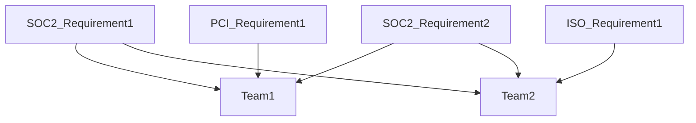
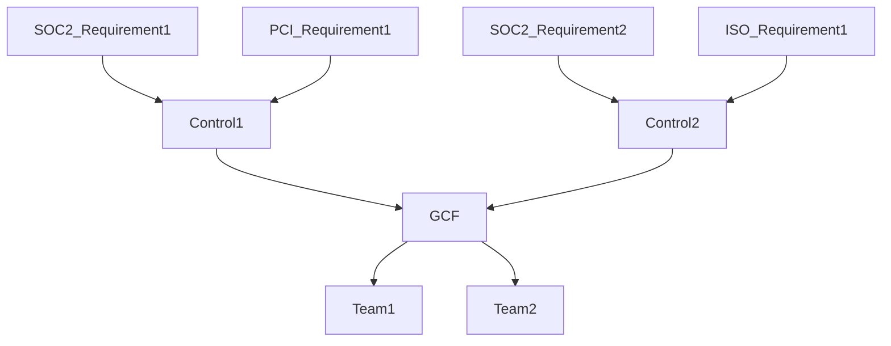
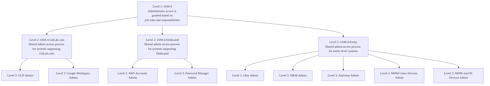



## What Are Security Controls?

Security controls are safeguards and countermeasures implemented to reduce or mitigate risks to organizational assets and data.

**Control Description:**

A control description is a clear, concise statement defining a specific security requirement or activity. Well-written control descriptions in the GCF:

- Use active, professional language
- State what must be done or what security measure is in place
- Are written generically without vendor-specific terminology (to remain reusable and vendor-neutral)
- Are actionable and testable by auditors
- Clearly communicate the objective

**Examples:**

- EPM-12: Laptops are configured by default to prevent the use of portable storage devices to mitigate data exfiltration with exceptions documented and approved by management.
- PSM-6: Security awareness training is required to be completed upon hire and on an annual basis thereafter for team members. The training covers topics including organizational security policies, industry security best practices, and relevant threat landscapes applicable to job responsibilities.
- AIM-6: AI systems are verified and validated using defined criteria and testing methodologies to ensure accuracy, performance, and quality standards are met.

## Control Ownership

For controls to operate effectively, clear ownership and accountability must be established. Two key roles are responsible for control design, operation, and evidence collection:

**Control Owner**

- Accountable for the overall control and the risk it mitigates
- Responsible for remediation of control deficiencies and audit findings to bring the control into a state of audit-readiness
- May delegate control execution to stewards or responsible parties, but retains ultimate accountability
- Approves control design changes and major operational adjustments

**Process Owner**

- Subject matter expert who understands how the control operates in practice
- Works with the compliance team to provide evidence and explain control implementation
- May provide technical details, system access, or operational context for testing
- Often the person who actually performs or oversees the control activity

**Note:** The control owner and process owner may be the same individual.

## GitLab Control Framework (GCF)

We take a comprehensive approach to our immediate and future security compliance needs. Older and larger companies tend to treat each security compliance requirement individually which results in independent security compliance teams going out to internal teams with multiple overlapping requests. For example, at such a company you might have one database engineer that is asked to provide evidence of how a particular database is encrypted based on SOC2 requirements, then again for ISO requirements, then again for PCI requirements.

To address this, we developed a common controls framework called the **GitLab Control Framework (GCF)**. This approach can be visualized as follows:

Given our efficiency value here at GitLab we created a set of security and AI controls that would address multiple underlying requirements with a single control allowing the Security Compliance team to make fewer requests to control owners and efficiently collect all evidence we would need for a variety of audits at once. This approach can be visualized as follows:

### GCF Methodology

As our security compliance goals and requirements have evolved, so have our requirements and constraints related to our security control framework. Our GCF is a proprietary set of controls developed specifically for GitLab's unique infrastructure, business model, and security posture.

The GCF was developed through a comprehensive analysis process:

1. **Analyzed compliance requirements** from certifications and attestations we maintain and are pursuing (SOC 2, ISO 27001, ISO 42001, PCI DSS, FedRAMP, etc.)
2. **Compared against industry frameworks** such as NIST Cybersecurity Framework (CSF), NIST SP 800-53, and the Secure Controls Framework (SCF) to ensure alignment with industry best practices
3. **Created custom control domains and controls** tailored to GitLab's all-remote, cloud-native, and AI-powered DevSecOps environment

This approach allows us to maintain mappings to all compliance requirements while eliminating irrelevant controls and adding GitLab-specific controls where needed. The framework is designed to be customizable and scalable, enabling us to create new domains or controls as we pursue additional certifications and as our business evolves.

#### GCF Scope and Assessment Approach

The GCF includes controls beyond what is in-scope for external certifications, covering both compliance-required and risk-driven controls. Each year, an assessment schedule is created to test and monitor controls, with assessments grouped by quarter and assigned to members of the Compliance team:

- **Compliance controls:** Required for external certifications; tested at least annually
- **Risk-based controls:** Driven by system criticality (Tier 1/2) or data sensitivity (RED/ORANGE); tested based on capacity and risk priority

### GCF Structure and Data

Traditional control frameworks typically track minimal information such as a control ID, description, and owner. The GCF takes a more comprehensive approach, capturing extensive data that provides context around control implementation details, requirements the control is mapped to, scope of control (assets and processes included in the control), and other relevant details documented in the [control fields](#gcf-control-fields) below.

The GitLab Control Framework is maintained in our GRC solution, GAS (GitLab Assurance Solution). This centralized repository enables efficient control management, visibility into control relationship mappings, audit preparation, and continuous monitoring of GitLab's security posture.

#### GCF Control Domains

Through our analysis of industry frameworks and compliance requirements, we created custom control domains that organize controls into logical families aligned with GitLab's security program structure and operational model.

| Abbreviation | Domain | Description |
|--------------|--------|-------------|
| AAM | Audit & Accountability Management | Controls for logging, monitoring, and maintaining audit trails of system activities |
| AIM | Artificial Intelligence Management | Controls specific to AI system development, deployment, and governance |
| ASM | Asset Management | Controls for identifying, tracking, and managing organizational assets |
| BCA | Backups, Contingency, and Availability Management | Controls for business continuity, disaster recovery, and system availability |
| CHM | Change Management | Controls for managing changes to systems, applications, and infrastructure |
| CSR | Customer Security Relationship Management | Controls for customer communication, transparency, and security commitments |
| DPM | Data Protection Management | Controls for protecting data confidentiality, integrity, and privacy |
| EPM | Endpoint Management | Controls for securing end-user devices and workstations |
| GPM | Governance & Program Management | Controls for security governance, policies, and program oversight |
| IAM | Identity, Authentication, and Access Management | Controls for user identity, authentication mechanisms, and access control |
| INC | Incident Management | Controls for detecting, responding to, and recovering from security incidents |
| ISM | Infrastructure Security Management | Controls for network, server, and foundational infrastructure security |
| PSM | People Security Management | Controls for personnel security, training, and awareness |
| PAS | Product and Application Security Management | Controls for security capabilities built into the GitLab product that are dogfooded to secure GitLab's own development, such as branch protection code security scanning |
| SDL | Software Development & Acquisition Life Cycle Management | Controls for secure SDLC practices and third-party software acquisition |
| SRM | Security Risk Management | Controls for risk assessment, treatment, and management |
| TPR | Third Party Risk Management | Controls for managing security risks from vendors and suppliers |
| TVM | Threat & Vulnerability Management | Controls for identifying and remediating security vulnerabilities |

#### GCF Control Fields

The GCF tracks the following fields for each control to provide context, enable efficient management, and support audit activities:

<b>Core Control Information</b>

**Control ID**

- Unique identifier for the control
- Format varies by control level:

  - **Level 1:** `[Domain]-[Number]` (Example: IAM-4)
  - **Level 2:** `[Domain]-[Number]-[Environment]` (Example: IAM-4-GitLab.com, IAM-4-Dedicated, IAM-4-Entity)
  - **Level 3:** `[Domain]-[Number]-[Environment]-[Asset]` (Example: IAM-4-GitLab.com-GCP, IAM-4-Entity-Okta)
- Enables consistent tracking and referencing across the control hierarchy

GitLab operates multiple product deployments (GitLab.com on GCP, GitLab Dedicated on AWS), and compliance requirements are typically scoped by product offering. The environment component in the Control ID differentiates between product-specific and organization-wide controls based on where customer data is maintained and managed. The asset component identifies the specific systems that comprise the product.

**Control Name**

- High-level summary demonstrating the essence of the control
- Provides at-a-glance understanding of the control's purpose
- Examples: "Audit Logging Policy", "Multi-Factor Authentication", "AI System Verification and Validation"

**Description**

- Statement of the control implementation or activity
- Defines what the control does and the security objective it achieves
- Written in clear, actionable language without vendor-specific references

**Domain**

- Control family or category that organizes related controls
- Examples: Audit & Accountability Management, Identity Authentication and Access Management, Artificial Intelligence Management
- Helps navigate and understand control relationships

<b>Control Implementation Details</b>

**Status**

- Current state of the control
- Values: `In Existence` or `Gap`
- Indicates whether the control is operational or represents a confirmed or potential control deficiency that requires remediation

**Implementation Details**

- Specific details about how the control is implemented in GitLab's environment
- May include system-specific configurations, responsible teams, or operational procedures
- Provides context on the practical implementation approach

**Owner**

- Individual(s) responsible for the control
- Ensures accountability for control design, operation, and remediation
- The control owner provides evidence and responds to audit requests

**Environment**

- Entity or product/service offering the control addresses
- Values: `Entity` (organization-wide), `GitLab.com` (multi-tenant SaaS), `GitLab Dedicated` (single-tenant)
- Defines control applicability across different deployment models

Note: "RBCT" is also used as an "environment" to help differentiate controls that are not tested for compliance purposes.

<b>Control Characteristics</b>

**Classification**

- Indicates why the control is in scope and what types of systems or requirements the control applies to
- Helps prioritize control testing and resource allocation based on risk and compliance drivers
- Values:

| Value | Description |
|-------|-------------|
| `External` | Control is in-scope for external certifications and attestations |
| `Internal` | Control is risk-driven, either system-specific (based on data sensitivity or criticality) or addresses risks identified through organizational risk assessments |

Internal control risk factors are defined through:

- Data classification levels (Red, Orange) are defined in the [Data Classification Standard](/handbook/security/policies_and_standards/data-classification-standard.md)
- System criticality tiers (Tier 1, Tier 2) are defined in the [Critical System Tiering](/handbook/security/security-assurance/security-risk/storm-program/critical-systems.md) methodology

**Frequency**

- How often the control is performed or operates
- Values: `Annual`, `Semi-Annual`, `Quarterly`, `Monthly`, `Weekly`, `Daily`, `Automated`, `Ad-hoc`
- Defines operational cadence and testing intervals

**Nature**

- Degree of automation in control execution
- Describes how the control operates in practice
- Values:

| Value | Description |
|-------|-------------|
| `Manual` | Control is executed manually without automation |
| `Semi-Automated` | Control execution combines automated and manual activities |
| `Automated` | Control is executed automatically without manual intervention |

**Type**

- Classification of the control's security function
- Defines the control's role in the overall security program
- Values:

| Value | Description |
|-------|-------------|
| `Preventative` | Control prevents security event or policy violations from occurring |
| `Detective` | Control detects security event, policy violations, or anomalies after they occur |
| `Corrective` | Control corrects or remediates event identified through detective controls |
| `Recovery` | Control restores systems or data to normal operations after an event |
| `Administrative` | Control consists of policies, procedures, or management activities |
| `Compensating` | Control provides alternative protection when primary controls cannot be implemented |

**Category**

- Categorization by scope and implementation point
- - Enables identification of where a control applies: organization-wide, product-specific (GitLab.com or Dedicated), infrastructure-level, repository-level, etc.
- Values:

| Value | Description | Examples |
|-------|-------------|----------|
| `ELC - Administrative` | Organization-wide policies, procedures, and administrative controls | Security policies, risk assessment processes, training programs, governance frameworks |
| `ELC - Technical` | Enterprise-wide technical controls deployed across all systems | SIEM/centralized logging & monitoring, enterprise antivirus, endpoint security agents |
| `SaaS - Administrative` | Administrative controls for service delivery operations, where processes or ownership differ between GitLab.com and Dedicated | Customer data handling procedures, SLA management, service status notifications |
| `Technical - Asset` | Foundational IT general controls that apply across multiple systems and contexts | Access provisioning and deprovisioning, privileged access management, change management procedures, segregation of duties |
| `Technical - Infrastructure` | Controls for network, servers, and foundational infrastructure | Firewalls, load balancers, network segmentation, time synchronization |
| `Technical - Project/Repo` | Controls within code repositories and development projects | Branch protection rules, merge request approvals, code scanning |
| `Technical - SaaS` | Technical controls specific to delivery of GitLab.com or GitLab Dedicated services | Multi-tenancy isolation, platform availability monitoring, backup replication, customer data segregation, GitLab.com-specific security configurations |

**GitLab Platform**

- Indicates whether the control is implemented using GitLab the product
- Used to demonstrate which controls GitLab dogfoods using our own platform
- Values: Checkbox (Yes/No)
- Purpose: Enables identification of controls that leverage GitLab features, showcasing real-world usage for potential open-source adoption of the framework

**Level**

- Indicates the granularity and scope of the control within the organizational hierarchy
- Defines the control's position in the hierarchy from broad policy to specific implementation
- Values:

| Level     | Description | Example |
|-----------|-------------|---------------------|
| `Level 1` | Single common control applied across the entire organization | Administrative access requires approval and is granted based on least privilege |
| `Level 2` | Shared process that implements the control for entity-level operations or for a product offering (GitLab.com, Dedicated); all Level 2 controls are in-scope for external certifications | Admin access workflow for production infrastructure supporting GitLab.com |
| `Level 3` | Most granular implementation of the control for a specific asset or component (multiple Level 3 controls can exist for each Level 2) | Admin access to PostgreSQL database; Admin access to Redis cache; Admin access to Kubernetes cluster |

<i>How Control Levels Work (click to expand)</i>

The GCF uses a three-level hierarchy to enable scalable control management. This structure allows us to define a control once at Level 1, then implement it consistently across our service offerings through a shared process (Level 2) and specific assets (Level 3), rather than creating dozens of independent controls.

**Why This Matters:**

- **Without levels:** We would need separate controls for "MFA on GCP," "MFA on AWS," "MFA on Bastion Hosts," etc. - potentially hundreds of disconnected controls
- **With levels:** One Level 1 control (IAM-10: MFA Required) cascades to product-specific implementations (Level 2), which then cascade to asset-specific configurations (Level 3)

**Alignment with Audit Scope:**

This hierarchical structure aligns with how external audits are typically scoped:

- **Entity-level audits** focus on Level 1 controls - organization-wide policies, governance, and enterprise controls
- **Product offering audits** focus on Level 2 controls - controls specific to GitLab.com, GitLab Dedicated, or GitLab Dedicated for Government (FedRAMP)
- **Level 3 controls** provide the granular evidence and implementation details that support Level 2 assessments

This approach allows us to efficiently prepare for and support multiple audit types without duplicating control documentation or creating separate control frameworks for each product offering.

**Visualized Hierarchy:**

**How It Works:**

- **Level 1 (1 control):** Organizational policy - defines WHAT must be done

  - Example: IAM-4 - "Administrator access is granted based on job roles and responsibilities and limited authorized personnel."
- **Level 2 (Few controls):** Product/environment implementation - defines HOW it's done per offering

  - Example: IAM-4-GitLab.com - "Shared admin access process for systems supporting GitLab.com"
  - Example: IAM-4-Dedicated - "Shared admin access process for systems supporting Dedicated"
  - Example: IAM-4-Entity - "Shared admin access process for entity-level systems"
  - Note: All entity-level controls (ELC) are Level 2 controls
- **Level 3 (Many controls):** Asset-specific configuration - WHERE it's actually enforced

  - Example: IAM-4-GitLab.com-GCP - "Admin access for GCP"
  - Example: IAM-4-GitLab.com-Bastion - "Admin access to bastion hosts"
  - This is the most granular level where controls are tested and evidence is collected

**Key Insight:** Level 3 is where implementation happens. This granular approach enables precise testing, clear ownership, and efficient audit evidence collection while maintaining traceability to organizational policy.

<b>Control Testing Details</b>

**Test Plan**

- Procedures used to test whether the control is operating effectively
- Defines how the control should be inspected, reviewed, or verified
- Provides step-by-step testing guidance

**Source**

- System, tool, or location where control evidence originates
- Examples: GitLab Handbook, AWS Inspector, Okta
- Identifies where to collect proof of control operation

**Testing Automation**

- Level of automation in control testing activities
- Indicates automation maturity for continuous control monitoring (manual effort involved with testing)
- Values:

| Value | Description |
|-------|-------------|
| `Manual` | Control testing is performed manually without automation tools |
| `Semi-Automated` | Some aspects of control testing are automated while others require manual effort |
| `Fully Automated` | Control testing is completely automated with no manual intervention required |

**Evidence Automation**

- Level of automation in evidence collection
- Indicates automation maturity for audit evidence collection
- Values:

| Value | Description |
|-------|-------------|
| `Manual` | Evidence collection is performed manually without automation tools |
| `Semi-Automated` | Some aspects of evidence collection are automated while others require manual effort |
| `Fully Automated` | Evidence collection is completely automated with no manual intervention required |

**Assessment Frequency**

- How often the control should be assessed or tested
- Determined by risk, regulatory requirements, and control criticality
- Establishes continuous monitoring schedule based on control risk
- Values:

| Value | Description | Typical Use Case |
|-------|-------------|------------------|
| `3 Years` | Control assessed every three years | Low-risk controls such as policy-level controls or controls with minimal change |
| `2 Years` | Control assessed every two years | Moderate-risk controls or controls with infrequent changes |
| `Annually` | Control assessed once per year | Standard frequency for most controls |
| `Quarterly` | Control assessed every quarter | High-risk controls or controls supporting critical systems |
| `Ad-hoc` | Control assessed on an as-needed basis | Event-driven controls or controls tested in response to incidents or changes |

### 3. Security Compliance Additional Procedures

Once the Security Compliance performs the assessment for inclusion in external certification scope, the team may elect to perform walkthroughs or testing of these controls.

Additionally, if the system poses a high risk to the environment (regardless of scoping), the team may also perform additional control testing. The Production Readiness Assessment Template (template being developed) may be used to document this testing.

### 4. Documentation

Security Compliance makes documentation updates as follows:

- GAS - results for any control testing performed are documented in GAS Assessments
- [External Audit 'Technical Scope'](https://gitlab.com/groups/gitlab-com/gl-security/security-assurance/security-compliance/-/wikis/External-Audit-'Technical-Scope') - changes to the scope are reflected in this wiki page
- Continuous Control Monitoring (CCM) Testing Issues/Schedule - needed updates to the CCM based on scoping changes are made to ensure future testing is performed

## References

<a href="../security-compliance/" class="btn bg-primary text-white btn-lg">Return to the Security Compliance Team page</a>
